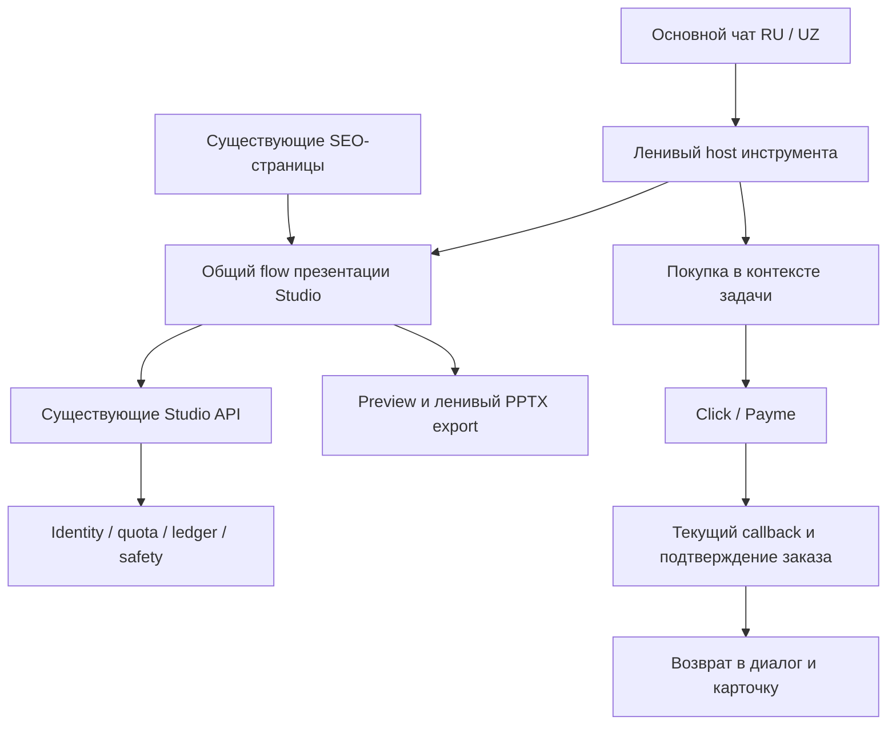

# Презентации внутри основного чата GPTBot.uz: roadmap

Дата: 07.10.2026. Статус: **архитектурное предложение**, реализация этого roadmap не начата. Источник фактов — текущий код, проверенный dist и live API; старый ценовой макет — источник намерения владельца. Production source: `96d2b8b7e8ee49df575a61cb58266b50f82b802e`. Платёжный запуск Payme зафиксирован отдельно в `PAYME_ACTIVATION_20261007.md`.

## 1. Решение для продукта

Главная точка работы — существующий AI-чат. В нём пользователь выбирает «Презентация», задаёт тему, получает результат, скачивает PPTX и покупает нужный пакет. Между чатом и Studio переходить не требуется. При оплате остаётся штатный переход к Click/Payme с возвратом в исходную карточку и диалог.

Studio становится общим инструментом двух поверхностей: чата и уже индексируемых страниц презентаций. Используем одну генерацию, одну проверку лимитов, один экспорт и один платёжный backend. SEO-страницы и их URL сохраняются; позже они могут показывать тот же чат с заранее выбранной презентацией.

Приоритет: **встроенный результат → покупка в контексте задачи → более широкий пакет**. Общий пакет с новыми обещаниями выпускается после подтверждения экономики и надёжности. Менять только рекламную надпись «пакет» недостаточно: права обоих продуктов должны реально выдаваться одним заказом.

## 2. Что есть сейчас

| Участок | Проверенный факт | Следствие |
|---|---|---|
| Основной чат | Текстовые сообщения, SSE-ответ, шаблоны инструментов, отдельный кабинет AI-пакета | Презентация должна быть новым типом карточки в ленте |
| Studio | Отдельный frontend в `apps/studio`, API и storage в том же репозитории/Cloudflare/D1 | Новый backend не нужен |
| Генерация | Free flow; full flow: JSON outline и параллельные JSON parts; отдельная загрузка картинок | Это не token-stream чата; переиспользовать orchestration Studio |
| Экспорт | Preview и PPTX уже реализованы, библиотека загружается лениво | Не писать второй генератор PPTX |
| Бесплатная презентация | 1 в сутки, 4–6 слайдов, до 2 изображений | Та же quota должна действовать из чата и отдельной страницы |
| Полная презентация | По текущему live config 6–12 слайдов, до 8 изображений, заметки, 3 палитры | Не рекламировать15 слайдов до отдельного выпуска |
| Kunlik | 5 900 сум,24 часа,1 полная презентация | Сохранить как понятную покупку под одну задачу |
| Oylik | 39 900 сум, календарный месяц,10 полных презентаций | Сохранить для регулярной работы;1 разрешённая регенерация на единицу |
| AI-пакет | 20 000 сум,300 ответов/месяц, до50 в день; Studio не включает | Пока не выдавать за общий пакет |
| Фото | `photo=false`, действующая версия тарифов имеет `photoTask=0` | Старые обещания2/5/40 разборов на макете ещё не действуют |
| Оплата | Live Click+Payme для трёх текущих продуктов | Интеграция в чат меняет UX возврата, а не протокол провайдера |
| История | Текстовая; дополнительные поля при сохранении/восстановлении отбрасываются | Deck/Blob нельзя просто приписать к сообщению |

На предоставленном макете есть будущие фото-задачи,15 слайдов и расчёт остатка денег. Это не текущие обязательства и не подтверждённая чистая прибыль. Нужна новая проверка затрат с реальными retry/регенерациями, налогами, комиссиями, возвратами и стоимостью трафика.

## 3. Как должен выглядеть путь пользователя

1. На первом экране рядом с вводом — видимое действие «Создать презентацию» / «Taqdimot yaratish». В меню также остаётся инструмент. Ссылки из рекламы/SEO могут заранее выбрать его, сохраняя исходную страницу чата.
2. Прямой запрос «сделай презентацию про…» предлагает в ленте карточку с уже заполненной темой. Для MVP — явная кнопка плюс осторожное предложение по распознанному намерению; генерация не начинается автоматически. Обычный вопрос о презентациях остаётся текстовым вопросом.
3. В карточке: тема, язык RU/UZ, аудитория, число слайдов. Основные поля видны сразу, дополнительные раскрываются. Параметры редактируются локально, без лишних LLM-запросов чата.
4. Кнопка заранее говорит, что произойдёт: «Создать бесплатно» либо «Создать —1 презентация из пакета». Баланс и доступный формат берутся с сервера. Исчерпанный лимит сообщений чата не блокирует купленные презентации.
5. В той же ленте появляются этапы «План → слайды → изображения → готово». Отображаются настоящие события Studio, без выдуманного процента готовности.
6. После результата: preview, скачивание PPTX, разрешённая регенерация. Мобильное превью — последовательные карточки слайдов; большой просмотр раскрывается отдельно. Длинная презентация не должна вытеснять поле ввода или ломать прокрутку диалога. Локальная правка заголовка/текста и выбор доступной палитры — полезное продолжение R2: они не требуют нового AI-вызова или повторного списания. Запрос к AI на новую версию подчиняется текущему лимиту регенерации.
7. После бесплатного результата — спокойная карточка полной версии: больше слайдов, картинки и заметки, реальные текущие цены. Исходный бесплатный результат остаётся доступным.
8. Покупка открывается поверх текущей задачи. Черновик сохраняется до перехода к провайдеру. После возврата backend подтверждает оплату, интерфейс восстанавливает диалог и предлагает продолжить. Покупка сама по себе не запускает генерацию и не расходует единицу.

## 4. Как предлагать покупку

Три подходящих момента:

- После полезного бесплатного результата: «Нужна полная презентация с заметками?». Пример результата уже доказывает ценность продукта.
- При выборе полного формата без единиц: встроенная карточка тарифов, выбранный запрос сохранён.
- При исчерпании бесплатного лимита: честно показать, когда он обновится, и предложить купить сейчас. Отличать личный лимит от остановки сервиса/общего бюджета: при технической недоступности не обещать немедленный результат за оплату.

В первой версии в карточке покупки два предложения: **1 презентация —5 900** и **10 презентаций на месяц —39 900 сум**. Показать различие состава и срока. Для Oylik допустимо сравнение «3 990 сум за презентацию при использовании всех 10», рядом с полной ценой и сроком. У действующего покупателя сначала показывается использование уже купленных единиц.

Без попапа по таймеру на входе, ложного дефицита и искусственного обратного отсчёта. Закрытое предложение не показывать при каждом сообщении. Подсказки основаны на состоянии задачи и server balance, их можно отключить. Оферта и её существенные условия остаются рядом с действием оплаты; дополнительный промежуточный экран не возвращается.

События воронки: выбор инструмента → открытие параметров → запуск → результат → скачивание → просмотр тарифа → начало checkout → подтверждённая оплата → использование оплаченной единицы. Параметры аналитики — tool, locale, entry source, plan, статус; тема, тексты, изображения, номера заказа/аккаунта и cookies в marketing analytics не отправляются. Продажу считать по server-confirmed payment с идемпотентностью, не по клику и не по return URL.

## 5. Архитектура

### Переиспользовать

- `src/gpt-chat/components/AiChatConsole.tsx` — orchestration диалога; `AiChatMessageList.tsx` — вывод карточки.
- `apps/studio/src/tools/presentation/flow.ts` — `startFreeDeck`, `startFullDeck`, `regenerateFullDeck`, `drawPictures`.
- `apps/studio/src/tools/presentation/Preview.tsx`, `Download.tsx`, `apps/studio/src/pptx/build.ts` — результат и экспорт.
- Studio `api.ts`, `config.ts`, `identity.ts`, `billing/runtime.ts`, `Tariffs.tsx`/`Checkout.tsx` — состояние, права и покупка.
- `functions/lib/studio/**` и `functions/api/studio/**` — существующий server engine и правила единиц; текущие callbacks Click/Payme.

Не переносить целиком standalone `Form.tsx` в ленту: нужен тонкий встроенный сценарий поверх общего flow. Не отправлять презентацию через `doSend()`/чатовый SSE: это смешает лимиты, добавит лишний вызов и не даст корректного структурированного результата.

### Добавить или изменить

- Frontend catalog инструментов: tool ID, локализованные entry actions, lazy loader, доступные форматы. Сначала только presentation; backend платформы агентов из-за этого не рефакторить.
- Версионируемое сообщение `text | presentation` со стабильным ID; локальная машина состояний карточки, draft/job/result/error. В LLM-контекст чата отправлять только допустимый текст; deck, платёжные поля и служебные карточки не включать.
- Shared client orchestration и UI-адаптеры; границы стилей и один экземпляр React при общей сборке. Standalone страницы продолжают использовать тот же engine.
- Явное различение chat/Studio при checkout return, два разрешённых chat path и восстановление конкретной карточки. Return path остаётся allowlist, без arbitrary URL.
- Контроль identity/отмены: поздний результат другого аккаунта или диалога не вставляется в текущую ленту; один активный Studio job на владельца сохраняется.

## 6. Критические ограничения

**Вес загрузки.** Проверенный чат: JS 109 155/110 000 bytes Brotli, page CSS 26 947/27 000; запас 845 и 53 байта. Все вложенные lazy части сейчас ограничены12 kB; библиотека PPTX существенно больше. До UI-интеграции нужен отдельный измеряемый контракт ленивой загрузки Studio и экспорта. Обычный чат должен сохранить прежний стартовый бюджет, а тяжёлые модули загружаться только по действию. Нельзя выключить общий guard, просто поднять baseline или незаметно загрузить Studio CSS на все страницы.

**Identity и права.** На первом выпуске сохранить действующие cookie/identity и серверные правила двух продуктов. Встраивание на тот же origin использует Studio identity и те же дневные counters; отдельный free limit для «презентаций в чате» не создаётся. В кабинете можно одновременно показать сообщения и презентации, но UI-агрегация не делает существующие аккаунты одним. Единый аккаунт требует проверенного серверного связывания обеих сессий; значения из localStorage и общий IP не доказывают владение. `IdentityStore.adoptGuest()` переносит заказы чата, на Studio автоматически не распространяется. При последующем объединении counters уже использованные бесплатные единицы текущего окна сохраняются атомарно и идемпотентно. Восстановление доступа проверять для каждого права.

**Сохранение.** Чат хранит последние 40 сообщений и до 10 архивных диалогов; Studio не хранит на сервере сам deck/PPTX. Рекомендуется локальное IndexedDB-хранилище артефактов с ограничением размера/количества и явной очисткой при смене владельца. В текстовую историю — только ссылку на локальный artifact ID. Формат результата и изображений проверить отдельно: одного job ID недостаточно для повторного скачивания. При удалённом локальном файле показывать честное «файл не сохранён». Облачная синхронизация — другой этап с изменением privacy/оферты, не скрытая часть MVP.

**Оплата.** Сейчас `STUDIO_RETURN_PATHS` допускает только Studio-страницы; chat account panel реагирует на общий `?pay=return`. Без изменения этого контракта Studio-покупка из чата откроет не тот кабинет. Сохранить anti-CSRF, Turnstile, строгие суммы, ownership и идемпотентность. URL возврата не выдаёт оплаченные права.

**Несколько карточек.** Preview сейчас имеет фиксированный ID и автоматический focus. В ленте нужны уникальные ID, контролируемое восстановление фокуса и отсутствие скачка к старому результату при каждом обновлении.

**Прерывание.** Закрытие карточки/вкладки не означает гарантированный возврат единицы: расход определяется серверным ledger и действующими условиями доставки результата. UI не должен обещать возврат по своему локальному abort; тестируются отказ до результата, частичная доставка и отмена после доставки.

**Ёмкость.** В committed runtime: общий предел 3 Studio starts/min, ramp 50 бесплатных презентаций/сутки, free AI budget $0.3/сутки, paid emergency stop $20/сутки. Это настройки запуска, не обещание пропускной способности. До увеличения трафика измерить отказы, длительность, себестоимость и загрузку; обновлять лимиты по данным. Очередь/новую инфраструктуру вводить при подтверждённой необходимости.

## 7. Последовательность выпуска

| Этап | Результат | Что доказывает готовность |
|---|---|---|
| R0. Контракт и прототип | Типы сообщений, state machine, адаптер flow, схема хранения, контракт lazy budget, checkout return | Старый чат/история не меняются; обычный чат не грузит генератор/PPTX; карточка работает на фикстурах |
| R1. Бесплатная презентация в чате | Действие на первом экране, параметры, настоящий free flow, preview и PPTX в ленте | RU/UZ, мобильные устройства, валидный PPTX; единый free counter с standalone; сбой не расходует чужие/платные единицы |
| R2. Платная презентация в чате | Full flow, баланс, inline выбор Kunlik/Oylik, Click/Payme, сохранение/возврат в задачу, регенерация | Оба плана и провайдера; повтор callbacks без дублей; отмена/смена аккаунта; оплаченные права только после callback; реальная контрольная покупка |
| R3. Продажа после результата | Три контекстных предложения, dismiss policy, события и отчёт воронки | Считаются подтверждённые покупки и использование; нет тем/PII в аналитике; качество/ошибки/возвраты оцениваются вместе с конверсией |
| R4. Общий пакет | Новый SKU chat+presentations, версия состава/оферты и серверная выдача двух ресурсов | Измерена экономика worst case и реклама; один заказ/чек, два корректных гранта; купленные старые пакеты сохраняют условия |
| R5. Расширение возможностей | Фото после отдельного качества/safety/cost gate; затем другие инструменты через тот же host | Каждый инструмент имеет свой schema, quota, стоимость и тесты; не публикуются неподтверждённые15 слайдов/фото |
| R6. Единая поверхность и SEO | Старые tool URLs используют тот же встроенный сценарий; рекламные ссылки открывают нужный режим | Canonical/hreflang/title/H1/ссылки и существующий индекс сохраняются; обычный чат не теряет скорость |

Первые релизы **R0–R2** решают основную просьбу. R3 делает воронку измеримой. R4 расширяет продаваемый пакет по фактической экономике. Фото и другие инструменты не должны задерживать презентации в чате.

Это последовательность независимых выпусков, а не обещание сроков без проверки извлечения frontend/bundle. На каждом этапе: scoped tests, typecheck, lint, точная сборка, browser acceptance, guarded deploy и live readback. Feature flag встраивания позволяет отключить новый host, сохранив standalone Studio и обработку начатых оплат.

## 8. Общий пакет: отдельное продуктовое решение

Рекомендую в будущем показывать три понятные категории: бесплатный старт; разовая презентация; месячный **чат + презентации**. Пакет только для текста остаётся доступным тем, кому не нужны файлы.

Не называем текущий Oylik за 39 900 общим пакетом: он сейчас содержит10 презентаций, а не300 чатовых ответов. Для нового совместного пакета фиксируются новые SKU, состав, цена, срок, версия условий и правила возврата. Цена определяется после worst-case расчёта: выбранная модель,12 слайдов/8 картинок, retries, разрешённая регенерация, чат, НДС/комиссии и рекламная стоимость привлечения. Числа из старого макета не подставляются как текущая прибыль.

У одной оплаты должна быть одна каноническая ownership-запись. Нельзя проводить одну Payme/Click transaction отдельно через два существующих order store. Новый composite order в рамках монолита связывает один платёж с двумя ресурсами: выдача атомарна, журнал имеет уникальность `(org_id, order_id, resource)`. Повтор callback не выдаёт вторые права. Полный возврат отзывает оба ресурса, частичный имеет заранее определённое распределение. Ошибка выдачи не превращает успешную оплату в потерянный доступ: нужна повторяемая delivery/reconciliation. Старые `pay_*`/`stu_*` заказы продолжают обслуживаться прежними обработчиками.

## 9. Минимальная приёмка интеграции

- Обычный текст, сценарий презентации и переключение между ними на RU/UZ; ложное распознавание намерения не запускает генерацию.
- Guest, действующий chat buyer, действующий Studio buyer, пользователь без единиц; история и права разных владельцев не смешиваются.
- Бесплатные6 слайдов и полные 12; картинки/заметки/палитры соответствуют формату; PPTX реально открывается в выбранном редакторе, а не только проходит ZIP/schema checks.
- Retry, отказ модели/изображения, прерывание вкладки, двойной клик, регенерация, исчерпание личного и общего лимита; корректный расход ledger.
- Оплата обоих планов через Click/Payme, возврат именно в нужный диалог, pending/failed/paid/refunded, повторы и старые открытые заказы.
- Мобильные320/360/390 и desktop, клавиатура, прокрутка, focus/keyboard/screen reader, несколько результатов в диалоге.
- Старые local histories мигрируют; reload во время оплаты восстанавливает черновик; локально сохранённый результат скачивается повторно; потерянный результат не объявляется восстановленным.
- Стартовый bundle/CSS в пределах действующих бюджетов, tool/export имеют явные измеряемые лимиты; защищённые SEO-страницы проверены с reviewed revisions при реальной правке контракта.

## 10. Первое действие после принятия roadmap

**R0: встроенная карточка презентации и общий адаптер существующего Studio flow, сначала на фикстурах.** Одновременно определить безопасный lazy-контракт, историю/identity и возврат оплаты. Затем R1 с реальной бесплатной презентацией. Текущие тарифы и Payme/Click уже опубликованы; их не требуется переделывать для такого MVP.

В этом запросе владелец ждёт roadmap. Код, тарифы и публичные страницы ради этого плана не изменялись; разработка следующего этапа не объявляется уже выполненной.
