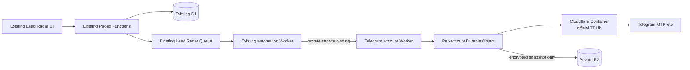

# ADR: Lead Radar Telegram account campaigns

**Status:** implemented as a disabled release candidate; infrastructure
provisioning, canary and production enablement remain separately gated

**Date:** 2026-08-25

**Scope:** the existing GPTBot monorepository and Cloudflare account only

## Context

Lead Radar can discover companies, prepare a draft and, through its dedicated
Telegram Business bot, reply in a narrow active-chat window. The requested
extension lets an operator connect one separate Telegram user account, select
up to 50 Radar results, review one offer and create one campaign.

That user experience must not turn a public `@username` into permission to send
an automated message. Telegram prohibits spam, says developers must obtain their
own `api_id`, and requires third-party clients to act with the user's knowledge
and consent. A Telegram account may also be limited after unwanted messages are
reported. See the official [Telegram Terms of Service](https://telegram.org/tos),
[Telegram API Terms](https://core.telegram.org/api/terms),
[application credential guide](https://core.telegram.org/api/obtaining_api_id)
and [spam FAQ](https://telegram.org/faq_spam).

The existing Pages Functions runtime is not the right place for a persistent
native Telegram client. Official TDLib is a full asynchronous client that owns
networking, encryption and local state; it requires a Linux-capable runtime.
[Cloudflare Containers](https://developers.cloudflare.com/containers/) provide
that runtime and are controlled through a Durable Object. Containers require
the Workers Paid plan; the current documented minimum account charge is USD 5
per month in [Workers pricing](https://developers.cloudflare.com/workers/platform/pricing/).

## Decision

Implement the feature inside the existing monorepository and Cloudflare trust
boundary. Do not use Railway, GramJS, a second repository or a public auxiliary
backend.

- Pages Functions remain the authenticated API and D1 remains the source of
  truth for organizations, searches, company eligibility, campaigns, targets,
  approvals, DNC and effects.
- The existing Queue and automation Worker remain the only campaign dispatcher.
  A campaign does not create 50 simultaneous sends: it creates at most 50
  tenant-scoped target records that the Worker processes in order.
- The Telegram account Worker has no public route. The automation Worker calls
  it through a private Cloudflare service binding. Service bindings can call a
  Worker without exposing a public URL; see the official
  [service bindings documentation](https://developers.cloudflare.com/workers/runtime-apis/bindings/service-bindings/).
- There is one stable, routing-key-derived Durable Object identity per
  organization and primary Telegram account slot. It is independent from the
  rotatable session-encryption key, is the serialization authority and permits exactly one
  active TDLib sender/session. Durable Objects provide a unique identity and
  strongly consistent state; see the official
  [Durable Objects overview](https://developers.cloudflare.com/durable-objects/).
- The Durable Object controls one Cloudflare Container whose Debian base digest
  and official TDLib source commit are pinned. Cloudflare documents that a Container
  is backed by a Durable Object and deployed from a Docker image; see
  [Containers: getting started](https://developers.cloudflare.com/containers/get-started/).
- Railway and GramJS are explicitly rejected. They would add another trust and
  deployment boundary or replace the selected official stateful client without
  a demonstrated production advantage.

## Authentication and session custody

1. The operator requests a short-lived connection attempt from the authenticated
   admin UI. The server binds it to the organization, operator and account slot.
2. TDLib performs QR authentication. Telegram QR tokens are short-lived and must
   be regenerated after expiry; see the official
   [QR login flow](https://core.telegram.org/api/qr-login) and TDLib
   [`requestQrCodeAuthentication`](https://core.telegram.org/tdlib/docs/classtd_1_1td__api_1_1request_qr_code_authentication.html).
3. QR token/URI, login code and two-factor-authentication password exist only in
   process memory for the active connection attempt. They are never written to
   D1, R2, Queue, logs, analytics or browser persistence. Responses are
   `Cache-Control: no-store` and expire with the attempt.
4. On successful authorization, TDLib's local database is closed and snapshotted.
   The snapshot is encrypted with an application-owned per-account envelope key
   before it is written to a private R2 bucket. D1 stores only opaque object
   references, key version, status and audit metadata.
5. R2 is accessed only through a binding; no public bucket/domain or S3 key is
   exposed. R2 already encrypts objects at rest, but application-level envelope
   encryption remains required because this object is an authorization session.
   See [R2 data security](https://developers.cloudflare.com/r2/reference/data-security/)
   and the [Workers R2 binding API](https://developers.cloudflare.com/r2/api/workers/workers-api-reference/).
6. Disconnect/revoke immediately stops dispatch, destroys the in-memory TDLib
   instance, deletes the R2 snapshot and removes its wrapped key. Any Telegram
   `AUTH_KEY_UNREGISTERED`, `AUTH_KEY_DUPLICATED`, authorization-state logout or
   owner revocation transitions the account to `revoked`; automatic recovery or
   silent re-login is forbidden.

`api_id`, `api_hash`, the TDLib-snapshot envelope key, the separate D1 campaign
data key and internal authentication material are Cloudflare secrets. The two
data keys must never be reused across those trust domains. They never appear in
source, migrations, D1, R2 object
metadata, logs, release reports, command history or chat.

## Campaign and eligibility model

The UI may select all current Radar results, up to 50. Before campaign approval,
the server freezes the exact ordered target set and classifies every target:

- `auto_eligible`: exact, fresh, same-company corporate Telegram endpoint plus
  one recorded lawful route — documented opt-in, qualifying inbound company
  conversation, or contractually qualified outreach basis approved for that
  organization;
- `manual_draft`: public corporate endpoint exists, but no automatic-send basis
  is recorded;
- `excluded`: personal/unverified/ambiguous endpoint, DNC, duplicate company,
  wrong organization, stale evidence, missing route, unsupported peer or any
  other fail-closed reason.

A public website, directory result or public Telegram `@username` is evidence of
addressability, not consent. It can produce a reviewed `t.me` draft only. It can
never by itself produce `auto_eligible`. A personal username is never promoted
to a corporate route by name similarity, biography, `sameAs` or an LLM guess.
A contractual route qualifies only when the agreement or existing relationship
explicitly covers or reasonably expects outreach to this company endpoint under
the approved policy; a purchased list or generic terms of service do not count.
Therefore cold, unexpected Telegram outreach remains manual.

An operator sees the three counts and reasons before approval. Approval freezes
message text/hash, account, eligibility evidence version and target order. Any
material edit requires a new approval. The server rechecks tenant, endpoint,
evidence, lawful route, DNC, account state, approval and capability flags both
when reserving and immediately before the provider boundary.

## Dispatch policy

- `selected_count <= 50` is a UI and server invariant, not a concurrency value.
- One account has one serialized sender. At most one provider-bound effect may
  be in flight for that account. No fan-out, parallel sessions or account pool
  rotation is allowed.
- A conservative organization/account daily cap and minimum interval are
  enforced atomically. The disabled release candidate is configured for at most
  10 automatic messages per rolling/calendar policy day and at least 120 seconds
  between attempts. A 50-target campaign therefore spans multiple days. These
  values require legal/operations sign-off before enablement and may only be
  made stricter without a new review.
- Pause prevents new reservations while preserving terminal results. Resume
  revalidates every remaining target. Stop cancels only unsent targets. Neither
  action retries an in-flight/ambiguous effect.
- DNC is transitive across the exact company identity and all known endpoints.
  It is checked before reservation and before send; a new DNC cancels every
  unsent target and deletes reversible account-to-company routing material.
- Each target has a unique idempotency/effect key. Success is terminal. A crash,
  timeout or lost acknowledgement after crossing the TDLib boundary is
  `ambiguous`, never automatically retried.
- `FLOOD_WAIT_X`, `FLOOD_PREMIUM_WAIT_X`, slow-mode or restriction signals pause
  the whole account. The system waits at least the provider interval and
  requires an operator health review before resume; it never distributes work
  to another account. Telegram documents these errors in
  [API error handling](https://core.telegram.org/api/errors).
- A peer that requires Telegram Stars becomes `paid_message_required` and is
  not sent automatically. `allow_paid_stars` and `allow_paid_floodskip` are
  always absent/false. The operator may use a manual draft after a separate
  explicit payment decision. See Telegram's
  [paid messages documentation](https://core.telegram.org/api/paid-messages).
- Privacy, invalid-peer, write-forbidden, revoked-session and spam-restriction
  errors are terminal for the target/account as appropriate. Unknown errors are
  not normalized into retryable failures.
- No message body, username, Telegram/user/chat ID, phone, QR token, 2FA value,
  TDLib database bytes or provider error description enters Queue or logs.

## Capability and rollout gates

Migrations `0045_lead_radar_telegram_campaigns.sql` and
`0046_lead_radar_telegram_campaign_safety.sql` plus application code ship
rolling-compatible while all account/campaign capabilities are false:

- `LEAD_RADAR_TELEGRAM_ACCOUNT_ENABLED=false`
- `LEAD_RADAR_TELEGRAM_CAMPAIGN_ENABLED=false`
- `LEAD_RADAR_TELEGRAM_CAMPAIGN_AUTOSEND_ENABLED=false`

Only the exact string `true` enables a capability. Account connection requires
the first flag; campaign creation additionally requires the second; provider
dispatch additionally requires all three, the organization allowlist and every
eligibility check above. Disabling any flag immediately blocks new effects while
retention, disconnect, DNC and reconciliation continue.

`LEAD_RADAR_TELEGRAM_DISCOVERY_ENABLED` is an independent research-only flag.
It may expose verified corporate Telegram discovery and filtering while contact
and every campaign flag remain false; it never grants account access or a send.

The code deployment is allowed to precede migration/configuration because old
Pages and Worker artifacts ignore the additive `0045`/`0046` objects, and new artifacts
must report the capability unavailable when the exact schema contract or binding
is missing. Migration, secrets, bindings/configuration and deploy each need a
distinct written approval and separate audit evidence.

## External blockers before production

The feature must remain unavailable until all of these are resolved:

1. Workers Paid is enabled (documented minimum USD 5/month) and budget/usage
   alerts are accepted.
2. A reproducible Linux/amd64 Docker build pins the official TDLib source and
   Debian base digest;
   CI builds, scans, signs and publishes it, and staging proves backup/restore.
3. The owner creates the application's own `api_id` and `api_hash` at
   `my.telegram.org`; neither value is supplied or invented by engineering.
4. Cloudflare secrets, a private R2 bucket, per-account Durable Object migration,
   Container binding and private service binding are provisioned and verified.
5. Local counsel/data owner approves lawful-basis taxonomy, retention,
   cross-border processing, offer content, DNC handling, daily cap, minimum
   interval and operator accountability.
6. Separate written approvals exist for D1 migration apply, secret changes,
   Cloudflare configuration/bindings and deployment. A broad implementation
   approval does not substitute for these four production changes.

## Implemented release-candidate boundary

The reviewed implementation lives in `workers/lead-radar-telegram-account/`
and uses a route-less Worker, one Durable Object/Container per stable account
slot, an application-encrypted private-R2 snapshot, a two-layer idempotency
ledger and the pinned official TDLib JSON contract. The Pages control plane and
existing automation Worker call it only through the optional private service
binding. If the binding, exact `0045+0046` schema, keys or capability flags are
absent, account connection and provider dispatch fail closed.

Automatic eligibility is not created by choosing a basis in the campaign form.
The owner must record a separate, expiry-bounded authorization for the exact
organization, company and current corporate endpoint. D1 stores only keyed
digests of the evidence reference and reviewer identity. Campaign creation
freezes that authorization, and dispatch revalidates the live authorization,
endpoint, DNC, account safety and capability state immediately before the
provider boundary.

## Rejected alternatives

- **Bot API broadcast:** [Telegram states that bots cannot start conversations
  with users](https://core.telegram.org/bots#how-are-bots-different-from-users),
  and the existing Business bot plane remains limited to active eligible
  replies.
- **Browser-held Telegram session:** exposes durable credentials to the admin
  browser and cannot provide a single serialization authority.
- **Pages Function or ordinary Worker running TDLib:** lacks the selected native
  Linux runtime/session lifecycle.
- **Railway/another hosted server:** creates a second backend and new custody,
  network and incident boundary outside the approved platform.
- **GramJS:** an additional non-official client dependency is unnecessary when
  the architecture already requires a native Container and official TDLib.
- **Parallel sends or multiple accounts:** increases abuse and consistency risk,
  defeats per-account serialization and is outside scope.

## Consequences

The operator gets one campaign workflow and truthful per-target progress, while
automatic sending remains a narrow, evidence-backed subset. Most newly found
public contacts will initially remain manual drafts. The architecture adds paid
Cloudflare infrastructure, a native-image supply chain and custody of a Telegram
authorization session, so production enablement is intentionally more demanding
than shipping the UI/API/schema behind false flags.
