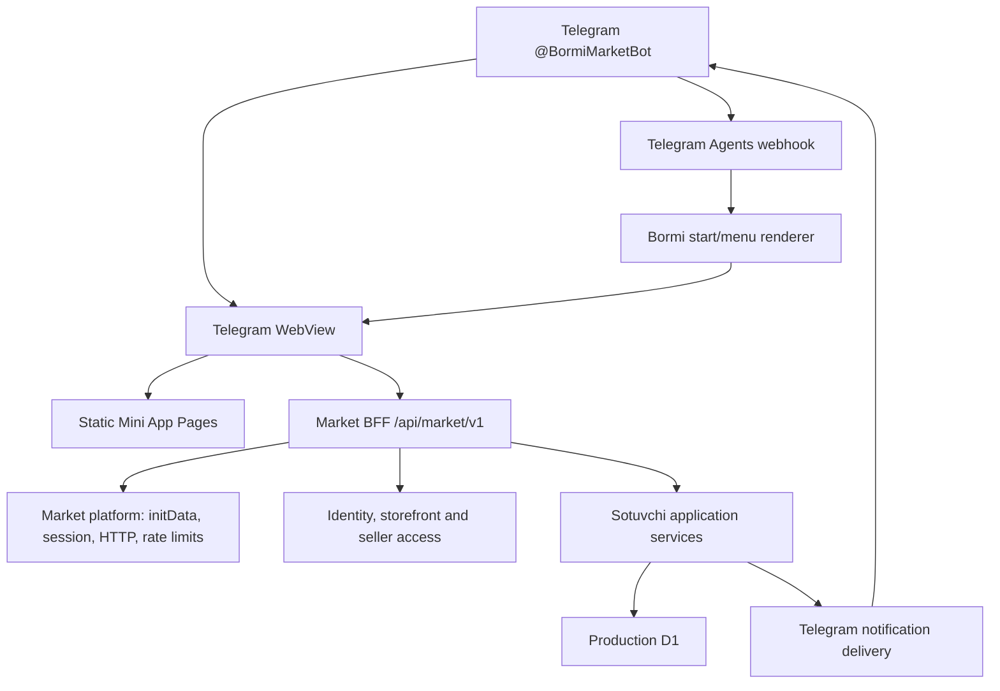
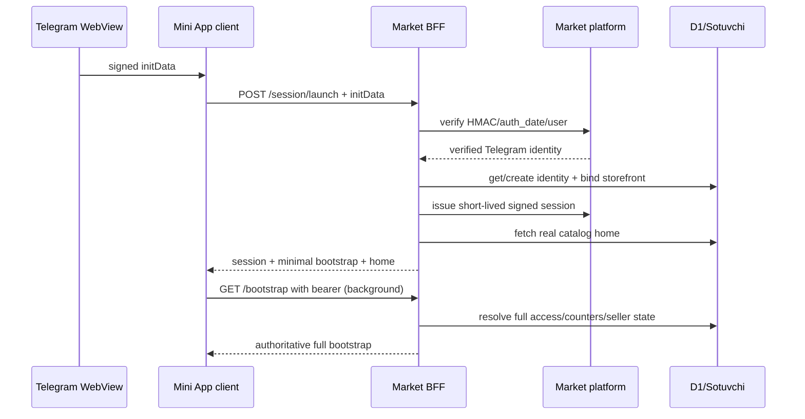
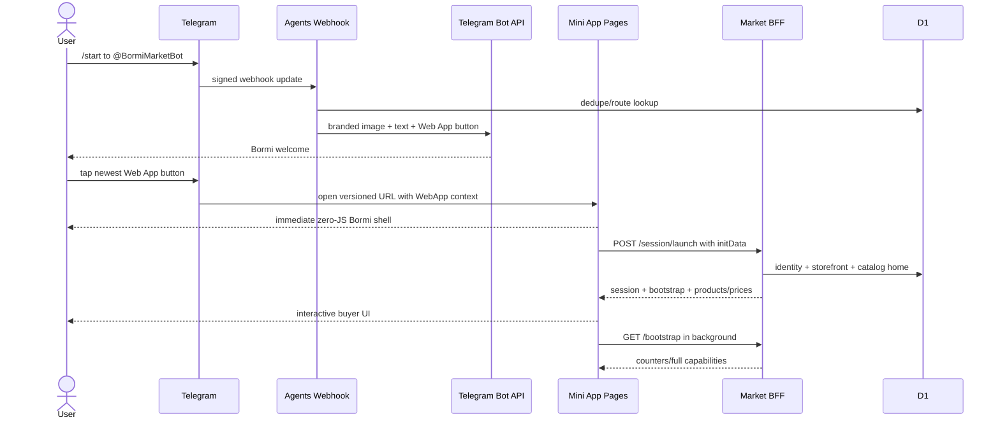
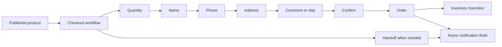

# Bormi Market / Telegram Mini App — максимально подробный handoff

> Снимок состояния: 2026-08-02
> Назначение: передать проект следующему production-агенту без повторного
> исследования репозитория, инфраструктуры, Telegram-cutover и текущего инцидента.
> Кодовая production-база этого handoff: `d47d99891006b0fe33994f9b8c101d14aaa4f115`.
> Ветка production-кандидата: `feature/gptbot-market-mini-app-synthetic-candidate`.
> Текущий рабочий worktree автора handoff: `F:\Claude\gptbot-bormi-api-fix`.
>
> **Дополнение 2026-08-02 (после этого снимка):** в том же worktree поверх
> `d47d998` реализован голосовой поиск Bormi. Он не развёрнут. Разделы 8.6/8.7
> (API map) и 20 (gaps) дополняются документом
> `mini-app/implementation/BORMI_VOICE_SEARCH_RELEASE.md`; kill switch —
> `MARKET_VOICE_SEARCH_ENABLED`. Открытый v8 launch-инцидент этим изменением не
> закрыт и остаётся первым приоритетом.

---

## 0. Как пользоваться этим документом

Этот файл — операционный supplement к основным governance-документам платформы.
Он не отменяет архитектурные решения и обязательный порядок чтения из
`AGENTS.md`, но содержит самый свежий Bormi/Telegram/Cloudflare контекст.

Новый агент должен:

1. Открыть именно `F:\Claude\gptbot-bormi-api-fix`.
2. Не начинать работу из другого worktree, пока не сверит SHA и upstream.
3. Прочитать разделы 1, 2, 3, 14, 16, 21 и 22 этого файла до любых изменений.
4. Затем прочитать документы в обязательном порядке:
   `STATE.json` → `HANDOFF.md` → `ARCHITECTURE.md` → `ROADMAP.md` →
   `CURRENT_STATE.md` → `KNOWN_ISSUES.md` → `TEST_MATRIX.md` → `DECISIONS.md`.
5. Считать production truth только то, что помечено здесь как проверенное.
6. Не повторять токены, не экспортировать secrets, не раскрывать пользовательские
   строки D1 и не запускать write-запросы к production D1 без явной необходимости.
7. Перед дальнейшим push/deploy получить новое явное разрешение владельца.

Если времени только одна минута, прочитайте следующий блок.

### One-minute brief

- Публичный бренд: **Bormi**.
- Бренд-механика: **Bormi? — Bor.**
- Telegram-бот: **`@BormiMarketBot`**.
- Старый бот: `@gptbot_market_bot`; он больше не является владельцем нового
  storefront route/session.
- Mini App: `https://gptbot-market-mini-app.pages.dev`.
- BFF/API: `https://gptbot.uz/api/market/v1`.
- Текущий код: `d47d998`.
- Последний Mini App production deployment:
  `49111efd-9b25-41b1-a31f-717c5c0c3e1a`.
- Последний root/BFF production deployment:
  `41a3d4de-cffb-4b2d-b1f8-9b1b650e5490`.
- Текущий Telegram Web App release marker:
  `bormi-fastpath-20260802-8`.
- Последнее исправление уже развернуто: session launch возвращает реальный
  каталог до вторичных account/seller counters, React больше не ждёт prefetch.
- **Незакрытый gate:** владелец ещё не подтвердил этот exact v8 build на
  реальном Android Telegram WebView после последнего deploy.
- Первый следующий шаг — не писать новый код, а провести свежий native canary:
  закрыть WebView → отправить новый `/start` в `@BormiMarketBot` → нажать самую
  новую кнопку → зафиксировать экран и время до появления интерактивного каталога.
- Если ошибка повторится, сначала доказать, на каком слое она возникает:
  document/asset → Telegram initData → `/session/launch` → D1 binding/access →
  React hydration/background `/bootstrap`.
- Не трогать lead bot `functions/api/telegram/webhook.ts` и его
  `TELEGRAM_BOT_TOKEN`.
- Не использовать секрет из старой переписки: ранее опубликованный token считается
  скомпрометированным. Текущий replacement хранится только как encrypted Pages
  secret `TELEGRAM_AGENTS_BOT_TOKEN`.

---

## 1. Точная live baseline

### 1.1 Git

На момент создания handoff:

```text
worktree: F:\Claude\gptbot-bormi-api-fix
local branch: fix/bormi-api-origin
HEAD: d47d99891006b0fe33994f9b8c101d14aaa4f115
origin/feature/gptbot-market-mini-app-synthetic-candidate:
  d47d99891006b0fe33994f9b8c101d14aaa4f115
origin/main:
  e2977d3d5c3103005aacb238806d81e8c6c11153
stash: empty
worktree before this documentation change: clean
git diff --check before this documentation change: PASS
git fsck --full: no structural corruption; only unreachable/dangling blobs
```

Важно: локальная ветка называется `fix/bormi-api-origin`, но её upstream/live
target — `origin/feature/gptbot-market-mini-app-synthetic-candidate`.

### 1.2 Static Mini App production

```text
Cloudflare Pages project: gptbot-market-mini-app
Canonical URL: https://gptbot-market-mini-app.pages.dev
Production branch: feature/gptbot-market-mini-app-synthetic-candidate
Deployment ID: 49111efd-9b25-41b1-a31f-717c5c0c3e1a
Deployment URL: https://49111efd.gptbot-market-mini-app.pages.dev
Source SHA: d47d998
Current hashed JS observed after deploy: /assets/index-CCA8aGcN.js
Previous rollback deployment: 9f7bec8a-3d0c-4892-a0d1-b9621797307c
Previous rollback source: 11b4875
```

Критически важно: для проекта `gptbot-market-mini-app` production branch —
**не `main`**. Команда с `--branch=main` создаёт Preview deployment. В ходе
расследования такой preview был случайно создан (`aee5abee...`), после чего
production был корректно развернут на feature-ветку. Не путать preview и
production при проверке результата.

### 1.3 Root/BFF production

```text
Cloudflare Pages project: ai-direct-pro-landing
Canonical URL: https://gptbot.uz
Production branch: main
Deployment ID: 41a3d4de-cffb-4b2d-b1f8-9b1b650e5490
Deployment URL: https://41a3d4de.ai-direct-pro-landing.pages.dev
Source SHA attached to deployment: d47d998
Previous rollback deployment: 3886fa85-1fff-4daf-9c21-52142d0f4e45
Previous rollback source: 11b4875
```

Root Pages project обслуживает не только Bormi. Любой его deploy потенциально
затрагивает основной SEO-сайт, admin, GPT chat, lead bot, Javob, Agents platform,
automation и Pages Functions. Поэтому root build и regression scope обязательны.

### 1.4 Проверенный HTTP baseline

После последнего release было проверено:

- canonical root `https://gptbot.uz` отвечает `200`;
- canonical static Mini App отвечает `200`;
- текущий hashed JS asset отвечает `200`;
- malformed/unauthorized Market launch возвращает контролируемый `400`, а не
  необработанный `500`;
- Telegram Agents webhook: `GET` возвращает `405`;
- Telegram Agents webhook: unauthorized `POST` возвращает `401`;
- публичные RU/UZ поверхности содержат имя `BormiMarketBot`.

Эти проверки подтверждают доступность маршрутов и защитные границы, но не
заменяют реальный Telegram initData canary.

### 1.5 Проверенный D1 baseline

Production D1:

```text
database name: gptbot-ai-drafts
database id: 97ef0372-d937-406f-8871-755368d9afff
binding: GPTBOT_DRAFTS_DB
```

Последний read-only снимок; каждый diagnostic statement завершался с
`rows_written=0`:

| Сущность | Количество |
|---|---:|
| Stores | 1 |
| Products | 48 |
| Orders | 1 |
| Order items | 1 |
| `sotuvchi_inventory_moves` | 44 |
| Handoffs | 1 |
| `sotuvchi_notifications` | 0 |
| Identities | 3 |
| `sotuvchi_storefront_sessions` для `bormimarketbot` | 2 |
| `telegram_agent_routes` для `bormimarketbot` | 1 |

Последний размер D1: `12,386,304` bytes.

Не считать старые документы с `orders=0` или `handoffs=0` актуальными: текущая
live truth — `orders=1`, `handoffs=1`. Вероятный источник — реальное действие
пользователя во время native проверки. Не читать содержимое этих записей без
необходимости и не удалять их как «тестовые».

---

## 2. Текущий открытый инцидент и точный следующий шаг

### 2.1 Что видел владелец

История симптомов на Android Telegram:

1. Mini App первоначально не запускался и показывал экран
   «Откройте внутри Telegram».
2. После исправления initData/origin запуск доходил до брендированного shell.
3. Через несколько секунд shell сменялся на
   «Магазин временно недоступен».
4. Кнопка «Повторить» в некоторых версиях визуально ничего не делала.
5. После ряда исправлений приложение открылось, но владелец сообщил о медленной
   загрузке цен и каталога.
6. Затем приложение снова зависало на статическом заполненном shell с двумя
   карточками и текстом «ПРОВЕРЯЕМ НАЛИЧИЕ».
7. После последующего релиза снова был репорт «магазин временно недоступен».
8. В ответ на это развернут `d47d998` / release marker v8. Реальный owner
   confirmation после exact v8 ещё не получен.

### 2.2 Что уже доказано

- Telegram действительно открывает canonical Mini App URL.
- Статический документ и assets доступны.
- Production storefront session rows обновлялись в момент владельческих запусков.
  Следовательно, по крайней мере часть цепочки Telegram initData → BFF → D1
  проходила успешно.
- Новый bot username привязан в `telegram_agent_routes` и storefront sessions.
- Текущий token работает для публичного профиля/menu mutations и webhook identity.
- Ошибка не сводится только к отсутствию JS или несуществующему deploy.
- `wrangler pages deployment tail` в этом проекте не дал надёжного request log:
  он не выводил события даже для валидных синтетических `400` probes. Нельзя
  писать в отчёте, будто отсутствие tail output доказывает отсутствие запроса.

### 2.3 Что изменил последний fast path

В `d47d998`:

- `/session/launch` сначала выдаёт session, minimal bootstrap и реальный catalog
  home;
- вторичные account counters/seller resolution больше не блокируют первый
  полезный экран;
- при launch `resolveMarketAccess(..., includeSeller=false)` пропускает seller
  resolution;
- полноценный `/bootstrap` запускается клиентом в фоне и позже уточняет права,
  counters и seller state;
- React Query bootstrap принудительно обновляется (`staleTime: 0`,
  `refetchOnMount: 'always'`);
- launch timeout ограничен 15 секундами;
- Telegram launch URL получил новый marker `bormi-fastpath-20260802-8`, чтобы
  Android открыл свежий WebView вместо закэшированного старого launch context.

### 2.4 Первый обязательный canary

Попросить владельца выполнить именно так:

1. Полностью закрыть текущий Mini App WebView крестиком.
2. Вернуться в `@BormiMarketBot`.
3. Отправить новый `/start`.
4. Нажать кнопку только из самого нового сообщения.
5. Засечь:
   - время до первого брендированного shell;
   - время до интерактивных карточек/цен;
   - меняется ли экран на error;
   - реагирует ли bottom navigation;
   - какой текст/экран появляется через 15–20 секунд.
6. Если есть ошибка, получить скриншот и локальное время до секунды.

Не просить нажимать старую кнопку: её URL может содержать старый release marker
и Telegram может восстановить старый WebView/session.

### 2.5 Если v8 снова падает

Диагностировать по слоям, а не делать очередной blind cache bump:

1. Проверить production deployment/asset IDs.
2. Проверить, обновился ли D1 session row для `bormimarketbot` в точное время
   owner launch; только read-only SQL.
3. Проверить ответ `/session/launch` в воспроизводимой подписанной dev-сессии,
   не раскрывая production token/initData.
4. Разделить ошибки:
   - initData/HMAC;
   - session issue/refresh;
   - storefront binding;
   - catalog home query;
   - background `/bootstrap`;
   - client rendering/service worker cache.
5. Добавить privacy-safe telemetry с `requestId`, route, status, duration и
   reason code. Не логировать initData, bearer token, username, телефон, адрес.
6. Только после доказательства причины менять код.

---

## 3. Git, ветки и worktrees

### 3.1 Текущие worktrees

```text
F:/Claude/gptbot-repo-clean-20260801
  d791487 [feature/gptbot-market-mini-app-synthetic-candidate]

F:/Claude/gptbot-bormi-api-fix
  d47d998 [fix/bormi-api-origin]

F:/Claude/gptbot-main-baseline-20260801
  a146413 (detached HEAD)
```

`F:/Claude/gptbot-repo-clean-20260801` визуально выглядит как canonical feature
worktree, но его локальная ветка отстаёт от remote production candidate. Не
продолжать работу там без fetch/reconciliation. Текущий полный Bormi fix находится
в `F:\Claude\gptbot-bormi-api-fix`.

### 3.2 Последовательность Bormi/Mini App commits

От старого baseline к текущему:

```text
fb3537a feat(market-app): accelerate launch and add demo catalog media
d4b345e docs(market): record launch performance release
e1101bc feat(market-app): rebrand Telegram experience to Bormi
aade84b docs(market): record Bormi production release
04a8957 fix(market): repair Telegram launch and branded start
b689c78 fix(market): route production app to BFF
8c156d9 fix(market): align BFF origin with CSP
ed52e15 fix(market): version Telegram launch URL
f1365c5 perf(market): accelerate launch and add bot avatar
bac6f6e chore(market): apply Bormi bot avatar
e5e99b9 chore(market): close avatar setup hook
a1ba706 fix(brand): align bot avatar with Bormi mark
54d32cd chore(market): apply exact Bormi mark avatar
76b9e83 chore(market): close exact avatar hook
9b3e5be perf(market): roll fast launch version
c106d6d feat(brand): polish Bormi bot profile
2a34b02 feat(telegram): stage BormiMarketBot cutover
5c9e004 chore(telegram): close BormiMarketBot cutover hook
64f0da1 docs(telegram): record BormiMarketBot production cutover
ba29234 fix(telegram): force fresh Mini App session after bot cutover
4f4bb7a perf(market): keep prices visible across fast launch
8831844 perf(telegram): open optimized Mini App in a fresh WebView
11b4875 fix(market): prevent Android launch shell from stalling
d47d998 perf(market): return catalog before secondary account data
```

Много `chore(... close hook)` commits намеренны: временные one-time hooks для
Bot API setup/metadata/avatar сначала выкатывались, выполняли idempotent mutation,
а затем удалялись, чтобы production runtime не повторял одноразовую настройку.

### 3.3 Git safety

Обязательные правила:

- не использовать `git reset --hard`;
- не использовать `git clean`;
- не force-push;
- не делать `git add .`;
- stage только точные файлы;
- не перетирать чужие/пользовательские изменения;
- перед коммитом: `git status --short`, `git diff --check`, targeted tests,
  secret scan;
- SHA production build фиксировать точно;
- push/deploy только после явного owner authorization на новый шаг.

---

## 4. Продукт, бренд и границы обещания

### 4.1 Public brand

```text
Name: Bormi
Mechanic: Bormi? — Bor.
Positioning: нужные товары прямо в Telegram
Primary locale: RU
Secondary locale: UZ
Primary surfaces: Telegram bot entry + Telegram Mini App
```

Визуальная идентичность:

- violet rounded-square mark;
- белая lowercase `b`;
- lime dot;
- без «наушников», лишних дуг или декоративных выступов;
- лёгкий warm/off-white фон;
- сильная чёрная типографика;
- violet как action/brand color;
- lime как короткий узнаваемый accent, не как массовая заливка UI.

### 4.2 Telegram identity

```text
Canonical bot: @BormiMarketBot
Public title: Bormi
Public description:
  Bormi? — Bor. Найдите, сравните и выберите товар прямо в Telegram.
Old bot: @gptbot_market_bot
```

Точный утверждённый avatar asset:

`apps/market-mini-app/public/assets/brand/bormi-bot-avatar.jpg`

Welcome artwork:

`apps/market-mini-app/public/assets/brand/bormi-telegram-welcome.webp`

### 4.3 Что продукт сейчас честно умеет

- открываться из Telegram bot/menu button;
- валидировать Telegram initData;
- привязывать Telegram identity к storefront session;
- показывать каталог/категории/поиск/карточки товара;
- сравнивать товары;
- поддерживать пошаговый checkout intent;
- создавать заказ в существующей Sotuvchi domain model;
- создавать handoff продавцу;
- давать серверно-определяемый seller mode доверенному owner;
- поддерживать RU/UZ и light/dark;
- работать с синтетическим demo catalog/media для investor review.

### 4.4 Чего нельзя утверждать

- payments не подключены;
- доставка Bormi не обещана;
- public marketplace launch не авторизован;
- synthetic catalog не является подтверждённым live assortment;
- synthetic изображения не подтверждают наличие товаров;
- real store onboarding ещё не пройден;
- stable p95 на реальных Android/iOS Telegram WebView не доказан;
- human VoiceOver/TalkBack certification не проведена;
- native Uzbek copy sign-off не завершён.

Demo assets должны оставаться явно synthetic. Нельзя добавлять вымышленные
ratings, reviews, seller promises, delivery dates или scarcity claims.

---

## 5. Репозиторий в целом

Это не отдельный маленький магазин, а modular monolith. Bormi живёт рядом с
другими production-продуктами.

Приблизительное число файлов по крупным каталогам без `node_modules`/`dist`:

| Каталог | Файлов | Назначение |
|---|---:|---|
| `apps` | 63 | Отдельные frontend-приложения, включая Market Mini App |
| `config` | 2 | Общая конфигурация |
| `content` | 251 | SEO/marketing content |
| `docs` | 189 | Governance, architecture, release evidence |
| `functions` | 384 | Cloudflare Pages Functions и domain/application code |
| `gptbot-audit` | 1212 | Audit artifacts/evidence |
| `migrations` | 30 | D1 schema migrations |
| `public` | 513 | Root-site public assets |
| `reports` | 23 | Generated/curated reports |
| `scripts` | 54 | Build, SEO, audit, migration, candidate tooling |
| `src` | 135 | Root React application |
| `tests` | 55 | Root/server contract and regression tests |
| `workers` | 1 | Automation worker area |

Продукты внутри root:

- SEO/marketing site;
- admin/control center;
- GPT chat/backend;
- legacy/main lead Telegram bot;
- Javob;
- Agents platform;
- first-party automation;
- Sotuvchi commerce domains;
- Bormi Market Mini App и BFF.

Следствие: изменение root `functions`, `wrangler.toml`, shared `Env`, общих
channel/platform modules или root build может иметь cross-product impact.

---

## 6. Архитектурная модель и dependency laws

### 6.1 Упрощённая схема



### 6.2 Основные слои

1. **Channel adapters** — Telegram webhook/API/render/deep-link.
2. **Mini App client** — React/Vite, Telegram bridge, UI state.
3. **Market platform** — auth/session/CORS/rate limits/media handles.
4. **Market application/BFF** — route orchestration, DTOs, access composition.
5. **Sotuvchi domains** — catalog, checkout, orders, inventory, handoff и т.д.
6. **Storage/infrastructure** — D1, KV, Queue, Cloudflare Pages/Workers.

### 6.3 Законы, которые нельзя нарушать

- UI/channel не определяют seller authority.
- Seller role вычисляется сервером из identity/org/store ownership.
- Domain services не должны зависеть от React/Telegram WebView.
- Telegram input нельзя считать доверенным до HMAC verification.
- Tenant/org/store context обязателен для commerce reads/writes.
- Mutating commands требуют idempotency key.
- State transitions и version conflicts проверяются доменом/сервером.
- Ответы о товаре grounded в catalog truth; нельзя синтезировать несуществующий
  товар или цену.
- Side effects/notifications не должны блокировать пользовательский critical path.
- Секреты и PII не должны попадать в logs, docs, analytics или exception bodies.
- Schema migrations additive; destructive migration требует отдельного плана.

---

## 7. Mini App client

### 7.1 Расположение

```text
apps/market-mini-app/
├── index.html
├── package.json
├── public/
│   ├── _headers
│   ├── sw.js
│   └── assets/
│       ├── brand/
│       └── catalog-demo/
├── scripts/
│   └── sign-init-data.ts
├── src/
│   ├── App.tsx
│   ├── main.tsx
│   ├── styles.css
│   ├── types.ts
│   ├── components/ui.tsx
│   ├── dev/synthetic.ts
│   ├── lib/api.ts
│   ├── lib/demo-product-media.ts
│   ├── lib/i18n.ts
│   ├── platform/telegram.ts
│   └── screens/
│       ├── BuyerApp.tsx
│       └── SellerApp.tsx
└── test/
```

### 7.2 `index.html`

`index.html` содержит настоящий zero-JS first paint, а не пустой root:

- Bormi header и mark;
- hero «Bormi? — Bor.»;
- две заполненные карточки demo товаров;
- видимые цены;
- понятный статус подключения каталога.

Это сделано, чтобы пользователь сразу видел бренд/товары, пока загружается
React. Telegram bridge подключён `async`, чтобы внешний script не блокировал
первый paint.

Не удалять static shell без замены на столь же быстрый first paint. При изменении
React markup синхронизировать shell, чтобы hydration/transition не выглядели как
скачок в другой продукт.

### 7.3 `src/main.tsx`

После `11b4875` React монтируется немедленно. Старый prefetch gate мог оставить
Android на статическом shell навсегда, если network promise зависал. Prefetch не
должен блокировать `createRoot(...).render(...)`.

### 7.4 `src/lib/api.ts`

Ключевые свойства:

- production API base: `https://gptbot.uz/api/market/v1`;
- Telegram raw initData отправляется только на session exchange/launch;
- issued bearer session хранится только в memory;
- session token не сохраняется в localStorage;
- requests имеют bounded timeout;
- launch timeout: 15 секунд;
- launch query работает с `networkMode: 'always'`;
- ошибки нормализуются в контролируемые client states.

Любые изменения auth должны сохранять следующее:

- не логировать initData;
- не класть bearer в URL;
- не делать session token persistent;
- не принимать `initDataUnsafe` как доказательство подлинности;
- locale может быть RU/UZ, но authority не приходит с клиента.

### 7.5 `src/App.tsx`

Ответственность:

- Telegram/synthetic platform bootstrap;
- launch session;
- QueryClient и background `/bootstrap`;
- role/locale/theme selection;
- buyer/seller routing;
- global error/retry states.

После `d47d998` первый meaningful catalog приходит из `/session/launch`, а
полный bootstrap refetch идёт в фоне с `staleTime: 0` и
`refetchOnMount: 'always'`.

### 7.6 Buyer/Seller split

- `BuyerApp.tsx` — основной public path: home, search, category, product,
  comparison, checkout, orders, handoff.
- `SellerApp.tsx` — seller dashboard/catalog/inventory/orders/handoffs.
- Seller UI lazy-loaded, чтобы buyer bundle/launch не платил за seller code.
- Наличие seller UI на клиенте не предоставляет seller access.

### 7.7 Telegram platform adapter

`src/platform/telegram.ts`:

- читает Telegram WebApp context;
- вызывает ready/expand и интегрирует theme/safe-area;
- предоставляет haptics/back button/main button abstractions;
- отличает реальный Telegram от dev/synthetic mode;
- не должен выдавать synthetic mode в production при отсутствующем initData.

### 7.8 Service worker и cache policy

Текущий cache namespace: `bormi-shell-v6`.

Policy:

- document/navigation — network-first с shell fallback;
- local immutable assets — cache-first;
- `/index.html` — `no-store`;
- `/sw.js` — `no-cache`;
- `/assets/*` — `public, max-age=31536000, immutable`;
- cache precache включает Bormi mark/welcome/avatar и две first-paint product
  images.

При новом shell несовместимом со старым обязательно bump cache name. Один только
release query marker не заменяет корректную service worker cache migration.

### 7.9 CSP и headers

`public/_headers` разрешает:

- scripts: self + `https://telegram.org`;
- connect: self + `https://gptbot.uz`;
- frames: Telegram web domains;
- images: self/blob/data;
- запрещает object, camera, microphone, geolocation, payment, usb;
- `noindex, nofollow` для Mini App.

Если BFF origin меняется, нужно одновременно обновить:

1. client API base;
2. `_headers` `connect-src`;
3. root `MARKET_MINI_APP_ORIGINS`;
4. tests и release evidence.

### 7.10 Bundle snapshot

Последний проверенный Mini App production build:

```text
HTML: 4.93 kB, gzip 2.13 kB
CSS: 25.01 kB, gzip 6.12 kB
lazy Seller chunk: 15.26 kB, gzip 3.62 kB
main JS: 271.01 kB, gzip 84.25 kB
```

---

## 8. Market BFF/API

### 8.1 Entry point

```text
functions/api/market/v1/[[path]].ts
```

Pages Function делегирует request, env и `waitUntil` в Market handler.

### 8.2 Основные файлы

| Файл | Ответственность |
|---|---|
| `functions/market/router.ts` | HTTP routes, orchestration, DTO, error mapping |
| `functions/market/access.ts` | launch binding, buyer/seller access context |
| `functions/market/composition.ts` | wiring Sotuvchi application services |
| `functions/market/menu.ts` | versioned Web App URL и guarded menu sync |
| `functions/market/index.ts` | public exports |
| `functions/platform/market/init-data.ts` | Telegram HMAC verification |
| `functions/platform/market/session.ts` | signed short-lived Market session |
| `functions/platform/market/http.ts` | JSON, errors, CORS/origin, request IDs |
| `functions/platform/market/rate-limit.ts` | bounded per-route protection |
| `functions/platform/market/media.ts` | signed media handles/proxy |

### 8.3 Configuration gates

Market fail-closed зависит от:

- `GPTBOT_DRAFTS_DB` binding;
- `TELEGRAM_AGENTS_BOT_TOKEN` secret;
- `TELEGRAM_AGENTS_BOT_USERNAME` var;
- `MARKET_MINI_APP_SESSION_SECRET` secret;
- `MARKET_MINI_APP_ENABLED`;
- `MARKET_MINI_APP_BUYER_ENABLED`;
- `MARKET_MINI_APP_SELLER_READS_ENABLED`;
- `MARKET_MINI_APP_SELLER_COMMANDS_ENABLED`;
- `MARKET_MINI_APP_ORIGINS`.

### 8.4 Session lifecycle



Endpoints:

- `POST /session/launch` — preferred combined fast path;
- `POST /session/exchange` — session without launch payload;
- `POST /session/refresh` — re-verifies current claims against fresh initData;
- `POST /session/locale` — RU/UZ change, idempotency required;
- `DELETE /session` — client-side logical close; session is stateless/signed.

### 8.5 Launch security

`/session/launch`:

1. limits JSON body;
2. extracts only `initData`/`init_data` string;
3. rate-limits by IP + bounded suffix fingerprint;
4. verifies Telegram HMAC using current Agents bot token;
5. get-or-create identity by Telegram subject;
6. binds storefront via exact bot username;
7. issues signed short-lived Market token;
8. resolves buyer access;
9. returns real catalog home.

Нельзя подменять эту схему доверенным client user ID или username.

### 8.6 Read API map

Все routes ниже требуют bearer session, кроме session exchange/launch:

| Method | Route | Назначение |
|---|---|---|
| GET | `/me` | locale, capabilities, storefront, seller store |
| GET | `/bootstrap` | полный authoritative bootstrap |
| GET | `/catalog/home` | home categories/products |
| GET | `/catalog/categories` | категории |
| GET | `/catalog/categories/:id/products` | товары категории |
| GET | `/catalog/products?q=...` | list/search/filter availability |
| GET | `/catalog/products/:id` | product detail |
| GET | `/comparison` | current comparison |
| GET | `/checkout/active` | active checkout |
| GET | `/orders` | последние buyer orders |
| GET | `/orders/:id` | buyer order detail |
| GET | `/handoffs/active` | active buyer handoff |
| GET | `/media/:handle` | verified/proxied Telegram media |
| GET | `/seller/dashboard` | seller store/stats/orders/handoffs |
| GET | `/seller/stats` | seller stats |
| GET | `/seller/orders` | seller orders |
| GET | `/seller/orders/:id` | seller order detail |
| GET | `/seller/handoffs` | seller handoffs |
| GET | `/seller/handoffs/:id` | handoff detail |
| GET | `/seller/products` | seller products |
| GET | `/seller/products/:id` | product + inventory |
| GET | `/seller/categories` | seller categories |
| GET | `/seller/inventory` | inventory list |

Search/presentation analytics failures are intentionally caught and kept off the
critical response path.

### 8.7 Buyer command API map

Все mutating commands требуют `Idempotency-Key`:

| Method | Route | Назначение |
|---|---|---|
| POST | `/comparison/items` | добавить товар |
| DELETE | `/comparison/items/:id` | убрать товар |
| DELETE | `/comparison` | очистить сравнение |
| POST | `/checkout` | начать checkout |
| POST | `/checkout/quantity` | количество |
| POST | `/checkout/name` | имя |
| POST | `/checkout/phone` | телефон |
| POST | `/checkout/address` | адрес |
| POST | `/checkout/comment` | комментарий |
| POST | `/checkout/comment/skip` | пропустить комментарий |
| POST | `/checkout/confirm` | подтвердить checkout/order |
| POST | `/checkout/cancel` | отменить checkout |
| POST | `/handoffs` | запросить связь с продавцом |

Notification flush после confirm/handoff выполняется через `waitUntil` и не
должен задерживать HTTP response.

### 8.8 Seller command API map

Seller mutations требуют одновременно:

- server-derived seller org/store;
- exact flag `MARKET_MINI_APP_SELLER_COMMANDS_ENABLED=true`;
- `Idempotency-Key`;
- version check там, где есть optimistic concurrency.

Routes:

| Method | Route | Назначение |
|---|---|---|
| POST | `/seller/orders/:id/confirm` | подтвердить order |
| POST | `/seller/orders/:id/cancel` | отменить order |
| POST | `/seller/orders/:id/done` | завершить order |
| POST | `/seller/handoffs/:id/reply` | начать/отправить reply |
| PUT | `/seller/inventory/:productId` | set on-hand |
| POST | `/seller/categories` | создать category |
| PATCH | `/seller/categories/:id` | изменить category |
| POST | `/seller/products` | создать product |
| PATCH | `/seller/products/:id` | изменить product |
| POST | `/seller/products/:id/publish` | publish |
| POST | `/seller/products/:id/unpublish` | unpublish |
| POST | `/seller/products/:id/archive` | archive |

Order/handoff/product version mismatch возвращает controlled `409`.

### 8.9 Error contract

Ожидаемые категории:

- `validation_failed` → 400;
- invalid Telegram/session → 401;
- seller forbidden → 403;
- missing resource → 404;
- version/state conflict → 409;
- rate limited → 429;
- feature/binding unavailable → 503;
- unknown internal → sanitized 500.

Client copy «Магазин временно недоступен» агрегирует несколько server/network
категорий. Для следующего инцидента важно сохранить reason code/request ID в
privacy-safe telemetry, иначе UI-строка недостаточна для root cause.

---

## 9. Telegram entry experience и bot runtime

### 9.1 Webhook entry

```text
functions/api/telegram/agents.ts
functions/api/telegram/agents-schema.ts
```

Это отдельный Telegram Agents bot namespace. Не путать с lead bot:

```text
functions/api/telegram/webhook.ts
```

Lead bot и `TELEGRAM_BOT_TOKEN` не менялись в рамках Bormi cutover и не должны
использоваться для Market.

### 9.2 Telegram channel modules

`functions/channels/telegram/` содержит:

- `api.ts` — Bot API client;
- `addresses.ts` — delivery address mapping;
- `deep-link.ts` — Telegram launch/deep links;
- `identity.ts` — bot/user identity normalization;
- `ingest.ts` — update ingestion;
- `metadata.ts` — commands/name/about/menu metadata;
- `rate-limit.ts` — channel protection;
- `render.ts` — messages/buttons/cards;
- `schema.ts` — update contracts;
- `setup.ts` — webhook/setup helpers;
- `store.ts` — Telegram update/route persistence;
- `webhook.ts` — channel orchestration.

### 9.3 `/start` behavior

Новый `/start` должен:

- выдавать Bormi-branded welcome;
- использовать firm welcome image;
- содержать native Web App button;
- не запускать старую анкету «Как вас зовут?» для Market entry;
- использовать versioned URL из `resolveMarketWebAppUrl`;
- оставаться честным по availability/payment/delivery.

### 9.4 Menu sync

`functions/market/menu.ts`:

- current release marker: `bormi-fastpath-20260802-8`;
- строит canonical Web App URL с version query;
- перед metadata/menu mutation вызывает `getMe`;
- продолжает sync только если exact username совпадает с
  `BormiMarketBot`;
- TTL sync interval — один час;
- sync запускается Telegram webhook path, а не Market session API.

Перенос sync из Market session path был performance fix: пользовательский launch
не должен ждать Bot API metadata maintenance.

### 9.5 One-time setup hooks

Cutover использовал временный idempotent hook:

- `2a34b02` — staging setup нового webhook/menu/avatar/metadata;
- production runtime выполнил настройку;
- `5c9e004` — hook удалён/закрыт.

Avatar аналогично проходил серию apply/cleanup commits. Не возвращать one-time
mutation в постоянный hot path.

### 9.6 BotFather-only элементы

Bot API не покрывает всё. Вручную через BotFather владелец должен управлять:

- Description Picture;
- Privacy Policy URL;
- при необходимости username/support request.

Рекомендованный privacy URL:

`https://gptbot.uz/ru/politika-konfidentsialnosti/`

---

## 10. Sotuvchi domain layer

Расположение:

```text
functions/agents/sotuvchi/
```

### 10.1 Domain map

| Поддомен | Назначение |
|---|---|
| `analytics` | Privacy-aware events/metrics |
| `buyer` | Buyer intents, grounded QA, cards/responses |
| `catalog` | Categories/products/search/publish lifecycle |
| `checkout` | Buyer checkout workflow/history/validation |
| `delivery` | Notification dispatch to Telegram |
| `experience` | UX copy/budget/rules |
| `handoff` | Buyer-to-seller handoff workflow/replies |
| `inventory` | Inventory types/rules/validation |
| `onboarding` | Store owner onboarding workflow |
| `orders` | Order lifecycle and inventory effects |
| `outbox` | Reliable side-effect schema |
| `stats` | Owner/seller statistics |

Обычно каждый богатый поддомен разделён на `types`, `schema`, `validation`,
`rules`, `store`, `service`, `tools`, `facts`, `responses`, `errors`, `index`.
Сохранять это разделение: SQL не должен расползаться в React/router, а transport
copy — в domain rules.

### 10.2 Commerce invariants

- Product price хранится/передаётся как integer UZS, без float rounding.
- Buyer видит только published/allowed products своего storefront.
- Store/org context нельзя подменить из body/query.
- Order confirmation decrement inventory выполняется один раз при повторном
  idempotency key.
- Inventory не уходит в отрицательное значение.
- Invalid order transitions отклоняются.
- Handoff reply доступен правильному seller org.
- Stats — owner/seller only.
- Analytics не хранит raw buyer PII.
- Seller UI и Telegram wording не предоставляют authority.

---

## 11. D1 schema и migrations

### 11.1 Migration chain

```text
0001 ai_drafts
0002 seo_autopilot_jobs
0003 seo_autopilot_control_center
0004 intent_guard
0005 llm_router
0006 yandex
0007 indexnow
0008 gpt_chat
0009 telegram_assistant
0010 javob_billing
0011 telegram_voice_reply
0012 voice_analysis
0013 platform_events
0014 platform_identity_orgs
0015 platform_knowledge
0016 platform_workflow
0017 telegram_agents_transport
0018 sotuvchi_store_onboarding
0019 sotuvchi_catalog
0020 sotuvchi_buyer_qa
0021 sotuvchi_checkout
0022 sotuvchi_orders_inventory
0023 sotuvchi_handoff
0024 first_party_automation
0025 owner_control_center_audit
0026 market_buyer_experience
0027 market_catalog_quality
0028 market_product_comparison
0029 market_checkout_comment
0030 market_telegram_reliability
```

### 11.2 Bot cutover data migration

Перед cutover был создан полный D1 backup:

```text
F:\Claude\gptbot-bormi-migration-backups\
  20260802-new-bot-cutover-c106d6d\
  gptbot-ai-drafts-before-bormimarketbot.sql
```

Evidence:

```text
bytes: 10,767,726
SHA-256: AF4CAB56387E3D1DB2BE4E12E95BBF662DA1D53F0E0950279F456C8061CCC875
in-memory restore: PASS
PRAGMA integrity_check: ok
tables in restored backup: 73
```

Логически изменены только две bot ownership references old → new:

1. одна `telegram_agent_routes.bot_username`;
2. одна `sotuvchi_storefront_sessions.bot_username`.

Исторические updates/metrics сохранили старую attribution. Cloudflare D1 metadata
мог показывать больше indexed physical writes, но logical rows changed = 2.

### 11.3 Data safety

При диагностике:

- сначала только aggregate counts;
- использовать `--remote` осознанно;
- проверять metadata `rows_written=0`;
- не выводить raw identity/user/order/handoff rows в чат;
- не «чистить тестовые данные» по догадке;
- до любой write migration создать backup и checksum;
- после write сравнить domain counts/invariants before/after;
- schema changes только через additive migration file.

---

## 12. Secrets и security boundary

### 12.1 Критическое предупреждение

Первый token нового бота был однажды вставлен владельцем в чат. Он считается
скомпрометированным и не должен повторяться, использоваться или попадать в этот
handoff. Владельцу было сказано выполнить `/revoke`.

Replacement token владелец ввёл сам в видимый terminal prompt команды:

```powershell
npx wrangler pages secret put TELEGRAM_AGENTS_BOT_TOKEN `
  --project-name ai-direct-pro-landing
```

Ни token, ни его части не экспортировались в docs. Secret list подтверждает
наличие encrypted secret. Публичные Bot API mutations/profile подтверждали, что
production использовал валидный current token.

### 12.2 Secret names в root Pages

Проверенный список имён encrypted secrets включает:

- `ADMIN_EMAIL`;
- `ADMIN_PASSWORD_HASH`;
- `CEREBRAS_API_KEY`;
- `CF_AI_MODEL`;
- `CRON_SECRET`;
- `GEMINI_API_KEY`;
- `GITHUB_TOKEN`;
- `GROQ_API_KEY`;
- `INDEXNOW_KEY`;
- `JWT_SECRET`;
- `MARKET_MINI_APP_SESSION_SECRET`;
- `MISTRAL_API_KEY`;
- `OPENROUTER_API_KEY`;
- `OPENROUTER_MODEL_ARTICLE`;
- `OPENROUTER_MODEL_JUDGE`;
- `OPENROUTER_MODEL_OPTIMIZER`;
- `OPENROUTER_MODEL_RETARGET`;
- `OPENROUTER_MODEL_UZ`;
- `OPENROUTER_TIMEOUT_MS`;
- `SERPER_API_KEY`;
- `TELEGRAM_AGENTS_BOT_TOKEN`;
- `TELEGRAM_AGENTS_WEBHOOK_SECRET`;
- `TELEGRAM_ASSISTANT_BOT_TOKEN`;
- `TELEGRAM_ASSISTANT_BOT_USERNAME`;
- `TELEGRAM_ASSISTANT_WEBHOOK_SECRET`;
- `TELEGRAM_BOT_TOKEN`;
- `TELEGRAM_WEBHOOK_SECRET`;
- `VITE_TELEGRAM_BOT_USERNAME`;
- `YANDEX_SEARCH_API_KEY`;
- legacy secret с именем `___`.

Значения encrypted и не должны читаться/печататься. Legacy `___` не удалять без
owner-led cleanup и impact analysis.

### 12.3 `wrangler.toml` — authoritative non-secret config

Direct `wrangler pages deploy` заменяет dashboard-only plain vars/bindings тем,
что объявлено в `wrangler.toml`. Поэтому все production non-secret bindings и
vars должны быть committed там.

Текущие bindings:

```text
D1 GPTBOT_DRAFTS_DB -> gptbot-ai-drafts
KV LOGIN_ATTEMPTS -> c5e30ccbfcbe43f0b22a027b38c225f4
Workers AI -> AI
Queue producer AUTOMATION_QUEUE -> gptbot-automation
```

Текущие relevant vars:

```text
FIRST_PARTY_AUTOMATION_ENABLED=true
TELEGRAM_AGENTS_BOT_USERNAME=BormiMarketBot
MARKET_MINI_APP_ENABLED=true
MARKET_MINI_APP_BUYER_ENABLED=true
MARKET_MINI_APP_SELLER_READS_ENABLED=true
MARKET_MINI_APP_SELLER_COMMANDS_ENABLED=true
MARKET_MINI_APP_ORIGINS=https://gptbot-market-mini-app.pages.dev
MARKET_MINI_APP_URL=https://gptbot-market-mini-app.pages.dev
MARKET_MINI_APP_BUILD_ID=telegram-review-20260802
```

---

## 13. Хронология расследования и исправлений

### 13.1 Initial Telegram launch

- Исправлен branded `/start`.
- Market button перестал вести в старый GPTBot Market flow.
- Выделен Bormi welcome image.
- Исправлен production app → BFF route.
- BFF origin согласован с Mini App CSP.
- Launch URL versioned для обхода Telegram WebView cache.

### 13.2 Avatar/profile

- Сгенерирован Bormi avatar.
- Первая версия была отклонена владельцем как визуально отличающаяся.
- Убраны выступающие «наушники»/дуги.
- Финальная версия: только белая `b` + lime dot на violet square.
- One-time avatar hook после успешного применения удалён.
- Профиль Bormi/about/description/commands приведён к фирменному виду.

### 13.3 New bot cutover

- Создан `@BormiMarketBot`.
- Скомпрометированный paste-token не сохранён.
- Replacement token введён в encrypted Pages secret.
- Webhook/menu/profile настроены на новом bot identity.
- D1 route и storefront session ownership перенесены old → new.
- Перед write сделан и проверен backup.
- Runtime setup hook закрыт после cutover.

### 13.4 Android stale WebView

`ba29234` добавил новый marker после bot identity cutover, потому что Android
Telegram мог восстанавливать WebView/initData, подписанный старым bot context.

### 13.5 First-paint performance

`4f4bb7a`:

- Telegram bridge стал async;
- static catalog shell оставлен видимым;
- menu sync убран из session critical path;
- лишняя launch verification/store lookup сокращена.

`8831844`:

- новый release marker принудил fresh WebView для optimized build.

`11b4875`:

- удалён blocking prefetch gate;
- React mounts immediately;
- request timeout bounded;
- launch query `networkMode: always`.

`d47d998`:

- launch response возвращает session + real catalog раньше вторичных данных;
- seller resolution пропускается в launch;
- full bootstrap выполняется background;
- release marker обновлён до v8.

---

## 14. Cloudflare deploy topology и команды

### 14.1 Root/BFF build/deploy

Из repo root:

```powershell
npm run build
```

После явного owner authorization:

```powershell
$releaseSha = git rev-parse HEAD
npx wrangler pages deploy dist `
  --project-name=ai-direct-pro-landing `
  --branch=main `
  --commit-dirty=true `
  --commit-hash=$releaseSha `
  --commit-message="<точное сообщение>"
```

`--commit-dirty=true` применялся потому, что deploy может происходить из
отдельного release worktree; это не разрешение выкатывать непроверенные changes.
Сначала `git status --short` и exact diff.

### 14.2 Static Mini App build/deploy

```powershell
Set-Location F:\Claude\gptbot-bormi-api-fix\apps\market-mini-app
npm run build
```

После явного owner authorization:

```powershell
$releaseSha = git rev-parse HEAD
npx wrangler pages deploy dist `
  --project-name=gptbot-market-mini-app `
  --branch=feature/gptbot-market-mini-app-synthetic-candidate `
  --commit-dirty=true `
  --commit-hash=$releaseSha `
  --commit-message="<точное сообщение>"
```

Нельзя подставлять `--branch=main` для static project: это Preview.

### 14.3 Post-deploy evidence

После deploy зафиксировать:

1. deployment ID;
2. deployment URL;
3. canonical URL;
4. source SHA;
5. branch/environment = Production;
6. hashed asset URL и `200`;
7. root/static `200`;
8. controlled invalid launch status;
9. webhook `405/401` guards;
10. read-only D1 counts/`rows_written=0`;
11. owner native canary result;
12. rollback target.

Не объявлять production success только по CLI `deploy complete`.

### 14.4 Logs caveat

В этой сессии `wrangler pages deployment tail` не дал полезных событий даже для
запросов, которые точно дошли и вернули `400`. Считать tail best-effort, а не
источником отрицательного доказательства. Для устойчивой диагностики нужен
privacy-safe application telemetry/request correlation.

---

## 15. Build, tests и quality evidence

### 15.1 Последний targeted server suite

На `d47d998`:

```text
165/165 PASS
```

Scope включал Market auth/contract, Telegram webhook, buyer QA и checkout.

### 15.2 Mini App

```text
Mini App tests: 5/5 PASS
Mini App typecheck: PASS
Mini App production build: PASS
```

### 15.3 Root quality

```text
functions TypeScript: PASS
scoped ESLint: PASS
secret scan: 2966 files PASS
earlier full root production build: PASS
```

Последний полный build evidence:

- 113 SEO pages;
- 124 articles;
- sitemap 240;
- TypeScript/Vite/prerender successful.

Предыдущий broader migration/domain suite: `208/208 PASS`.

### 15.4 Основные команды

```powershell
# Market server contracts
node --import tsx --test `
  tests/market-mini-app-auth.test.ts `
  tests/market-mini-app-contract.test.ts

# Mini App
Set-Location apps/market-mini-app
npm run typecheck
npm test
npm run build

# Root secret scan
Set-Location F:\Claude\gptbot-bormi-api-fix
npm run scan:secrets

# Root build
npm run build
```

Перед запуском уточнить exact test files через `rg --files tests | rg
'market|telegram|sotuvchi|checkout'`; не полагаться только на сокращённый пример.

---

## 16. End-to-end request flows

### 16.1 `/start` → каталог



### 16.2 Checkout/order/handoff



Каждый mutation должен иметь idempotency key. Seller status transitions также
используют expected version.

---

## 17. Design skills, methods и assets

Rebrand stage был выполнен с установленными owner-requested skills.

### 17.1 UX/UI skill

Основной skill:

```text
C:\Users\Borinio\.codex\skills\ui-ux-pro-max\SKILL.md
```

Связанные references/quick rules и созданная Bormi design system:

```text
design-system/bormi/MASTER.md
design-system/bormi/ADAPTATION.md
```

Применённые методы:

- brand hierarchy и position-first hero;
- mobile marketplace information architecture;
- attention hierarchy и visual rhythm;
- product-card scanability;
- thumb-reachable bottom navigation;
- conversion-safe progressive disclosure;
- accessible contrast/focus/touch targets;
- RU/UZ expansion-aware layouts;
- Telegram safe area/light/dark behavior;
- screenshot visual QA;
- removal of generic/cheap dashboard feel.

### 17.2 21st skills

```text
C:\Users\Borinio\.codex\skills\21st-ai\SKILL.md
C:\Users\Borinio\.codex\skills\21st-cli-use\SKILL.md
C:\Users\Borinio\.codex\skills\21st-design-sync\SKILL.md
C:\Users\Borinio\.codex\skills\21st-registry\SKILL.md
```

Patterns, адаптированные под Bormi:

- premium search field;
- compact filter chips;
- mobile product cards;
- product detail hierarchy;
- comparison tray;
- bottom sheets/dialog patterns;
- skeleton/filled launch shell;
- empty/error states;
- sticky checkout actions;
- status timeline;
- compact seller dashboard.

Отклонено:

- generic shadcn dashboard shell;
- desktop-first sidebars;
- heavy data tables on buyer path;
- decorative motion before content;
- massive component imports;
- inaccessible glassmorphism/low contrast;
- patterns, которые дублируют Telegram chrome;
- механическое копирование 21.dev без product rationale.

Полный rebrand evidence:

`docs/agents-platform/mini-app/implementation/BORMI_REBRAND_RELEASE.md`

Исторически требовавшиеся release flags:

```text
UX_UI_SKILL_USED=YES
21_DEV_SKILL_USED=YES
```

### 17.3 Assets

- точный bot avatar:
  `apps/market-mini-app/public/assets/brand/bormi-bot-avatar.jpg`;
- welcome:
  `apps/market-mini-app/public/assets/brand/bormi-telegram-welcome.webp`;
- Bormi mark:
  `apps/market-mini-app/public/assets/brand/bormi-mark.svg`;
- synthetic product media:
  `apps/market-mini-app/public/assets/catalog-demo/`.

Всего подготовлено 12 synthetic WebP product images. Четыре Bormi/investor
images были добавлены поверх первоначальных восьми. Все должны оставаться
lightweight и честно demo-labeled.

---

## 18. Decision record index

Ключевые решения из `docs/agents-platform/DECISIONS.md`:

- `D-001` — modular monolith;
- `D-002` — source priority;
- `D-004` — production baseline;
- `D-005` — explicit deploy authorization;
- `D-006` — exact SHA/release identity;
- `D-009` — identity/org boundary;
- `D-014` — isolated Telegram Agents bot;
- `D-017`–`D-021` — Sotuvchi product domains;
- `D-026` — n8n retired from production path;
- `D-027` — `wrangler.toml` authoritative for non-secret bindings;
- `D-029` — schema contract;
- `D-030` — feedback/notification lifecycle off critical path;
- `D-031` — server-role-aware Telegram UX does not grant authority;
- `D-032` — evidence-bound naming/product promise;
- `D-033` — opaque Telegram `file_id` contract;
- `D-034` — synthetic proof is labeled, not success proof;
- `D-035` — automated a11y is not human certification;
- `D-036` — exact-SHA/data-neutral release;
- `D-037` — Mini App synthetic candidate reuses Sotuvchi truth;
- `D-038` — Telegram review uses isolated static hosting and existing secret
  boundary;
- `D-039` — Bormi replaces GPTBot Market as public consumer brand.

Не создавать новое решение, противоречащее этим ADR/decision entries, без
явного обновления decision log.

---

## 19. Governance docs и официальный roadmap

### 19.1 Обязательный порядок

```text
docs/agents-platform/STATE.json
docs/agents-platform/HANDOFF.md
docs/agents-platform/ARCHITECTURE.md
docs/agents-platform/ROADMAP.md
docs/agents-platform/CURRENT_STATE.md
docs/agents-platform/KNOWN_ISSUES.md
docs/agents-platform/TEST_MATRIX.md
docs/agents-platform/DECISIONS.md
```

### 19.2 Смысл документов

- `STATE.json` — machine-readable stage/release state; некоторые Bormi поля до
  этого handoff могли отставать от latest performance fixes.
- `HANDOFF.md` — основной platform handoff, шире Bormi.
- `ARCHITECTURE.md` — invariants, domains, runtime/tools/knowledge/conversation,
  storage, channels, debt/migration/risks.
- `ROADMAP.md` — R0/R1 и параллельный Mini App track.
- `CURRENT_STATE.md` — platform implementation status.
- `KNOWN_ISSUES.md` — открытые gaps и ограничения evidence.
- `TEST_MATRIX.md` — suites, canaries, expected evidence.
- `DECISIONS.md` — обязательные decisions/ADRs.

### 19.3 Official next stage

Официальный следующий product stage остаётся **Store Pilot #1**, но до него есть
операционный gate — owner native canary v8.

Store Pilot #1 требует внешних/owner inputs:

- один verified consenting seller;
- 10–30 approved real products;
- legal decision;
- native Uzbek sign-off;
- owners/SLA/support process;
- explicit one-store activation authorization.

Не подменять отсутствие этих inputs инженерным «публичным запуском».

---

## 20. Known gaps и риски

### P0 — до заявления «исправлено»

- Нет owner confirmation exact v8 на реальном Android Telegram.
- Нет надёжной request-level production telemetry для Market launch.
- Error screen агрегирует причины слишком широко.

### P1 — до pilot

- Real seller/catalog evidence отсутствует.
- Human accessibility pass не проведён.
- Native Uzbek copy sign-off отсутствует.
- Stable cold/warm latency distribution не измерена.
- Нет подтверждённого support/SLA процесса.

### P2 — технический долг

- Root project остаётся большим shared deployment blast radius.
- Direct-upload deployment зависит от дисциплины `wrangler.toml`.
- Telegram WebView cache требует версионирования и осторожной SW policy.
- Tail/log observability недостаточна.
- Legacy encrypted secret `___` требует отдельного owner-led audit.

### Не считать blocker автоматически

- dangling blobs из `git fsck` без corruption;
- отсутствие tail output само по себе;
- synthetic assets при условии явной маркировки;
- lazy Seller chunk на buyer path;
- старые D1 counts в historical docs.

---

## 21. Rollback и recovery

### 21.1 Static rollback

Текущий → предыдущий:

```text
current: 49111efd-9b25-41b1-a31f-717c5c0c3e1a / d47d998
rollback: 9f7bec8a-3d0c-4892-a0d1-b9621797307c / 11b4875
```

Перед rollback проверить, что проблема действительно появилась в `d47d998`,
потому что `11b4875` не содержит server fastpath и может вернуть прежнюю
медленную последовательность.

### 21.2 Root/BFF rollback

```text
current: 41a3d4de-cffb-4b2d-b1f8-9b1b650e5490 / d47d998
rollback: 3886fa85-1fff-4daf-9c21-52142d0f4e45 / 11b4875
```

Root rollback имеет cross-product blast radius. Проверить SEO/admin/other bot
compatibility и bindings. Не делать rollback только из-за client cache symptom.

### 21.3 D1 recovery

Cutover backup указан в разделе 11. Никогда не выполнять blind full restore в
production: после backup уже появились реальные order/handoff/session changes.
Recovery должен быть selective и основан на exact diff/current backup.

### 21.4 Bot recovery

- Не возвращать старый token.
- Не менять lead bot token/webhook.
- Перед `setWebhook`/menu mutations проверять exact `getMe` username.
- При смене token повторно установить encrypted secret и webhook с соответствующим
  webhook secret; не печатать значения.
- Проверить `getWebhookInfo`, pending count и last error без раскрытия secret URL.

---

## 22. Exact next-agent protocol

### Phase A — baseline, без mutations

```powershell
Set-Location F:\Claude\gptbot-bormi-api-fix
git fetch --all --prune
git branch --show-current
git rev-parse HEAD
git rev-parse origin/feature/gptbot-market-mini-app-synthetic-candidate
git rev-parse origin/main
git status --short
git log --oneline --decorate -30
git worktree list
git stash list
git diff --check
git fsck --full
```

Ожидание: source branch remote = `d47d998`, если после handoff никто не сделал
новый commit. Если SHA изменился, не сбрасывать: сначала прочитать новые commits.

### Phase B — native owner canary

Провести процедуру из 2.4. Не deploy и не cache-bump до результата.

### Phase C — при повторной ошибке

1. Снять timestamp/screenshot/device/Telegram version без лишнего PII.
2. Сверить static/root production deployment IDs.
3. Выполнить read-only D1 correlation.
4. Проверить route-level synthetic/dev contract.
5. Добавить минимальную privacy-safe observability, если причина не доказуема.
6. Написать failing regression test.
7. Исправить минимальный слой.
8. Прогнать targeted + secret scan + builds.
9. Обновить docs/state/known issue.
10. Получить явное owner authorization на deploy.
11. Deploy exact SHA в правильные production branches.
12. Повторить owner canary и сохранить evidence.

### Phase D — если v8 успешен

1. Зафиксировать exact device/Telegram/time-to-interactive result.
2. Закрыть open launch incident в `KNOWN_ISSUES.md`/`STATE.json`.
3. Не объявлять stable p95 по одному наблюдению.
4. Согласовать с владельцем: performance measurement или Store Pilot #1 inputs.

---

## 23. Что категорически не делать

- Не повторять/вставлять старый token из чата.
- Не пытаться «найти» secret через environment dump, history или logs.
- Не менять `functions/api/telegram/webhook.ts` ради Bormi.
- Не менять `TELEGRAM_BOT_TOKEN` ради Bormi.
- Не деплоить static project с `--branch=main`.
- Не считать Preview production.
- Не писать в D1 ради диагностики, если достаточно read-only query.
- Не удалять текущие order/handoff как synthetic без доказательства.
- Не выполнять полный D1 restore поверх новых live данных.
- Не возвращать menu sync в `/session/launch`.
- Не блокировать React mount prefetch/network promise.
- Не хранить bearer/initData в localStorage/URL/logs.
- Не разрешать seller mode из client-provided flag.
- Не добавлять real-store/public-payment claims.
- Не копировать heavy 21.dev/shadcn dashboard целиком.
- Не ухудшать first paint, bundle или Telegram safe-area.
- Не force-push/reset hard/clean/add-all.
- Не объявлять «готово» без owner native canary.

---

## 24. Definition of Done для текущего launch incident

Инцидент можно закрыть только если:

- exact source/deployment IDs известны;
- `@BormiMarketBot` выдаёт новое branded `/start` сообщение;
- самая новая Web App button открывает canonical Mini App;
- zero-JS shell появляется быстро;
- React становится интерактивным;
- реальные catalog names/prices приходят из BFF/D1;
- screen не переключается на «Магазин временно недоступен» через 15–30 сек;
- retry выполняет реальный повторный запрос и меняет состояние;
- background `/bootstrap` не уничтожает уже показанный catalog;
- buyer navigation работает;
- server guards/tenant/seller authority сохранены;
- target tests/build/secret scan проходят;
- production D1 diagnostic пишет `rows_written=0`;
- владелец подтвердил результат на native Telegram;
- docs/STATE/KNOWN_ISSUES обновлены;
- rollback target записан.

Для product launch DoD дополнительно нужны Store Pilot #1 inputs; текущий
technical incident DoD не равен публичному marketplace launch.

---

## 25. Командная шпаргалка

### Найти файлы

```powershell
rg --files | rg "market|sotuvchi|telegram|BORMI|mini-app"
rg -n "BormiMarketBot|MARKET_MINI_APP|session/launch" `
  apps functions tests docs wrangler.toml
```

### Проверить Git

```powershell
git status --short
git diff --check
git diff --stat
git log --oneline --decorate -30
```

### Проверить release marker

```powershell
rg -n "WEB_APP_RELEASE|bormi-fastpath" functions/market/menu.ts
```

### Проверить current client asset после build

```powershell
Get-ChildItem apps/market-mini-app/dist/assets
```

### Secret scan

```powershell
npm run scan:secrets
```

### Точное staging

```powershell
git add -- docs/agents-platform/<точный-файл>
git diff --cached --check
git diff --cached --stat
```

---

## 26. Appendix A — key file index

| Область | Файл/каталог |
|---|---|
| Root rules | `AGENTS.md` |
| Machine state | `docs/agents-platform/STATE.json` |
| Platform handoff | `docs/agents-platform/HANDOFF.md` |
| Architecture | `docs/agents-platform/ARCHITECTURE.md` |
| Roadmap | `docs/agents-platform/ROADMAP.md` |
| Known issues | `docs/agents-platform/KNOWN_ISSUES.md` |
| Test evidence | `docs/agents-platform/TEST_MATRIX.md` |
| Decisions | `docs/agents-platform/DECISIONS.md` |
| Rebrand release | `docs/agents-platform/mini-app/implementation/BORMI_REBRAND_RELEASE.md` |
| Mini App root | `apps/market-mini-app` |
| Static first paint | `apps/market-mini-app/index.html` |
| Client root | `apps/market-mini-app/src/App.tsx` |
| Client API | `apps/market-mini-app/src/lib/api.ts` |
| Telegram bridge | `apps/market-mini-app/src/platform/telegram.ts` |
| Buyer UI | `apps/market-mini-app/src/screens/BuyerApp.tsx` |
| Seller UI | `apps/market-mini-app/src/screens/SellerApp.tsx` |
| SW | `apps/market-mini-app/public/sw.js` |
| Security headers | `apps/market-mini-app/public/_headers` |
| Market entry | `functions/api/market/v1/[[path]].ts` |
| Market router | `functions/market/router.ts` |
| Access | `functions/market/access.ts` |
| Composition | `functions/market/composition.ts` |
| Menu/version | `functions/market/menu.ts` |
| InitData auth | `functions/platform/market/init-data.ts` |
| Session | `functions/platform/market/session.ts` |
| Market HTTP | `functions/platform/market/http.ts` |
| Media | `functions/platform/market/media.ts` |
| Agents webhook | `functions/api/telegram/agents.ts` |
| Telegram channel | `functions/channels/telegram` |
| Sotuvchi domains | `functions/agents/sotuvchi` |
| D1 migrations | `migrations` |
| Root CF config | `wrangler.toml` |

---

## 27. Appendix B — glossary

- **BFF** — backend-for-frontend на `gptbot.uz/api/market/v1`.
- **D1** — Cloudflare SQLite-compatible production database.
- **initData** — подписанный Telegram Web App launch payload.
- **Market session** — короткоживущий signed bearer, выдаваемый после проверки
  initData.
- **Storefront session** — server-side привязка bot + identity к магазину/locale.
- **Buyer access** — разрешённый storefront/org/store контекст покупателя.
- **Seller access** — server-derived ownership context продавца.
- **Fast path** — session + minimal bootstrap + catalog в одном launch response.
- **Background bootstrap** — вторичный authoritative запрос за counters/roles.
- **Release marker** — query marker в Web App URL для fresh Telegram WebView.
- **Synthetic catalog** — demo data/media, не live commercial inventory.
- **Data-neutral canary** — проверка без production writes или с доказанным
  восстановлением exact baseline.
- **Owner canary** — проверка владельцем внутри реального Telegram клиента.

---

## 28. Итоговая передача

Проект находится не в состоянии «нужно всё построить заново», а в состоянии
production candidate с уже выполненными brand, Telegram, security, data cutover
и несколькими слоями performance hardening. Главный риск следующего агента —
снова менять cache/version вслепую или начать со старого worktree.

Правильное продолжение:

1. подтвердить exact v8 native behavior;
2. при ошибке получить request-level доказательство;
3. исправить минимальную доказанную причину;
4. сохранить security/data/tenant invariants;
5. только после технического закрытия перейти к owner-authorized Store Pilot #1.

Этот файл намеренно не содержит ни одного token value, raw initData, bearer,
телефона, адреса или содержимого live order/handoff.
