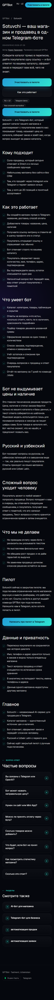
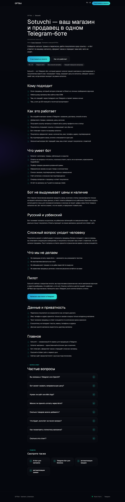
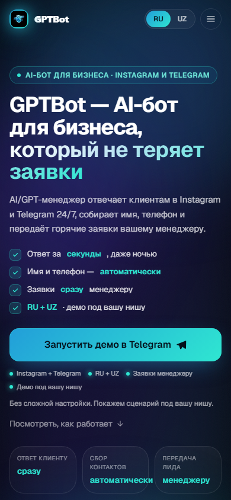

# GPTBot Market — design and conversational UX audit

**Date:** 2026-08-01
**Mode:** audit-only; no interface implementation performed

## Design verdict

The current experience is clean enough to demonstrate engineering, but it does not yet look or feel like a trusted shopping product. The website is a long, generic dark document; the public Telegram identity is sparse; the bot renderer is text-first and produces tall one-button rows. The right direction is not “more futuristic AI”. It is **warm, contemporary local commerce with strong catalog truth**.

No “Apple-level” claim is warranted. TypeScript and snapshots can prove deterministic output, not visual hierarchy, motion, Dynamic Type behavior, keyboard access, screen-reader semantics or comprehension on a small Telegram screen.

## Visual evidence

### Sotuvchi RU landing

Observed: responsive, legible and consistent; also extremely long, mostly text, visually undifferentiated and narrow on desktop. It contains almost no product imagery, seller evidence, live product proof or recognizable commerce patterns.

### Parent GPTBot.uz mobile hero

Observed: glossy blue/cyan “AI lead manager” visual language, phone/dashboard mockup and high-energy gradient. It is a different promise and visual world from the restrained Sotuvchi page. A user moving from parent brand to Market does not receive an obvious continuity cue.

### Public Telegram entry

Observed: public name and username are clear; description honestly says synthetic test store. The web preview does not show a convincing product demo or commerce identity. Telegram web may omit configured avatar/media, so avatar and BotFather media status remain `EVIDENCE_GAP`.

All capture conditions and limitations are in the [evidence README](./evidence/gptbot-market-audit-2026-08-01/README.md).

## Surface-by-surface audit

### 1. RU/UZ website

**What works**

- Both language routes return 200, use a correct canonical and have no observed console error.
- Single observations were fast: RU about 101 ms TTFB / 131 ms load and UZ about 82 ms / 106 ms. These are not p95 measurements.
- Hero has a readable promise, clear pilot label and high-contrast primary CTA.
- The dark palette and restrained decoration avoid crypto/gambling aesthetics.

**Critical design/content failures**

1. The hero says the seller builds a store/catalog in Telegram; an unknown seller cannot start onboarding. The primary CTA labeled “Участвовать в пилоте” opens an invite-only seller-interest state, not an application or onboarding flow.
2. The page promises a seven-day `/stats` report (`content/pages/ru/sotuvchi.json:83`); runtime is today-only (`functions/agents/sotuvchi/stats/types.ts:1`).
3. The page says a language model understands the question (`content/pages/ru/sotuvchi.json:92`); current manifest has `aiSelection: 'disabled'`.
4. “Sotuvchi”, “GPTBot Market” and “GPTBot.uz” are not explained as a hierarchy.

These are P0 trust defects, not copy polish.

**Layout and conversion**

- The desktop page uses a narrow reading column and leaves large unused width; it feels like a technical article rather than a commercial product.
- Benefits, features, trust, pilot and FAQ repeat similar assertions without changing the evidence level.
- There is no real product card, annotated conversation, seller dashboard crop, case metric, partner logo, pilot roster or named service standard.
- Primary seller intent splits between the bot deep link and a separate personal Telegram contact.
- The generic site OG image does not help Market recognition when shared.

**Localization**

- UZ page is structurally complete and uses Latin Uzbek for product content.
- Native-speaker product review is still required. Machine/code parity cannot validate register, cultural naturalness or persuasive quality.
- The author name remains Cyrillic; acceptable for a proper name, but the broader identity treatment is not localized.

### 2. Accessibility

Audit target is WCAG 2.2 AA for the website and equivalent platform semantics inside Telegram. Relevant reference: [Apple accessibility guidance](https://developer.apple.com/design/human-interface-guidelines/accessibility/) also uses WCAG AA contrast as a practical baseline.

| Finding | Evidence | Severity | Requirement |
|---|---|---:|---|
| Header language controls are too small | RU/UZ desktop/mobile inspection found ~36 px height on Sotuvchi; root mobile language controls ~28 px and menu ~36 px | High | at least 44×44 CSS px for touch target; 48 px preferred on Android contexts |
| FAQ is pointer-clickable but not exposed as a semantic button in the accessibility tree | cursor-interactive snapshot found FAQ divs, not ARIA buttons | High | native `<button>`, `aria-expanded`, controlled region, visible focus and keyboard activation |
| Tiny utility/footer links | observed ~18–36 px control heights | Medium | enlarge hit area without inflating typography |
| Contrast not programmatically certified | visual inspection only | Medium | measure text 4.5:1, large text/UI 3:1 in both themes/states |
| Font scaling not tested | no 200%/browser zoom or Telegram Dynamic Type evidence | High | no clipping, overlap or hidden actions at 200%; bot messages remain understandable at system large text |
| Reduced motion not inspected | root uses animated/intersection content | Medium | honor `prefers-reduced-motion`; content must never depend on animation to become available |
| Screen reader and focus order not tested | `EVIDENCE_GAP` | High | NVDA/VoiceOver/TalkBack task pass before public launch |

### 3. Buyer Telegram experience

Current behavior is inferred from implementation and tests unless noted.

| State / task | Current evidence | UX risk | Design requirement |
|---|---|---|---|
| `/start` home | RU buyer-first copy, five actions and synthetic notice in `experience/copy.ts` | live layout unobserved; seller action competes with shopping | one dominant “write what you need” prompt; secondary compact actions |
| Search | free text, category/query/budget and ambiguity handling | parser recovery may feel procedural | ask at most one high-value clarification; show understood constraints |
| Results | bounded text cards with price, availability, category, store, specs | no imagery; repeated text; weak desirability | photo, title, integer UZS, availability/freshness, store, one reason-to-fit, two actions max |
| Catalog | menu/list behavior | one-button-per-row renderer creates long keyboards | prioritize 2-column safe layout where Telegram labels fit; paginate deliberately |
| Product detail | factual text and actions | product proof and merchant responsibility weak | media group or photo, full specs, seller/store, updated-at, report/correct path |
| Compare | 2–3 products, text | long messages and poor side-by-side scanning | compare only decision dimensions; highlight trade-off, never invent score |
| Checkout/request | quantity, name, +998 phone, fulfillment request, comment, review; “not payment” | commitment and expected response time unclear | step progress only if helpful; explain merchant response and edit/cancel before submit |
| Orders/status | list and detail | no real fulfillment behavior observed | plain-language status + who acts next + aging/support action |
| Handoff | seller question and reply | live latency and notification comprehension unknown | show SLA expectation, reply attribution and safe fallback |
| Empty/zero result | honest fallback exists | can become dead end | preserve query; suggest constraint change/category/human help |
| Error | grounded error copy exists | repeated errors can look like product incompetence | state what is safe, what was preserved and next action |
| Stale inventory | system protects stock at order time | stale signal not visible to buyer | last-verified cue and correction/report action before public scale |
| Loading | Telegram delivery latency only; no proven intermediate state | users may resend and create anxiety | short processing acknowledgement only above measured threshold; preserve exactly-once |

The renderer maps each action to a separate button row and flattens product cards into text. This is safe but creates vertical burden on small screens. Redesign must preserve callback safety, authority, deduplication and Telegram label limits.

### 4. Seller Telegram experience

| State / task | Current evidence | UX risk | Design requirement |
|---|---|---|---|
| Unknown seller | invite-only interest path, no authority upgrade | contradicts website; can feel like a broken CTA | call it “Apply to pilot”; show verification reason and response expectation |
| Invited onboarding | persistent org/owner/store workflow | no device evidence; operational prerequisites live elsewhere | contextual checklist; one data group per step; safe resume and preview |
| Active dashboard | exact published products, today’s orders, open questions | very useful but visually unobserved; “today” differs from marketing | exception-first summary, freshness task and explicit today label |
| Products | catalog actions exist | no photo/quality/freshness operating loop | product completeness status, photo requirement, stock update priority |
| Orders | safe list/detail; buyer contact only in detail | no aging/service expectation | urgency, next action, aging and status-change confirmation |
| Questions | handoff ownership and reply | notification may compete with daily activity | queue by age, one-tap open, reply context, resolved confirmation |
| Stats | exact one-day facts | page promises seven days; seller value unclear | “Today” by default; 7/30 only when implemented and meaningful |
| Role switch | server-authorized hybrid behavior | label can imply authority change | say “Покупки”/“Магазин” as destinations; never imply permissions are granted |
| Paused/suspended | honest non-dashboard behavior | recovery/support path unclear | explain reason category, what still works and who can restore |
| Empty | synthetic-only production means real empty states unobserved | can feel abandoned | teach the next concrete operating task, not generic celebration |
| Error/stale/loading | tests cover safety, not perception | lost trust during operational task | explicit saved state, retry idempotency and support escalation |

### 5. Owner Control Center

The protected route redirects to the shared **GPTBot SEO Cockpit** login. This proves protection but creates product-context mismatch. Code exposes overview, stores, safe store detail, PII-minimized orders, content-free handoffs, automation/DLQ, append-only audit and pilot roster.

Authenticated visuals remain `EVIDENCE_GAP`; no “good design” conclusion should be made from React code. Before Pilot #1, capture desktop and 390 px views for loading, empty, populated, error, support-readonly and destructive confirmation states. Owner UI must remain an internal operational tool, not become a public marketplace console.

## Conversational UX principles

1. **One task per turn.** Ask only what changes the result or completes the request.
2. **Show the system’s understanding.** Reflect budget/category/key constraint without echoing private text unnecessarily.
3. **Facts carry provenance.** Price, stock, store, status and counts come only from approved catalog/FactSheet sources.
4. **Choices stay small.** Prefer 2–4 prioritized actions; put secondary navigation behind “Ещё”.
5. **Recovery preserves effort.** Never discard the query, cart/request or drafted seller reply on a recoverable error.
6. **Authority is invisible until relevant, explicit when relevant.** A mode switch changes navigation, never rights.
7. **Human help has an expectation.** Say who receives it, expected response window and fallback.
8. **No anthropomorphic overclaim.** “GPTBot found…” is acceptable; “I checked every store” is not unless proven.
9. **RU/UZ are designed, not mirrored.** Button length, examples and register get native review.
10. **The next action is visually dominant.** Avoid keyboards where every option has equal weight.

## Three creative/design directions

### Direction A — “Precision Commerce”

- Visual idea: near-white/ink interface, disciplined grids, cobalt accent, technical provenance labels.
- Strength: communicates exactness, enterprise trust and operational rigor.
- Risk: cold for mass-market buyers and too close to a B2B dashboard.
- Best for: Owner and seller operations.

### Direction B — “Warm Market Signals” — **selected**

- Visual idea: warm ivory or very dark brown base, deep teal trust color, tomato/coral action accent, real product crops, softly rounded utility cards and small woven/market-line motifs.
- Tone: helpful local shop assistant; concise, respectful, not cute.
- Strength: modern without crypto neon; supports both everyday buyers and serious sellers; visually separates GPTBot Market from the parent lead-agency aesthetic while retaining a teal family cue.
- Risk: requires disciplined photography and localization to avoid lifestyle-stock cliché.
- Best for: buyer bot previews, website, social and pilot assets; seller tools use a more restrained subset.

### Direction C — “Telegram Native Utility”

- Visual idea: Telegram-blue/system-neutral, message-led demonstrations, almost no decorative brand layer.
- Strength: immediate familiarity and low production burden.
- Risk: forgettable, dependent on Telegram’s identity, weak premium/commercial differentiation.
- Best for: fallback implementation if brand capacity is extremely limited.

### Selection rationale

Choose **Direction B**. The mass RU/UZ proposition needs warmth and merchandise, while the engineering truth needs sober labels. Direction B is the only route that can be inviting, non-cheap and non-AI-cliché without impersonating a national marketplace. Direction A becomes the internal operational sub-style; Direction C informs native bot restraint.

## Selected visual system requirements

| Element | Requirement |
|---|---|
| Logo/mark | simple GPTBot Market wordmark + small navigational “spark/locator” mark; no robot head, coin, chain, magic wand or neural brain |
| Color | deep teal for trust, warm neutral surfaces, coral only for primary action/attention; semantic states independently labeled |
| Typography | highly legible Cyrillic/Latin family with tabular numerals; integer UZS formatting; minimum mobile body 16 CSS px |
| Photography | real catalog products on consistent neutral backgrounds; no generic humanoid robots or fake storefront renders |
| Illustration | functional diagrams, annotated messages and catalog/source signals only |
| Motion | brief state feedback; no scroll-gated content; reduced-motion alternative |
| Icons | familiar commerce/status icons with labels; no icon-only critical controls |
| Spacing | 8 px base; 16–24 px section rhythm; touch targets ≥44×44 |
| Cards | image → title → price → availability/freshness → store → reason-to-fit → primary/secondary actions |
| Voice | “нашёл / не нашёл / уточните / продавец ответит”; avoid “революционный AI” and unsupported superlatives |

## Required component and state inventory

**Web:** global header, product hero, how-it-works demo, buyer example, seller value panel, catalog truth panel, trust/service panel, pilot proof, role-specific CTA, FAQ accordion, footer, cookie/privacy/support links; each with loading/error/empty where data-driven.

**Telegram buyer:** welcome, example prompt, constraint clarification, no-result, result summary, product card/media, compare, request step, review, placed, order list/detail, handoff queued/replied, stale/stock conflict, safe error, language switch.

**Telegram seller:** interest receipt, invite, onboarding step/resume/review, catalog import result/reject, active home, orders, order detail/status, questions/reply, stats today, catalog freshness, notification failure, paused, suspended, support.

**Owner:** login context, overview, store list/detail, orders, handoffs, automation/DLQ, audit, pilot roster, read-only role, mutation confirmation, success/error, empty/loading.

## Design acceptance gates

Before design implementation:

- Owner approves naming, Direction B moodboard and the truth-aligned message map.
- Native Uzbek reviewer approves example prompts, onboarding and error tone.
- Screenshot evidence pack covers current RU/UZ buyer/seller flows on iOS and Android.

Before Pilot #1:

- Five representative buyer tasks pass at 390 px and large text without hidden actions.
- All website controls meet target/contrast/keyboard/semantics criteria.
- Product photos and catalog source/freshness rules pass seller and buyer review.
- The seller understands invite, catalog responsibility, response SLA and request-not-payment model without facilitator explanation.

Before public launch:

- Assistive-technology tasks pass; no P0/P1 design defect remains.
- Real cohort data shows useful results, completed requests and response SLA.
- Empty, error, stale, paused, suspended and support recovery are observed, not only snapshotted.
- Public media previews, OG assets and RU/UZ creative variants are approved and measured.
