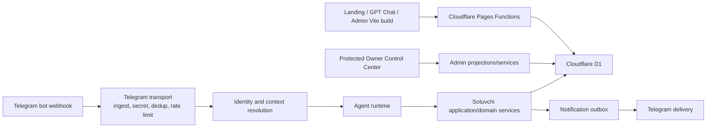

# GPTBot Market Mini App current architecture

## Audited baseline

| Item | Verified state |
| --- | --- |
| Local/source HEAD | `2d7896706c3dfbcaf4239de3b999fa39d86abac2` |
| `origin/main` | same SHA; no ahead/behind |
| Worktree | clean before documentation work; no stash |
| Last productization source | `08c21568581bf90e7122a566f2805a619cd9e81d` |
| Current production deployment | `68747046-8e1e-492a-8b81-dc4e4065916f` |
| Current immutable URL | `https://68747046.ai-direct-pro-landing.pages.dev` |
| Immediate rollback | deployment `d9ca163e-947b-40ba-856d-8143308c8402`, source `c670e4eebff79e2cc4b9027ffede865f0af813ab` |
| Canonical site / bot | `https://gptbot.uz` / `@gptbot_market_bot` |
| Production data | one synthetic store, 48 synthetic products, 44 inventory moves; zero orders, notifications and handoffs |
| Real stores / payments / public launch | 0 / disabled / disabled |
| Mini App implementation | none found: no runtime route, WebApp component, `initData` validator or Telegram Mini App SDK dependency |

No conflicting Mini App branch or unsafe source divergence was found. `git
fsck --full` reported only unreachable/dangling objects, not corruption.

## Runtime topology

The existing Pages project contains the public SEO site, GPT Chat, lazy admin
SPA, Telegram endpoints and one D1 binding. Vite has three entries but no app
workspace. Cloudflare auto-deploy is disabled and releases are manual.

## Domain inventory

| Capability | Current authority and truth | Main implementation | Coupling |
| --- | --- | --- | --- |
| Telegram update reservation | bot username + `update_id`, durable reservation/finalization | `functions/channels/telegram/store.ts`, `webhook.ts` | bot-only transport |
| Identity | provider `telegram` + external user id → durable identity | `functions/platform/identity/*` | transport-neutral after verified input |
| Organizations/memberships | active organization; owner/staff membership records | `functions/platform/orgs/*` | transport-neutral |
| Seller authorization | Runtime actor → active owner membership → active store | `catalog/service.ts`, `catalog/store.ts` | transport-neutral service; actor currently supplied by bot runtime |
| Store lifecycle/pilot | active store, active route, active owner pilot | onboarding, catalog store, Owner Control Center | transport-neutral truth |
| Catalog/categories/products | tenant-scoped CRUD, validation, OCC version, idempotent operation log | `functions/agents/sotuvchi/catalog/*` | services neutral; Telegram tools/presenters coupled |
| Search/budget/aliases | deterministic catalog ranking and durable presentation/selection | `catalog/*`, `buyer/query.ts`, `buyer/parser.ts` | query service reusable; parser is conversation-specific |
| Comparison | D1-backed 2–3 product context, tenant/session scoped | catalog comparison methods | reusable unchanged through BFF |
| Storefront session | bot username + identity bound to active pilot/store/locale | `sotuvchi_storefront_sessions` and catalog store | reusable; needs Mini App launch adapter |
| Checkout | durable workflow, idempotency, price refresh, stock check, one active draft | `checkout/*`, workflow engine | reusable commands; Telegram step renderer coupled |
| Orders/inventory | seller authorization, OCC, exactly-once movement, state transition + notification intent | `orders/*`, `inventory/*` | reusable unchanged through commands |
| Handoff | buyer session ownership, seller ownership, bounded retained content, reply workflow | `handoff/*` | services reusable; next-message bot binding remains bot-only |
| Notifications | payload-free intents, claims/settlement, Telegram address delivery | `outbox/*`, `delivery/*`, `channels/*` | intent reusable; delivery bot-only |
| Analytics | closed event allowlist, content-free scalar projection, idempotent append | `analytics/*`, `platform/events/*` | recorder reusable after allowlist extension |
| Automation/DLQ | first-party queue and protected replay | `platform/automation/*`, Owner APIs | remain backend/OCC only |
| Owner Control Center | platform JWT roles, privacy-minimized projections, audit | `functions/platform/admin/*`, `functions/api/admin/agents/*` | separate protected web surface |
| Schema contract | fail-closed read-only 32-table/column/index contract | `functions/api/telegram/agents-schema.ts` | reusable pattern; BFF needs its own startup contract |

## Proven invariants

- Every sensitive query includes organization/store scope.
- Seller order lists omit buyer contact; seller detail exposes contact only
  after owner authorization.
- Catalog, checkout, seller and handoff mutations have operation fingerprints,
  idempotency keys and version/conflict handling.
- Order placement writes seller notification intent with the domain batch.
- Seller confirmation decrements configured stock and records a unique move.
- Analytics accepts a closed set of fields and rejects common PII keys.
- Paused pilots and inactive stores fail closed in catalog/checkout resolution.
- Current AI selection is disabled; catalog facts are deterministic.

## Telegram-coupled code

- webhook secret verification, update parsing/reservation and callback ack;
- `/start` payload grammar and callback action IDs;
- bot username as storefront-session namespace;
- Runtime action/rule selection and workflow continuation envelope;
- `Outbound`/FactSheet → Telegram text/card/keyboard rendering;
- Telegram `file_id` photo delivery;
- address binding, send retry and notification dispatch;
- the seller “next message is a reply” interaction.

These remain useful for the bot but must not become the Mini App API.

## Gaps for Mini App

1. No server-side `initData` validation or Mini App session exchange.
2. No public buyer/seller BFF or versioned response schemas.
3. No Mini App-specific rate limiter, CSP, origin policy or error contract.
4. Global middleware currently emits `Access-Control-Allow-Origin: *`; an
   authenticated cross-origin BFF must override this with an exact allowlist
   and `Vary: Origin` before rollout.
5. Product media is Telegram `file_id`, not a browser-safe URL.
6. Some application wiring lives inside `functions/api/telegram/agents.ts` and
   should move to a shared composition root before a second transport calls it.
7. Bot response copy/presenters are not reusable UI components.
8. Existing buyer order history is capped at five and seller lists are bot-
   sized; BFF queries require cursor pagination without leaking DB rows.
9. No WebView E2E, direct-browser denial or role-routing tests exist.

## Schema reality

Physical production schema includes additive structures through migrations
0026–0030, while the historical `d1_migrations` ledger ends at 0025. This is a
governance discrepancy, not permission to mutate production. MA-0/MA-3 can be
implemented with no new schema. Any later schema proposal requires physical
introspection, ledger reconciliation, backup, forward/rollback rehearsal and
explicit owner approval.
