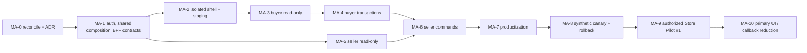

# GPTBot Market Mini App owner and engineering gates

## Owner gates

| Gate | Earliest stage | Required decision/evidence | Work allowed before it | Work blocked without it |
| --- | --- | --- | --- | --- |
| O-01 Architecture/ADR approval | MA-0 | frontend/BFF/deployment/auth/coexistence decisions approved or revised | documentation and prototypes | production-quality implementation that fixes these boundaries |
| O-02 Staging/test Telegram identity | MA-2 | owner-controlled test bot/environment, exact username/token path and responsible operator | local mock/synthetic contract work | real Telegram WebView staging auth |
| O-03 Staging/production domain | MA-2/MA-8 | approve `market.gptbot.uz` or alternative, DNS/TLS and origin ownership | local/Pages preview | production CORS/CSP and launch URL |
| O-04 BotFather launch configuration | MA-8/MA-9 | exact bot, URL, label, locale, screenshots and rollback action | inline link generated only in test tooling | menu/main Mini App/profile action in production |
| O-05 Native Uzbek review | MA-3 then every transactional phase | named reviewer approves navigation, product, checkout, errors and seller operations | engineering placeholders marked unapproved | UZ cohort/public evidence |
| O-06 Product media rights/quality | MA-3/MA-7 | photo ownership, neutral crop, fallback, freshness and correction process | current synthetic file IDs/fallback | real catalog media in Mini App |
| O-07 Real seller and Store Pilot #1 authority | MA-9 | verified seller identity, membership/store inputs, pilot scope and explicit authorization | synthetic canary only | real store, product or seller access |
| O-08 Privacy/legal/service wording | MA-4/MA-9 | contact/handoff retention, request-not-payment, seller responsibility, support/SLA reviewed | synthetic technical flows | real buyer contact/question collection |
| O-09 Support/incident ownership | MA-8/MA-9 | named on-call, hours, stop authority, comms and reconciliation runbook | lab/synthetic testing | monitored live cohort |
| O-10 Production exact-SHA release | each deploy | source, tests, deployment/rollback targets and flags approved | build/staging | production deploy/flag enable |
| O-11 Primary UI cutover | MA-10 | stability/task parity/support/accessibility evidence | coexistence with bot primary | menu/profile app primary and callback reduction |
| O-12 Payment/public marketplace | outside roadmap | new product/legal/provider ADR and authority | none | all payment/public-marketplace work |

Bot tokens, webhook secrets, real contact data and owner credentials are never
requested in roadmap documents or chat. Future values use the protected secret
path and are verified by name/identity without printing them.

## Engineering hard gates

| Gate | Passing evidence | Failure response |
| --- | --- | --- |
| E-01 Auth integrity | official/current vectors; forged/expired/foreign launch all denied | global app stop |
| E-02 Tenant/role isolation | full two-store IDOR matrix; revoked owner denied on next call | global or seller stop; security incident review |
| E-03 Idempotency | repeated/lost-response/two-device tests replay safely | transactional flags off |
| E-04 Order/inventory | one order, correct state, one move, no negative stock | buyer/seller commands off; pause affected store if live |
| E-05 Notification/handoff | one intent/delivery claim; correct ownership and TTL | relevant command off; bot/OCC recovery |
| E-06 Schema contract | BFF fails 503 before service use on any missing prerequisite | no deploy/cohort |
| E-07 CORS/CSP/XSS/secrets | exact origins, compatible Telegram embedding, no execution/secret/output leak | global app stop |
| E-08 Bot/platform regression | full current bot, GPT Chat, website, OCC and automation baseline green | no deploy/cohort |
| E-09 Fallback | kill switch and every surface return matching bot task without downtime | no cohort expansion |
| E-10 Rollback | immutable frontend/BFF targets and flag rollback executed successfully | no production enable |
| E-11 Accessibility/localization | automated AA + human VoiceOver/TalkBack + native UZ evidence | affected locale/client/whole cohort blocked |
| E-12 Performance/reliability | stage p95, error/crash and bundle budgets met | pause expansion and diagnose |
| E-13 Migration safety | physical/ledger reconciliation, backup and rehearsed forward/rollback | no migration command |

## Critical path

Auth/authority/BFF contracts are the single technical bottleneck. Seller
read-only can proceed in parallel with buyer screens after MA-1, but seller
mutations wait for both seller authority proof and buyer transaction
idempotency patterns.

## Parallel workstreams

| Stream | May run in parallel after | Deliverable | Cannot cross |
| --- | --- | --- | --- |
| BFF/auth/contracts | MA-0 | shared composition, session and API adapters | E-01–E-07 |
| Frontend shell | API schemas frozen in MA-1 | Router/query/Telegram adapter/states | no production auth bypass |
| Design system/prototypes | MA-0 | tokens/components/key states | O-01, accessibility gate before handoff |
| RU/UZ content | screen jobs frozen | reviewed dictionaries and expansion evidence | O-05 |
| Visual/media | MA-3 contract | image proxy/fallback and product components | O-06, E-07 |
| Analytics/performance | MA-1 schemas | closed events, budgets and dashboards | privacy review |
| Test infrastructure | MA-0 | vectors, contract harness, WebView/device matrix | no stage exit without it |
| Pilot operations | MA-7 | runbook, support, cohorts and rollback drill | O-07–O-10 |

## Exact next gate

Before implementation, approve or revise the proposed ADRs, then execute
`MA-1.1 — Mini App auth validator and session contract` in a new implementation
task using only synthetic test vectors. Do not configure BotFather, deploy or
touch D1 during that slice.
