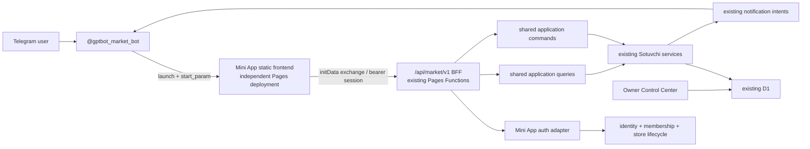

# GPTBot Market Mini App target architecture

## Recommended model

Use a dedicated Mini App frontend package/build and independent Cloudflare
Pages project, sourced from the same repository. Keep the versioned BFF in the
existing `gptbot.uz` Pages Functions deployment. The BFF composes existing
Sotuvchi services and returns privacy-minimized DTOs; it is not a second
domain implementation.

## Frontend placement comparison

| Option | Isolation and rollback | Reuse/build | Operational risk | Verdict |
| --- | --- | --- | --- |
| New route in current landing SPA | lowest isolation; rollback moves website, GPT Chat and app together | reuses root React but risks landing bundle/build coupling | SEO/prerender and app releases share blast radius | reject |
| Fourth root Vite entry in current Pages project | bundle isolation, but one deployment and Functions snapshot | simple shared dependencies | Mini App rollback also rolls back site/bot backend | acceptable prototype only |
| Separate repository | independent | duplicates contracts, tooling and governance | drift and second truth likely | reject |
| Separate app package/build in this repo + independent static Pages project | strong frontend isolation and immutable rollback | shared CI/contracts/design assets; explicit build | requires exact-origin BFF CORS and two release records | **recommended** |
| Separate Pages project with duplicated business Functions/D1 binding | independent and same-origin | can import services | two deployed backend versions can drift against one D1 | reject for first program |

Recommended source location for future implementation:
`apps/market-mini-app/`, with its own Vite config, TypeScript config and build
output. Add `packages/market-contracts/` only when BFF schemas exist; it may
contain request/response types and validators, never D1 rows or business rules.
Do not convert the entire repository to workspaces until a dependency audit
proves the root build and lockfile remain reproducible.

## Deployment topology

- Staging frontend: immutable Pages preview/custom staging hostname, exact
  origin allowlisted by the staging BFF policy.
- Production frontend: proposed `https://market.gptbot.uz/`, subject to owner
  domain approval.
- BFF: `https://gptbot.uz/api/market/v1/*` in the existing backend.
- Cross-origin requests use `Authorization: Bearer <short-lived-session>` and
  an exact origin allowlist. No credentialed cookies, wildcard CORS or browser
  localStorage token.
- App assets use content hashes and long immutable caching; app HTML and
  runtime config use `no-cache`/short revalidation.
- Frontend and BFF each carry a build/source version. Contract compatibility is
  tested before either exact-SHA deployment.
- A server-side kill switch denies Mini App sessions/commands and returns a
  safe “continue in bot” action without affecting the bot webhook.

This makes frontend rollback independent. If a BFF regression occurs, disable
the Mini App cohort first, preserving bot operation, then roll back the BFF
deployment using the recorded immutable Pages target.

## BFF style

Use resource-oriented HTTP for reads and explicit command endpoints for state
transitions:

- reads: `GET /catalog/products`, `GET /orders/:id`;
- domain commands: `POST /checkout/:id/confirm`,
  `POST /seller/orders/:id/confirm`;
- never a generic “execute tool” or client-selected Runtime action endpoint.

Why a BFF is required:

- existing services are safe but expose internal TypeScript/domain shapes;
- Mini App needs role-aware projections, pagination, error codes and media
  URLs that Telegram callbacks do not;
- the BFF centralizes validated identity, org/store context, rate limits,
  idempotency and privacy minimization;
- it prevents the browser from calling D1 or composing authority-bearing
  `OrgContext` fields.

Every handler builds `actorId`, `orgId`, `storeId` and bot namespace from the
validated server session and database lookups. Client route/store/role fields
are hints or resource identifiers only.

## Shared application boundary

Move only the transport composition now embedded in
`functions/api/telegram/agents.ts` into a shared factory. Keep these layers:

1. domain/store services — existing business invariants;
2. application queries/commands — typed use cases and trusted context;
3. Telegram presenters/runtime adapter — bot messages and callbacks;
4. Mini App BFF presenters — versioned DTOs and closed errors;
5. React client — visual state only.

Do not move stock, price, authorization, transition, notification or handoff
rules into shared client code. “Shared” frontend code is limited to DTO types,
format-neutral enums, locale keys and design tokens.

## Client architecture

- React 19 and React Router, already used in the repository.
- TanStack Query is recommended for server-state cache, cancellation,
  invalidation and bounded retry; add it only in the isolated app package.
- Local React state/reducers handle filters, compare tray visibility, form
  editing and navigation. No Redux is justified.
- The authoritative checkout draft remains in the existing workflow/order
  tables. Client form values are provisional until each server command
  succeeds.
- Session token is memory-only. A reload re-exchanges fresh Telegram
  `initData`; it never restores authority from localStorage.
- A thin internal Telegram adapter wraps the official
  `telegram-web-app.js` object. Do not add a third-party Telegram SDK in MA-2
  unless its bundle, maintenance, supported Bot API version and tree-shaking
  beat the native wrapper in an ADR.
- Route/error boundaries render preserved context and a bot recovery action.

## Media architecture

Current `mediaRefs` are opaque Telegram `file_id` values. The BFF must not
return Bot API URLs because they contain the bot token. For synthetic and first
pilot stages:

1. return an opaque product media handle in the DTO;
2. serve `GET /api/market/v1/media/:handle` through an authenticated,
   allowlisted proxy;
3. resolve `file_id` server-side with `getFile`, stream a bounded image, verify
   content type/size and never log the upstream URL;
4. cache only safe derived bytes/metadata for a bounded period; no token in
   cache keys or responses;
5. render a branded text/image fallback on failure.

Telegram officially guarantees a `getFile` download URL for at least one hour,
but the URL contains the bot token and therefore cannot be exposed. R2/CDN
media becomes an optional later schema/infrastructure track only if pilot
latency, image transforms or lifecycle ownership justify it.

## Design-system separation

Reuse token values, Geist, market assets, accessibility rules and factual card
semantics. Create Mini-App-specific shell, bottom navigation, headers, safe-area
layout, search, filters, galleries, compare, checkout, timelines and seller
operational components. Do not import landing Hero/FAQ/StickyCTA or admin
components into the app.

## Non-negotiable boundaries

- No direct D1, bot token, webhook secret or platform JWT in the client.
- No client-selected role, org or store authority.
- No duplicate order/inventory/notification transition logic.
- No Owner Control Center route or platform role in the Mini App session.
- No payment endpoints or UI in this roadmap.
- Bot parity and fallback are release requirements, not future cleanup.
