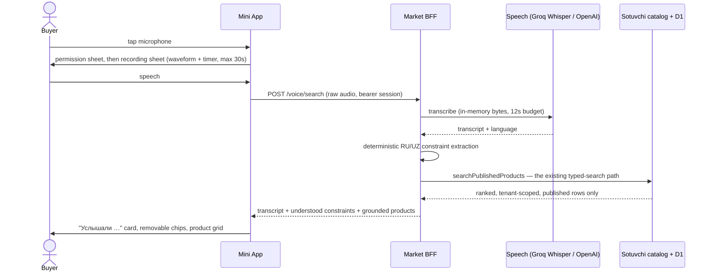

# Bormi voice search — implementation and release evidence

> Date: 2026-08-02
> Stage: `BORMI_VOICE_SEARCH_DEPLOYED_AWAITING_NATIVE_OWNER_CANARY`
> Base source: `d47d99891006b0fe33994f9b8c101d14aaa4f115` (v8 fast path)
> Worktree: `F:\Claude\gptbot-bormi-api-fix`, branch `fix/bormi-api-origin`
> Released source: `43678506ed4752f07e46004e22338d7890edf19c`
> Deploy status: **deployed** — see §13. No D1 statement and no Telegram Bot API
> mutation was performed for this change.

---

## 1. What was built

A buyer taps the microphone in the Bormi search field, speaks naturally in
Russian, Uzbek Latin or a mix of both, and gets real products from the
connected catalog — with the constraints Bormi understood shown back and
editable.



The nine required behaviours, and where each one lives:

| # | Behaviour | Implementation |
|---|---|---|
| 1 | Records voice | `apps/market-mini-app/src/lib/voice.ts` — `VoiceRecorder` |
| 2 | Transcribes safely | `functions/platform/ai` facade → existing Voice-to-Reply speech stack |
| 3 | Detects RU / UZ / mixed | `normalizedLanguage` in the reused speech adapter; the interpreter is language-agnostic |
| 4 | Extracts intent and constraints | `functions/market/voice/constraints.ts` |
| 5 | Shows what it understood | `VoiceSummary` — transcript card + removable chips |
| 6 | Runs the existing grounded search | `runCatalogSearch` in `functions/market/router.ts` |
| 7 | Shows only real catalog rows | `services.catalog.searchPublishedProducts`, unchanged |
| 8 | Asks at most one short question | `clarification: 'budget' \| 'empty_query'`, rendered once |
| 9 | Keeps the transcript on AI failure | transcript is returned before results and stays editable |

---

## 2. What was deliberately **not** rewritten

The catalog and search backend is untouched. Voice reuses it verbatim:

- `SotuvchiCatalogService.searchPublishedProducts` — unchanged;
- `rankCatalogProducts` — unchanged; relevance, `matchedConstraints`,
  `unmatchedConstraints`, `confidence` and `reasonCodes` are consumed as-is;
- `parseBudget` (`functions/agents/sotuvchi/experience/budget.ts`) — reused for
  every UZS amount, including its refusal to treat a cueless number as a price;
- `normalizeKnowledgeText` / `CATALOG_LIMITS` — reused for bounding;
- the D1 schema — **no migration**, no new table, no new column;
- `functions/api/telegram/webhook.ts` and `TELEGRAM_BOT_TOKEN` — untouched.

`/catalog/products` and `/voice/search` now share one function,
`runCatalogSearch`. A test asserts there are exactly two call sites and that the
voice route never reaches the catalog service directly — voice therefore cannot
return a product the typed search would not return.

---

## 3. Speech recognition — reuse, not a new provider

`functions/lib/telegram/transcription.ts` already ran Groq Whisper with an
optional OpenAI fallback for Telegram Voice-to-Reply: in-memory audio, two size
gates, bounded timeout, no logging of URLs, transcripts or bytes.

That implementation is now exposed through the platform AI contract, which
already declared a `TranscriptionDriver` and an `AiUnavailableError(…,
'transcribe')` but had no implementation:

- `functions/platform/ai/drivers/legacy.ts` — new
  `createLegacyTranscriptionDriver`, added on the existing `LEGACY-SHIM`
  adapter that is already on the boundary-checker allowlist;
- `functions/platform/ai/facade.ts` — new `transcribe()`, symmetric with
  `complete()` and `structured()`: route walking, per-attempt metadata, bounded
  deadline, capability fallback.

This is the first production consumer of the platform AI facade. Existing
callers of `complete`/`structured` are unaffected; the change is purely additive
and `tests/platform-ai.test.ts` (15/15) still passes untouched.

**No new credential is introduced.** Voice uses the existing `GROQ_API_KEY` and
optional `OPENAI_API_KEY` Pages secrets.

---

## 4. Interpretation is deterministic, not generative

The only model in the request path is speech-to-text. Turning a sentence into a
query is plain code, which is what keeps the result grounded:

1. `normalizeKnowledgeText` + a small dictation repair pass
   (`пауэр банк` → `power bank`, `ming gacha` → `minggacha`).
2. Spoken cardinals become digits, with Russian additive forms and Uzbek
   multiplicative hundreds: `до ста тысяч` → `100000`, `ikki yuz ming` →
   `200000`. Russian oblique forms (`ста`, `двухсот`, `пятисот`) are included
   because they are what survives after `до` / `дешевле` / `максимум`.
3. The shared `parseBudget` decides whether an amount is a real ceiling.
4. Availability is set **only** by unambiguous phrases (`в наличии`,
   `mavjud`, `sotuvda`, `hozir bor`). A bare question — `есть?`, `bormi?` — is
   stripped but never filters, because hiding preorder rows the speaker did not
   exclude would hide real catalog rows.
5. Intent verbs, politeness and budget scaffolding are removed; product words
   and attributes are kept. Colour and size words stay **inside** the query, so
   they are matched against real specifications rather than against an invented
   filter — and when nothing matches them the existing
   `relevance.unmatchedConstraints` surfaces an honest
   "Не нашли по условию: чёрная" line.
6. The result is capped at `CATALOG_LIMITS.queryTokens` (8) and
   `queryLength` (120), which is what the catalog search accepts. Without this
   step every spoken sentence would be rejected as an invalid query.

Ambiguity is resolved with **one** question, never a guess: a number with no
budget cue (`powerbank 20000` — price, or capacity?) is returned as
`ambiguousPriceMinor` with `clarification: 'budget'`, is not applied, and the UI
offers two chips.

---

## 5. API surface

| Method | Route | Notes |
|---|---|---|
| POST | `/api/market/v1/voice/search` | raw audio body, Market session required |
| GET | `/api/market/v1/catalog/products?maxPriceMinor=` | additive filter, integer UZS |

`GET /bootstrap` and `POST /session/launch` now report
`flags.voice`, which is true only when the kill switch is on **and** a speech
credential is configured. The client hides the microphone when it is false.

Request rules for `/voice/search`:

- bearer Market session, exactly as every other read;
- `Content-Type` from a fixed audio allowlist; codec parameters are stripped;
- 400 000 byte cap, enforced on `Content-Length` and again on the read body;
- optional `?durationMs=` bounded to 30 000 ms;
- dedicated `voice` rate-limit bucket: 8 calls per 5 minutes per identity —
  the tightest bucket in the Market platform, because each call spends an
  upstream speech request;
- no `Idempotency-Key`: the route performs no mutation.

Two new error codes keep recovery honest instead of collapsing into the generic
store-unavailable screen:

| Code | Status | Client behaviour |
|---|---|---|
| `voice_unavailable` | 503 | "Голосовой поиск недоступен", microphone hidden for the session, typed search unaffected |
| `voice_unclear` | 400 | "Не расслышали", offers re-record or typing, transcript preserved |

---

## 6. UX — skills applied

```text
UX_UI_SKILL_USED=YES
21_DEV_SKILL_USED=YES
```

### 6.1 UX/UI skill

Skill files read for this stage:

```text
C:\Users\Borinio\.claude\skills\ui-ux-pro-max\SKILL.md
C:\Users\Borinio\.claude\skills\ui-ux-pro-max\scripts\search.py
C:\Users\Borinio\.codex\skills\ui-ux-pro-max\SKILL.md   (path recorded by the rebrand stage)
design-system/bormi/MASTER.md
design-system/bormi/ADAPTATION.md
```

Queries run: `--domain ux "voice input microphone permission recording feedback
accessibility"`, `--domain ux "AI interaction transparency loading progress
cancel streaming"`, `--domain ux "bottom sheet modal filter chips search empty
state"`.

Decisions taken **from** the skill:

- *AI Interaction / Disclaimer (High)* → the transcript card is explicitly
  labelled "Распознано автоматически — можно исправить". Bormi never presents a
  machine transcript as if the buyer typed it.
- *Feedback / Loading Indicators (High)* → the recording sheet has a live
  waveform and timer; the recognition step has its own cancellable state. No
  step longer than 300 ms is silent.
- *Accessibility / Error Messages (High)* → every voice failure is a
  `role="alert"` heading plus a named recovery action, never a red border.
- *Accessibility / ARIA Labels (High)* → the icon-only microphone and every
  chip remove button carry an `aria-label` that names the constraint being
  removed.
- *Accessibility / Colour Only (High)* → the countdown uses a colour change
  **and** a numeric timer.
- *Forms / Input Labels (High)* → the transcript editor has a real (visually
  hidden) `<label>`, not a placeholder.
- *Touch / Haptic Feedback (Low)* → haptics on record start, stop and success
  only; not on every tick.
- *Search / No Results (Medium)* → a zero-result voice search offers removing a
  constraint rather than a dead end.

Decisions **rejected**, with the reason:

- The generated `design-system/bormi/MASTER.md` rose/blue palette, Satoshi and
  General Sans web fonts, GSAP stagger and hover-heavy cards were rejected
  again for this stage, exactly as in the rebrand: they conflict with the
  violet/lime Bormi identity, and remote fonts plus an animation library would
  regress Telegram WebView first paint.
- *Search / Autocomplete (Medium)* — rejected. A suggestions dropdown over a
  synthetic catalog would imply demand data Bormi does not have.
- *AI Interaction / Streaming (Medium)* — rejected. Partial transcripts would
  mean streaming speech recognition and a second transport; a 30-second cap
  with a visible timer is the honest, cheaper answer.
- *AI Interaction / Feedback Loop (Low)* — rejected. Thumbs up/down implies a
  learning loop that does not exist.

### 6.2 21.dev skill

Skill files read:

```text
C:\Users\Borinio\.codex\skills\21st-ai\SKILL.md
C:\Users\Borinio\.codex\skills\21st-cli-use\SKILL.md
C:\Users\Borinio\.codex\skills\21st-design-sync\SKILL.md
C:\Users\Borinio\.codex\skills\21st-registry\SKILL.md
```

**Honest limitation:** the live catalog could not be queried this session.
`npx @21st-dev/cli whoami` returns `Not logged in`, and `21st search` returns
`Not signed in. Run 21st login or set TWENTYFIRST_TOKEN`. `21st login` opens a
browser and needs the owner. The patterns below were therefore adapted from the
skill documentation and from the previously adapted-and-recorded 21.dev pattern
set in `design-system/bormi/ADAPTATION.md`, not from a fresh catalog pull. If
the owner supplies `TWENTYFIRST_TOKEN`, a catalog review can be re-run.

Patterns adapted to Bormi:

- **Search field with contextual trailing action** → the microphone lives
  inside the search field as the trailing action, next to the conditional clear
  button. The separate filter button moved out of the field row into the chip
  row, because four controls do not fit a 320 px WebView.
- **Recording bottom sheet** → reuses the existing Bormi `Modal … sheet`
  (focus trap, Escape, backdrop close, drag handle) instead of a new dialog
  primitive.
- **Waveform / timer** → 28 CSS-transform bars driven by an `AnalyserNode` RMS
  sample every 70 ms. `transform: scaleY()` only — no width/height animation,
  no canvas, no layout thrashing.
- **Status transitions** → one sheet, five states (intro → requesting →
  recording → processing → error) rather than five screens.
- **Filter chips** → the understood budget and stock constraints are the same
  chip component as the category filter, and they are bound to the **live**
  filter state, so removing a chip removes both the pill and the constraint.
- **Inline feedback** → "Услышали" card with an editable transcript.
- **Confirmation / error states** → each error names its own recovery; the
  denied state points at the phone's Telegram permission, the unsupported state
  points at the Telegram app, the unclear state offers a re-record.
- **Accessible icon buttons** → 44 px targets, `aria-label`, visible focus.

Patterns rejected:

- Framer Motion / Radix / shadcn / Lucide imports — the client keeps its two
  runtime dependencies and its Telegram WebView bundle budget.
- Canvas or WebGL visualisers — cost and battery for a decorative meter.
- Press-and-hold-to-talk — unreliable inside a Telegram WebView that owns swipe
  gestures, and hostile to motor-impaired users. Tap-to-start / tap-to-stop.
- Live "listening…" partial-transcript text — implies streaming recognition
  that is not implemented.
- A floating voice FAB over the product grid — it would cover the comparison
  tray, which already owns that corner.
- Mechanical copying of any generic catalogue component without product
  rationale.

### 6.3 Screens and states

| State | What the buyer sees |
|---|---|
| Entry | Microphone on the home hero next to "Что ищете сегодня?", and inside the search field |
| Permission | Why the microphone is needed and when it is on, then "Разрешить микрофон"; "Ввести текстом" always available |
| Recording | Pulsing orb, live waveform, `m:ss` timer, "До 30 секунд", "Готово", "Отменить" |
| Processing | "Распознаём речь…", cancellable |
| Result | "Услышали" card with editable transcript + AI note, removable budget/stock chips, grounded product grid |
| Clarification | One question: `20 000 сум — Это максимальная цена?` with two chips |
| Denied | Phone-settings recovery + typed search |
| Unsupported | "Откройте Bormi в приложении Telegram" + typed search |
| Unclear / too short | "Не расслышали" + re-record + typed search |
| Unavailable / rate limited | Voice off for the session, typed search untouched |

---

## 7. Security, privacy and data

- Audio exists only as one in-memory `ArrayBuffer` for the life of the request.
  It is never written to D1, KV, R2, `localStorage`, a cache or a log.
- The transcript is returned to the speaker and to nobody else. It is not
  persisted and not sent to analytics.
- A test asserts that none of the four voice modules contains a `console.*`
  call or touches `localStorage` / `sessionStorage` / `indexedDB`.
- The bearer stays in the `Authorization` header; it is never put in the voice
  URL. Only the bounded `durationMs` hint travels as a query parameter.
- Telegram `initData` is not involved: `/voice/search` runs on an already
  issued Market session.
- Tenant scope, publication state and seller authority are unchanged — voice
  calls the same `access.buyer` context as typed search.
- `Permissions-Policy` changed from `microphone=()` to `microphone=(self)`.
  Camera, geolocation, payment and USB stay denied. CSP is unchanged.
- No analytics event was added; voice reuses the existing
  `sotuvchi.search_results_shown` / `sotuvchi.zero_results` events. Voice is
  therefore not yet separately measurable — recorded as a known gap.

---

## 8. Changed files

| File | Change |
|---|---|
| `functions/market/voice/constraints.ts` | new — deterministic RU/UZ/mixed interpreter |
| `functions/market/voice/service.ts` | new — audio validation, facade wiring, category grounding |
| `functions/market/voice/index.ts` | new — module exports |
| `functions/market/router.ts` | `runCatalogSearch` extracted; `/voice/search`; `maxPriceMinor`; `flags.voice` |
| `functions/platform/ai/drivers/legacy.ts` | new `createLegacyTranscriptionDriver` |
| `functions/platform/ai/facade.ts` | new `transcribe()` |
| `functions/platform/ai/types.ts` | new `AiTranscriptionOutcome` |
| `functions/platform/ai/index.ts` | exports |
| `functions/platform/market/http.ts` | `voice_unavailable`, `voice_unclear` |
| `functions/platform/market/rate-limit.ts` | `voice` bucket |
| `functions/_types.ts` | `MARKET_VOICE_SEARCH_ENABLED` |
| `wrangler.toml` | `MARKET_VOICE_SEARCH_ENABLED = "true"` kill switch |
| `apps/market-mini-app/src/lib/voice.ts` | new — capture, level metering, caps |
| `apps/market-mini-app/src/components/VoiceSearch.tsx` | new — sheet + summary |
| `apps/market-mini-app/src/screens/BuyerApp.tsx` | microphone, voice state machine, price filter |
| `apps/market-mini-app/src/components/ui.tsx` | `mic` / `stop` icons |
| `apps/market-mini-app/src/lib/api.ts` | `voiceSearch` binary upload |
| `apps/market-mini-app/src/lib/i18n.ts` | RU/UZ voice copy, `attributeLabel`, `formatBudget` |
| `apps/market-mini-app/src/types.ts` | voice contracts, `flags.voice` |
| `apps/market-mini-app/src/styles.css` | voice styles, narrow-viewport rules |
| `apps/market-mini-app/src/App.tsx` | passes the voice capability down |
| `apps/market-mini-app/src/dev/synthetic.ts` | offline `/voice/search` fixture |
| `apps/market-mini-app/public/_headers` | `microphone=(self)` |
| `tests/market-voice-search.test.ts` | new — 21 server tests |
| `apps/market-mini-app/test/voice-search.test.ts` | new — 9 client tests |

---

## 9. Verification

All commands were run in `F:\Claude\gptbot-bormi-api-fix`.

| Check | Result |
|---|---|
| `tests/market-voice-search.test.ts` | 21/21 PASS |
| Market + catalog suites (`voice`, `auth`, `contract`, `synthetic-fixture`, `sotuvchi-catalog`, `sotuvchi-buyer-qa`) | 152/152 PASS |
| Platform suites (`platform-ai`, `platform-runtime`) + Market auth/contract | 83/83 PASS |
| Mini App tests | 15/15 PASS |
| `tsc -p tsconfig.functions.json --noEmit` | 0 errors |
| Mini App `tsc -b` | 0 errors |
| `scripts/check-agent-boundaries.ts` | OK, no violations |
| ESLint on every changed area | 0 problems |
| `npm run scan:secrets` | clean, 2967 files |
| Mini App production build | PASS |
| Root production build | PASS — 113 pages + 124 articles, sitemap 240, 10 LLM twins |
| `wrangler pages functions build` | Compiled Worker successfully |

### 9.1 Bundle delta

```text
                       before (d47d998)      after
HTML                   4.93 kB / 2.13 gz     4.93 kB / 2.13 gz
CSS                   25.01 kB / 6.12 gz    30.08 kB / 6.95 gz
lazy Seller chunk     15.26 kB / 3.62 gz    15.26 kB / 3.62 gz
main JS              271.01 kB / 84.25 gz  289.37 kB / 89.56 gz
```

Buyer JS grows by 5.31 kB gzip. The recorder is loaded eagerly on purpose: it
must be ready on the first microphone tap, and a lazy chunk would add a network
round trip to the moment the buyer is waiting to speak. First paint is
unchanged — the zero-JS shell, preloads and the lazy seller chunk are untouched.

### 9.2 Root build

`npm run build` at the repository root exits 0 and reproduces the documented
baseline: 113 SEO pages, 124 prerendered articles (7 drafts skipped), a
240-entry sitemap, 12 user redirects with 0 draft 404s, and 10 LLM Markdown
twins. `npx wrangler pages functions build` compiles the Worker successfully,
so the new Market route is included in the Functions bundle.

### 9.3 Browser QA (fixture transport, Chromium, no real microphone)

The full journey was exercised with `getUserMedia` backed by a synthetic Web
Audio stream, so the real `MediaRecorder`, the real `AnalyserNode` meter and the
real state machine ran.

| Check | Result |
|---|---|
| Entry → permission sheet | opens, both actions present |
| Real permission denial (pane blocks capture) | "Микрофон недоступен" + typed-search recovery |
| Recording | timer counts, 28 waveform bars all active |
| 30-second cap | auto-stop fired; sheet closed and results shown by 33 s |
| Result | transcript card, `до 400 000 сум` + `В наличии` chips, 1 grounded product |
| Chip removal | chip disappears **and** the filter is dropped |
| Transcript edit → "Искать" | re-runs as ordinary typed search, stays grounded |
| Uzbek locale | sheet, mic label and summary all Uzbek Latin, `o‘`/`bo‘ladi` correct |
| 320 × 720 | no horizontal overflow; search input 78 px; no target below 40 × 44 |
| Dark theme contrast | 6.05 : 1 – 20.08 : 1 across all new text and controls |

A defect found and fixed during this QA: the understood chips were rendered
from the frozen transcript interpretation, so removing a chip cleared the filter
but left the pill on screen. They are now bound to live filter state.

### 9.4 Not verified

- No real microphone, no real Groq/OpenAI call, no real Telegram WebView.
- No axe run for the new states (the previous automated a11y evidence predates
  them); contrast, target size and overflow were measured directly instead.
- No VoiceOver/TalkBack pass.
- No native Uzbek sign-off for the new copy.
- No production latency measurement for the speech round trip.

---

## 10. Rollout and rollback

Rollback is a configuration change, not a code revert:

```text
MARKET_VOICE_SEARCH_ENABLED = "false"   # wrangler.toml, then redeploy root
```

With the flag off, `/voice/search` answers 503, `flags.voice` is false, the
microphone disappears at the next launch, and typed search is byte-for-byte the
behaviour that shipped in `d47d998`.

Deployment rollback targets are unchanged from the v8 release:

```text
static: 49111efd-9b25-41b1-a31f-717c5c0c3e1a / d47d998
root:   41a3d4de-cffb-4b2d-b1f8-9b1b650e5490 / d47d998
```

Both static Mini App and root/BFF must be deployed together: the client calls a
route that only the new BFF serves, and the BFF reports a capability only the
new client reads. Deploying one alone degrades to voice being hidden (client
old) or unreachable (BFF old) — never to a broken storefront.

Release checklist, in order, **after explicit owner authorization**:

1. Confirm `GROQ_API_KEY` is present in root Pages production secrets.
2. Root: `npm run build`, then `wrangler pages deploy dist
   --project-name=ai-direct-pro-landing --branch=main`.
3. Static: `apps/market-mini-app` → `npm run build`, then `wrangler pages deploy
   dist --project-name=gptbot-market-mini-app
   --branch=feature/gptbot-market-mini-app-synthetic-candidate`.
   Never `--branch=main` for the static project — that is a Preview.
4. Record both deployment IDs, URLs and the exact source SHA.
5. HTTP canaries: root 200, static 200, hashed asset 200, malformed launch 400,
   Telegram Agents webhook GET 405 / unauthorized POST 401.
6. Read-only D1 probe; confirm `rows_written=0`.
7. Owner native canary — §11.

---

## 11. Owner native canary for voice

Voice must be confirmed on a real device before it is called done:

1. Fully close the Mini App WebView.
2. Send a fresh `/start` to `@BormiMarketBot` and tap only the newest button.
3. Grant the microphone when Telegram asks.
4. Say, in one breath: «Нужны наушники до четырёхсот тысяч, в наличии».
5. Record: time from "Готово" to results; whether the transcript matches; which
   chips appeared; whether the products shown exist in the catalog.
6. Repeat once in Uzbek: «Ikki yuz minggacha quloqchin bormi?».
7. Repeat once with the microphone denied, and confirm typed search still works.

Do not claim voice search is live until steps 4–7 are confirmed by the owner on
a real Telegram client.

---

## 12. Known gaps

- Telegram Web (`web.telegram.org`) runs the Mini App in an iframe whose
  `allow` attribute is set by Telegram. If it does not carry `microphone`,
  capture fails there and the buyer sees the unsupported state. Android and iOS
  Telegram use a WebView and are not affected. Not reproducible locally.
- Voice is not separately visible in analytics; it reuses the existing search
  events.
- Attribute words (colour, size) rank but do not filter. This is intentional —
  the catalog has no colour field — and it is disclosed through
  `unmatchedConstraints`.
- The interpreter's cardinal vocabulary covers the amounts a shopper says. Rare
  forms fall back to the ambiguity question rather than to a wrong filter.
- The 21.dev catalog was not queried live this session (see §6.2).

---

## 13. Release — 2026-08-02

Authorized by the owner: push, normal merge into `main`, manual exact-SHA
deploy of the BFF and the Mini App, voice enabled for the owner/native review
cohort. Real store, payments and public marketplace stay unauthorized and
untouched.

### 13.1 Source

```text
merge commit  43678506ed4752f07e46004e22338d7890edf19c   (main)
feature tip   bbecfa6                                    (fix/bormi-api-origin)
              ca4dc99  docs(market): record the Bormi voice search release
              f45ff09  feat(market): add grounded voice search to Bormi
base          d47d998  perf(market): return catalog before secondary account data
```

`git merge --no-ff` completed without conflicts. `main` had two content-only
commits the branch did not carry; both were already present as `bc2792b` on the
branch, so the merged tree reproduces the same build output.

One commit was added during release verification: `bbecfa6` rewords the §5 API
table so the row does not pair the word "bearer" with the 26-character
`api/market/v1/voice/search` token. That combination is the markdown-table shape
`scripts/scan-secrets.ts` was written to catch after R0.3, and it failed the
gate. The line was disambiguated rather than exempted; the bearer contract is
unchanged and still stated in the request rules.

### 13.2 Verification on the merged tree

| Check | Result |
|---|---|
| `tsc -b` / `tsc -p tsconfig.functions.json` | 0 errors / 0 errors |
| Mini App `tsc -b` | 0 errors |
| Market + voice + platform targeted corpus | 107/107 PASS |
| Mini App tests | 15/15 PASS |
| `scripts/check-agent-boundaries.ts` | OK, no violations |
| `npm run scan:secrets` | clean, 2,975 files |
| ESLint on changed root/Functions files | 0 problems |
| Root production build | PASS — 113 pages, 124 articles, sitemap 240, 10 LLM twins |
| Mini App production build | PASS — HTML 4.93 kB, CSS 30.08 kB, buyer JS 289.37 kB, lazy seller 15.26 kB (byte-identical to §9.1) |
| `wrangler pages functions build` | Compiled Worker successfully |

Full-repository corpus: 1,070 of 1,075 passed on the first sequential run. Two
of the five failures were an environment gap in this worktree —
`apps/gpt-backend/node_modules` was absent, so `web-security-hardening` and
`gpt-backend-security` could not resolve `@supabase/supabase-js`. After
`npm ci` in `apps/gpt-backend` they pass 13/13 and 30/30.

The remaining three failures were reproduced unchanged at `d47d998` in a
detached worktree, so they are pre-existing on the live-deployed source and
unrelated to voice:

```text
react-router-v8-migration  the current productization baseline preserves every public and admin route pattern
react-router-v8-migration  sitemap generation retains all 234 static canonical entries   (240 emitted)
sotuvchi-onboarding        buyer storefront route resolves the store but never launches seller onboarding
```

None of the two voice commits touches `tests/sotuvchi-onboarding.test.ts`,
`functions/agents/sotuvchi/**` or `functions/channels/telegram/**`.

### 13.3 Deployments

```text
root / BFF     76f59061-d25d-4679-aa62-65be3b3c2c43
               https://76f59061.ai-direct-pro-landing.pages.dev
               branch main, commit 4367850, alias https://gptbot.uz

static Mini App 2af92899-46b6-4356-ae5d-573aa7455837
               https://2af92899.gptbot-market-mini-app.pages.dev
               branch feature/gptbot-market-mini-app-synthetic-candidate,
               commit 4367850, environment production
```

Rollback targets are unchanged: `41a3d4de` (root) and `49111efd` (static), both
at source `d47d998`.

Pages Git auto-deploy stayed off throughout — the root project reports
`deployments_enabled: false`, `production_deployments_enabled: false` and
`preview_deployment_setting: none`, so pushing `main` created no deployment.
Both deployments were manual uploads of the exact merge tree.

`GROQ_API_KEY` was confirmed present in root Pages production before the
deploy; `OPENAI_API_KEY` is absent, which the design allows (it is the optional
fallback). All 30 production `secret_text` variables survived the upload.
`MARKET_VOICE_SEARCH_ENABLED=true` is now live in root Pages production, pushed
from `wrangler.toml` — this is what enables voice for the owner/native review
cohort. The static Mini App project keeps its own nine plain variables and its
KV/D1 bindings; the deploy from `apps/market-mini-app` added nothing to it.

### 13.4 Live canaries

| Check | Result |
|---|---|
| `https://gptbot.uz/`, `/ru/sotuvchi/`, `/uz/sotuvchi/` | 200, 200, 200 |
| Immutable root deployment | 200 |
| `https://gptbot-market-mini-app.pages.dev/` and the immutable alias | 200, 200 |
| Hashed static assets (`index-C8a3eoLY.js`, `index-5txNE9Q4.css`) | 200, 200 |
| Agents webhook `GET` / unauthorized `POST` | 405 / 401 |
| `POST /api/market/v1/voice/search` with no session | 401 |
| `GET /api/market/v1/bootstrap` with no session | 401 |
| Malformed `POST /api/market/v1/session/launch` | 400 |
| Deployed `Permissions-Policy` | `camera=(), microphone=(self), geolocation=(), payment=(), usb=()` |
| Deployed CSP / `X-Robots-Tag` | unchanged / `noindex, nofollow` |
| Hashed asset cache | `public, max-age=31536000, immutable` |

The unauthenticated voice call answers 401, not 503: session authentication runs
before `assertVoiceSearchEnabled`, so an anonymous caller cannot probe whether
speech is configured.

### 13.5 Read-only D1 probe

```text
stores 1 · products 48 · orders 1 · order items 1 · inventory moves 44
handoffs 1 · notifications 0 · storefront sessions 2 · agent routes 1
onboardings 0
changed_db=false   rows_written=0
```

Identical to the v8 baseline. No migration was applied, no schema changed, no
real store, order, payment or marketplace state was created.

### 13.6 What is still not verified (at the time of §13)

`flags.voice` cannot be observed from outside — it is only returned on an
authenticated Market session, which requires Telegram `initData` signed with a
production secret that is deliberately not readable. Speech has therefore not
been exercised against a real provider, a real microphone or a real Telegram
WebView in this release. **§11 remains open.** Until the owner completes steps
4–7 of that canary, the honest status is "deployed and enabled", not "working".

---

## 14. Follow-up — typed search reads sentences too

### 14.1 What the owner saw

The first native run reached production and worked: the microphone recorded,
Groq Whisper transcribed «Мне нужен блокнот.», the transcript card appeared and
real notebook cards came back. One line was wrong underneath them:

```text
Не нашли по условию: мне, нужен
```

### 14.2 Why

Voice reduces a sentence before searching; typed search did not. The transcript
card's «Искать» button — and any shopper who simply types a sentence — sent the
whole sentence to `/catalog/products?q=`, so `rankCatalogProducts` scored `мне`
and `нужен` as real query terms, found them in no product, and honestly reported
them through `relevance.unmatchedConstraints`. The message was truthful; the
question it answered was one nobody asked. The intent words also diluted the
relevance score of the word that mattered.

### 14.3 The change

The reduction moved out of the voice module into `functions/market/search-query.ts`
and now runs inside `runCatalogSearch`, the one shared path. A shopper who types
«Мне нужен блокнот» and one who says it reach `searchPublishedProducts` with the
same query — `блокнот`. `queryApplied` now reports what actually ran rather than
what was typed.

Two deliberate differences from the spoken reduction:

- **Digits survive when typed.** Voice holds a bare number back because `20000`
  may be a price or a battery capacity, and asks once. `iphone 15` or
  `power bank 20000` typed carries no such doubt, so deleting the model number
  would be the worse answer.
- **An all-intent query is not reduced to nothing.** «мне нужен» alone searches
  unchanged rather than falling through to a whole-catalog listing, because
  returning every product would read as a match.

`searchPublishedProducts` and `rankCatalogProducts` are still untouched, and the
vocabulary now has exactly one definition — a test asserts the second copy is
gone. The offline fixture matches per token for the same reason, so local QA
does not show an empty result for a journey that works in production.

Scope: the Mini App BFF only. The Telegram bot builds its query in
`functions/agents/sotuvchi/buyer/parser.ts`, whose fallback passes a short raw
message straight through and has the same weakness. It was left alone
deliberately — the agent layer may not import from the Market layer, so sharing
the vocabulary there is a boundary decision, not a copy-paste — and is recorded
as an open item rather than fixed silently inside a release.

### 14.4 Changed files

| File | Change |
|---|---|
| `functions/market/search-query.ts` | new — shared RU/UZ vocabulary, `reduceSearchQuery` |
| `functions/market/voice/constraints.ts` | imports the shared vocabulary instead of defining it |
| `functions/market/router.ts` | `runCatalogSearch` reduces once and returns `queryApplied` |
| `apps/market-mini-app/src/dev/synthetic.ts` | fixture matches per token |
| `tests/market-search-query.test.ts` | new — 10 tests |
| `apps/market-mini-app/test/voice-search.test.ts` | fixture regression for the typed sentence |

### 14.5 Verification

| Check | Result |
|---|---|
| `tests/market-search-query.test.ts` | 10/10 PASS |
| Market, catalog, contract and auth suites | 148/148 PASS |
| Mini App tests | 16/16 PASS |
| Full repository corpus | 1,123 of 1,126 — the only failures are the three pre-existing ones from §13.2 |
| Root · Functions · Mini App TypeScript | 0 · 0 · 0 errors |
| ESLint on changed files · agent boundaries | 0 problems · OK |
| Secret scan | clean, 2,975 files |
| Mini App production bundle | byte-identical — the fixture is dev-only and never ships |

Browser verification of the fixture was attempted and could not run: the Browser
pane was not displayed, so the page composited no frames and synthetic clicks
did not register. The fixture journey is covered by the Mini App test above
instead.

### 14.6 Release

```text
source          297c3bb7a77a3794927f0a1c9793c5dc69efb102   (main)
root / BFF      240523c3-03f3-4a8d-b0db-221229abe4e1
                https://240523c3.ai-direct-pro-landing.pages.dev, alias gptbot.uz
static Mini App d57e05b1-afd6-4e5e-9878-e71b64ae7f3f
                https://d57e05b1.gptbot-market-mini-app.pages.dev
rollback        76f59061 / 2af92899 at source 4367850
```

The static bundle is byte-identical to `2af92899` — the fixture change never
ships — so the Mini App was redeployed only to keep both projects stamped with
the same source. `MARKET_VOICE_SEARCH_ENABLED=true` and all 30 `secret_text`
variables are unchanged.

Canaries: root, RU and UZ Sotuvchi, the immutable root deployment, the canonical
static site and its hashed asset all 200; Agents webhook `GET` 405 and
unauthorized `POST` 401; unauthenticated `POST /voice/search` and
`GET /catalog/products?q=Мне нужен блокнот` both 401; malformed
`POST /session/launch` 400. Read-only D1 after the deploy: stores 1, products
48, orders 1, order items 1, inventory moves 44, handoffs 1, notifications 0,
storefront sessions 2 — `changed_db` false, `rows_written` 0.

The result of the reduction cannot be read from outside, because the catalog
route requires a Market session. Confirming it needs one more native run: type
or say «Мне нужен блокнот» and check that the «Не нашли по условию» line is gone
while the notebook cards stay.
