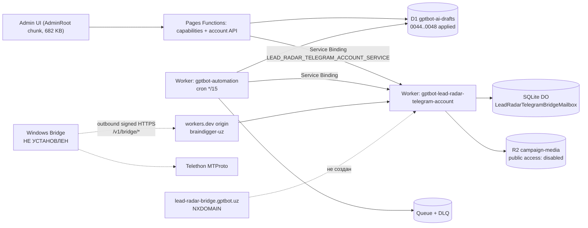

# Lead Radar: аудит подключения Telegram-аккаунта

Дата проверки: 2026-08-26, окно 16:00–16:10 UTC
Репозиторий: `F:\Claude\gptbot-ui-release-20260824`
Ветка: `codex/lead-radar-mvp-20260824`
Git HEAD: `2eb9a2a483ee9bb67ee7a2d0f819c0d88a6b2149`
Рабочее дерево: **dirty** — 47 modified, 19 untracked, 0 staged.

## Границы аудита

Выполнено строго в режиме диагностики: read-only проверки, локальные тесты, безопасные запросы состояния Cloudflare/D1. **Не выполнялось:** редактирование кода проекта, применение D1-миграций, изменение bindings/routes/secrets/feature flags, deploy, реальная Telegram-отправка, создание кампании, QR-вход. Значения токенов, API hash, session и ключей шифрования не выводились — проверялось только наличие по именам и соответствие формату (булево).

> **Предупреждение о свежести данных.** Предыдущая версия этого файла (написана 2026-08-26 в 13:32 UTC) и handoff-документ (17:08 местного времени) **устарели**. Production изменился уже после них: gateway Worker переразвёрнут в 15:58:10 UTC, Pages — в 16:01:28 UTC. Настоящий отчёт полностью заменяет обе версии. Где handoff расходится с измерением — приоритет у измерения.

---

## 1. Краткое объяснение простым языком

Ситуация изменилась по сравнению с тем, что описано в handoff. **Серверный переключатель уже включён.** В production и на Pages, и на automation-воркере сейчас стоит `LEAD_RADAR_TELEGRAM_ACCOUNT_ENABLED = "true"`. Миграции `0047` и `0048` тоже уже применены. То есть три из пяти «стоп-факторов» handoff'а закрыты.

Наблюдение «подключение выключено серверным переключателем» — это точный текст блокера `feature_disabled` из `TelegramAccountCampaignPanel.tsx:98`. Оно верное, но **относится к состоянию до 16:01 UTC**. После последнего деплоя этот конкретный блокер больше не должен срабатывать.

Тем не менее подключение всё равно не заработает. Пять фундаментальных причин:

1. **Windows Bridge физически не существует на машине.** Пакет `lead_radar_bridge` не установлен (`ModuleNotFoundError`), wheel не собран, а обязательные зависимости `telethon`, `Pillow`, `qrcode` отсутствуют в обоих доступных Python 3.12. Это первопричина №1.

2. **QR генерирует Bridge, а не сервер.** `client.qr_login()` вызывается в `telegram_adapter.py:130`, PNG рисуется в `e2e.py:187-194`, затем шифруется и кладётся в mailbox. Никакой серверный компонент QR создать не может. Нет Bridge — нет QR. Это не следствие флага, это архитектура.

3. **Задеплоенный код не существует ни в одном коммите.** Все шесть кодов блокеров (`feature_disabled`, `gateway_binding_missing`, `bridge_transport_mode_invalid` и остальные) присутствуют в живом production-бандле, но отсутствуют в HEAD и во всей истории репозитория. Два разных production-деплоя записаны с одним и тем же SHA `2eb9a2a4`, но собраны из разного содержимого. Production нельзя воспроизвести, откатить к коммиту или проверить.

4. **Ключевые файлы шлюза вообще не под контролем версий.** `bridge-mailbox.ts`, `bridge-protocol.ts`, `configuration.ts`, `message-effect.ts` и весь каталог `tools/` — untracked. Один `git clean` уничтожит работающий production-код без возможности восстановления.

5. **Живой сквозной путь ни разу не проверялся.** Service Binding, подписанный register/poll, pairing, adopt/finalize существуют в коде и в тестах (282/282 зелёные), но ни одна из этих цепочек не выполнялась против реального gateway с реальным Bridge.

Отдельно: **«0 Telegram-ready из 50»** к подключению аккаунта отношения не имеет. Discovery не нашёл ни одного подтверждённого корпоративного Telegram endpoint. Даже полностью рабочее подключение не сделало бы эти 50 компаний доступными для отправки.

---

## 2. Проверенная фактическая архитектура

Ниже — то, что действительно развёрнуто, а не то, что задумано.



Существенные отличия от схемы в handoff:

- **Публичный вход — не кастомный домен, а workers.dev.** `wrangler.toml` шлюза содержит `workers_dev = true` и переменную `LEAD_RADAR_TELEGRAM_BRIDGE_PUBLIC_ORIGIN = "https://gptbot-lead-radar-telegram-account.braindigger-uz.workers.dev"`, с комментарием в самом файле: *«The current Cloudflare token cannot manage Zone routes. Publish the exact account-owned workers.dev hostname instead»*. Bridge в `mailbox.py:29-34` принимает **оба** origin. Значит отсутствующий `lead-radar-bridge.gptbot.uz` — это отложенный cutover, а **не блокер подключения**. Handoff и предыдущая версия отчёта классифицировали это неверно.
- **Legacy Container и `account-object.ts` не в production.** Задеплоенный шлюз содержит ровно один DO-класс — `LeadRadarTelegramBridgeMailbox`. Класс `LeadRadarTelegramAccount` не привязан. Каталог `container/` — исторический код.
- **Публичны только аутентифицированные `/v1/bridge/*`.** Корень шлюза отвечает `404` — Worker исполняется, но ничего лишнего не отдаёт. Ожидать публичный `/health` неверно по замыслу.

Официальные источники, использованные для оценки:

- Workers Free: 50 subrequests на invocation, обращения к D1 считаются subrequests — [Workers limits](https://developers.cloudflare.com/workers/platform/limits/).
- `setAlarm()` перезаписывает ранее установленный alarm — [Durable Objects alarms](https://developers.cloudflare.com/durable-objects/api/alarms/).
- Чтение routes требует `Workers Routes Read`, создание — Edit/Write — [List Routes API](https://developers.cloudflare.com/api/resources/workers/subresources/routes/methods/list/).
- Публичный Worker требует route или custom domain на активной зоне — [Routing](https://developers.cloudflare.com/workers/configuration/routing/).
- Pages: изменения переменных окружения применяются только после нового деплоя — [Pages environment variables](https://developers.cloudflare.com/pages/functions/bindings/).
- Telegram требует собственные `api_id`/`api_hash` и предупреждает о перманентном бане за спам — [Obtaining api_id](https://core.telegram.org/api/obtaining_api_id), [API Terms](https://core.telegram.org/api/terms), [Spam FAQ](https://telegram.org/faq_spam).
- Telethon QR требует подключённого клиента и отдельной обработки `SessionPasswordNeededError` — [Telethon qr_login](https://docs.telethon.dev/en/stable/modules/client.html#telethon.client.auth.AuthMethods.qr_login).

---

## 3. Production snapshot (измерено 2026-08-26 16:00–16:10 UTC)

### Cloudflare Pages — `ai-direct-pro-landing`

| Параметр | Значение |
|---|---|
| Актуальный production deployment | `79727e7b-3ebe-4118-84f1-e10b25a2c269`, создан `2026-08-26T16:01:28Z` |
| Предыдущий | `f4b45a79-9a5c-4973-aa96-e31247ffd6aa`, `11:40:47Z` — тот, что назван в handoff |
| Ещё ранее | `df601a9b-1f85-4260-8368-6a20ee7bea4f`, `11:35:31Z`, source `82e9d540` |
| Записанный SHA у обоих верхних | `2eb9a2a4` — **одинаковый при разном содержимом** |
| `https://gptbot.uz/admin-tools/lead-radar` | HTTP 200 |
| `https://gptbot.uz/api/admin/lead-radar/capabilities` | HTTP 401 без авторизации (корректно) |
| Admin-чанк | `/assets/AdminRoot-BHjxQpWu.js`, 682 601 байт |

**Feature flags в production (Pages):**

```text
LEAD_RADAR_ADMISSION_ENABLED                   = true
LEAD_RADAR_PROCESSING_ENABLED                  = true
LEAD_RADAR_CONTACT_ENABLED                     = false
LEAD_RADAR_TELEGRAM_DISCOVERY_ENABLED          = true
LEAD_RADAR_TELEGRAM_TRANSPORT_MODE             = local_bridge
LEAD_RADAR_TELEGRAM_ACCOUNT_ENABLED            = true   ← handoff утверждал false
LEAD_RADAR_TELEGRAM_CAMPAIGN_ENABLED           = false
LEAD_RADAR_TELEGRAM_CAMPAIGN_AUTOSEND_ENABLED  = false
LEAD_RADAR_TELEGRAM_CAMPAIGN_DAILY_LIMIT       = 30
LEAD_RADAR_TELEGRAM_CAMPAIGN_MIN_INTERVAL_SECONDS = 120
LEAD_RADAR_ALLOWED_ORGS                        = owner_8ee98dc3040f160b308166b0
```

**Bindings (Pages production):** `GPTBOT_DRAFTS_DB` (D1), `LEAD_RADAR_CAMPAIGN_MEDIA` + `MARKET_MEDIA` (R2), `LEAD_RADAR_TELEGRAM_ACCOUNT_SERVICE` (service), `AUTOMATION_QUEUE` (queue), `LOGIN_ATTEMPTS` (KV). Секреты `LEAD_RADAR_TELEGRAM_CAMPAIGN_DATA_KEY` и `LEAD_RADAR_TELEGRAM_INTERNAL_SERVICE_TOKEN` присутствуют как `secret_text`.

> **Аномалия.** Среди секретов Pages есть запись с именем `___` (три подчёркивания). Это мусор или след неудачной операции. Значение не читалось. Требует проверки владельцем и, вероятно, удаления.

### Automation Worker — `gptbot-automation`

Флаги идентичны Pages, включая `LEAD_RADAR_TELEGRAM_ACCOUNT_ENABLED = true` и `LEAD_RADAR_TELEGRAM_TRANSPORT_MODE = local_bridge`. Bindings: `AUTOMATION_QUEUE`, `AUTOMATION_DLQ`, `GPTBOT_DRAFTS_DB`, `LEAD_RADAR_CAMPAIGN_MEDIA`, `LEAD_RADAR_TELEGRAM_ACCOUNT_SERVICE`, секреты `LEAD_RADAR_TELEGRAM_CAMPAIGN_DATA_KEY` и `LEAD_RADAR_TELEGRAM_INTERNAL_SERVICE_TOKEN`.

### Gateway Worker — `gptbot-lead-radar-telegram-account`

- Создан `2026-08-26T11:32:07Z`, **изменён `2026-08-26T15:58:10Z`** (новее версии `ff22fb59` из handoff).
- Секреты по именам: `LEAD_RADAR_TELEGRAM_ACCOUNT_DATA_KEY`, `LEAD_RADAR_TELEGRAM_ACCOUNT_ROUTING_KEY`, `LEAD_RADAR_TELEGRAM_INTERNAL_SERVICE_TOKEN` — все три присутствуют.
- Bindings: `TELEGRAM_ACCOUNTS` → `LeadRadarTelegramBridgeMailbox` (durable_object_namespace), `LEAD_RADAR_CAMPAIGN_MEDIA` (R2).
- `workers.dev` subdomain: `{"enabled": true, "previews_enabled": false}`.
- `https://gptbot-lead-radar-telegram-account.braindigger-uz.workers.dev/` → HTTP 404 с заголовком `CF-RAY` — Worker жив и исполняется.

### D1 — `gptbot-ai-drafts` (`97ef0372-d937-406f-8871-755368d9afff`)

```text
0044_lead_radar_telegram_business.sql          2026-08-25 07:44:00
0045_lead_radar_telegram_campaigns.sql         2026-08-25 13:44:40
0046_lead_radar_telegram_campaign_safety.sql   2026-08-25 16:12:47
0047_lead_radar_telegram_campaign_media.sql    2026-08-26 13:46:13  ← handoff: «не применена»
0048_lead_radar_telegram_media_quota.sql       2026-08-26 13:46:13  ← handoff: «не применена»
```

**Схема production совпадает с ожидаемой побайтово.** Вычислен `telegramCampaignSchemaFingerprint()` против живой production D1 и сравнён с константой в коде:

```text
production fingerprint : 1ee9958cf30efcbfe5e52a4a0024d60936d230dc346d8d654a311f48c074da73
compiled  fingerprint : 1ee9958cf30efcbfe5e52a4a0024d60936d230dc346d8d654a311f48c074da73
MATCH                 : true
```

Это сильное доказательство: runtime schema gate в production **пройдёт**, кампании схемно готовы.

### R2 и DNS

- Bucket `gptbot-lead-radar-campaign-media`: существует, создан `2026-08-26T11:32:00Z`, локация `EEUR`.
- Публичный доступ: `{"enabled": false}` — bucket приватный, как и требуется.
- `lead-radar-bridge.gptbot.uz`: **NXDOMAIN** (`dns.google`, «Non-existent domain»); HTTPS-запрос — код 000, DNS lookup 0.000000 s.
- Зона `gptbot.uz`: существует, статус `active`, читается текущим токеном.
- `GET /zones/{id}/workers/routes`: **ошибка 10000 Authentication error** — у токена есть Zone:Read, но нет Workers Routes.

### Windows host

- `py -3.12` → `C:\Users\Borinio\AppData\Local\Microsoft\WindowsApps\PythonSoftwareFoundation.Python.3.12_qbz5n2kfra8p0\python.exe`, версия 3.12.10. Это Store-алиас, не обычная установка.
- `import lead_radar_bridge` → `ModuleNotFoundError`. Пакет не установлен.
- Зависимости в WindowsApps Python: `cryptography` OK; `telethon`, `PIL`, `qrcode` — **MISSING**.
- Отдельный runtime `C:\Users\Borinio\Documents\Codex\.runtime\python312-3.12.2800`: существует, но **все четыре** зависимости отсутствуют.
- Wheel не собран: в `tools/lead-radar-telegram-bridge/` есть `build/lib/` и пустой `build/bdist.win-amd64/`, но ни одного `.whl` или `.tar.gz`. Присутствует `gptbot_lead_radar_telegram_bridge.egg-info/` — след editable-установки, а не воспроизводимой.
- `pyvenv.cfg`, ссылающихся на удалённый интерпретатор, не найдено — соответствующее утверждение handoff'а не подтвердилось.

---

## 4. End-to-end матрица

Статусы: **работает** · **работает частично** · **не настроено** · **сломано** · **не проверено** · **заблокировано предыдущим звеном**

| Компонент | Ожидание | Фактическое состояние | Доказательство | Блокирует подключение | Severity |
|---|---|---|---|---|---|
| Admin UI | Показывать реальную готовность, QR/2FA, connected | работает | `AdminRoot-BHjxQpWu.js` содержит все 6 кодов блокеров и `telegramAccountReadiness` | нет | P3 |
| Capabilities API | Fail-closed агрегировать flags/keys/binding/transport | работает | `capabilities.ts:62-99`; все 6 предусловий в production выполнены | нет (больше не блокирует) | P2 |
| Feature flags | Безопасное состояние | работает частично | `ACCOUNT_ENABLED=true` уже включён **до** готовности Bridge | нет, но опасно | P2 |
| Telegram account API | Начать pairing и опрашивать состояние | заблокировано предыдущим звеном | код и mock-тесты есть; живой вызов не выполнялся | да | P1 |
| Pages Functions | Приватная оркестрация | работает частично | deployment `79727e7b` живой, bindings на месте; сквозной путь не проверен | косвенно | P1 |
| D1 schema | Точная схема `0045..0048` | **работает** | ledger содержит 0044–0048; fingerprint совпал побайтово | нет | — |
| Runtime D1 schema check | Уложиться в бюджет Free | работает | `telegram-campaign-schema.ts:399-421` — ровно 4 запроса + isolate-кэш только при успехе | нет | P3 |
| Service Binding | Pages/automation → gateway | работает частично | binding присутствует с обеих сторон в задеплоенной конфигурации; подписанный live-вызов не выполнялся | не проверено | P1 |
| Gateway Worker | Принимать private и public bridge-вызовы | работает | развёрнут 15:58Z, все секреты и DO на месте, отвечает 404 на неизвестный путь | нет | P2 |
| Durable Object mailbox | Durable команды/результаты, alarms, GC, идемпотентность | работает | `bridge-mailbox.ts:324-325` — monotonic alarm; `1983-2060` — durable-курсоры по всем префиксам; `TERMINAL_PAYLOAD_RETENTION_MS = 24 ч` | нет | P3 |
| Публичный bridge origin | Доступный HTTPS `/v1/bridge/*` | работает | workers.dev отвечает; `mailbox.py:29-34` принимает этот origin | нет | P3 |
| Кастомный домен `lead-radar-bridge.gptbot.uz` | TLS + route | не настроено | NXDOMAIN; routes API → 10000 | **нет** (workers.dev покрывает) | P3 |
| Cloudflare token | Zone → Workers Routes: Edit | сломано | Zone:Read работает, `/workers/routes` → 10000 | нет | P3 |
| Windows Bridge install | Установленный wheel, task, handler | **не настроено** | `ModuleNotFoundError`; wheel отсутствует; deps отсутствуют | **да** | **P0** |
| Python runtime | 3.12 + locked deps, независимо от cwd | сломано | оба runtime без `telethon`/`PIL`/`qrcode`; активен Store-алиас | **да** | **P0** |
| PowerShell 5.1 / ACL | Надёжный `Get-Acl` | работает в коде, не установлено | `security.py:58-84` — абсолютный PS5.1, `$env:PSModulePath` первой инструкцией, `-NoProfile`, `CREATE_NO_WINDOW` | заблокировано установкой | P2 |
| DPAPI CurrentUser | Локальное хранение session | не проверено | реализация есть (`security.py`), vault не создан | заблокировано установкой | P1 |
| Single instance | Один poller | не проверено | `single_instance.py` есть, Scheduled Task не зарегистрирован | заблокировано установкой | P2 |
| QR pairing | pairing → QR → adopt/finalize | **заблокировано предыдущим звеном** | QR рождается в `telegram_adapter.py:130` / `e2e.py:187`; Bridge не запущен | **да** | **P0** |
| Telethon MTProto | QR, 2FA, точный resolve/send | не проверено | Telethon 1.44.0 в lock, но не установлен | да | P1 |
| Telegram api_id/api_hash | Только в Windows DPAPI | не настроено | имена присутствуют в приватном файле; vault не создан; значения не читались | да | P1 |
| Восстановление session после reboot | StringSession переживает рестарт | не проверено | невозможно без установки и логина | после QR | P1 |
| Offline/reconnect | Offline останавливает кампанию | работает частично | `HEARTBEAT_FRESH_MS = 95_000` при poll ~30 с даёт окно ложного «online» ≤95 с; реальный outage не проверялся | до проверки | P2 |
| Campaign eligibility | Только verified business + DNC | работает в коде и тестах | 282/282 зелёные; в production 0 Telegram endpoints | да для рассылки, нет для QR | P1 |
| Pacing/quota/no-repeat | ≤30/сутки, ≥120 с, permanent no-repeat | работает в тестах, в production выключено | флаги campaign/autosend = false | да для отправки | P1 |
| Media | Приватный R2, точная caption | работает частично | bucket приватный, 0047/0048 применены; живой рендер не проверялся | да для photo-кампании | P2 |
| Release gate | Хэши входов, Windows-артефакт, secret scan | работает частично | `FIXED_INPUTS` теперь включает `bridge-mailbox.ts`, `bridge-protocol.ts`, `configuration.ts`, `message-effect.ts`, файлы `tools/`; wheel в манифесте не подтверждён | да для чистого релиза | P1 |
| Secret scanner | Видеть tracked + untracked | работает | `scan-secrets.ts:209` — `ls-files -z --cached --others --exclude-standard` | нет | P3 |
| Воспроизводимость релиза | Deployed = commit | **сломано** | ни один коммит не содержит кодов блокеров; `git log --all -S` пуст; два деплоя с одним SHA | нет для QR, **да** для эксплуатации | **P0** |
| Контроль версий gateway/Bridge | Файлы под Git | **сломано** | `bridge-mailbox.ts`, `bridge-protocol.ts`, `configuration.ts`, `message-effect.ts`, весь `tools/` — untracked | нет | **P0** |

---

## 5. Root cause analysis

### 5.1 Подтверждённые причины

#### RC-1 — Windows Bridge не установлен; отсутствуют MTProto-зависимости (P0, stop-ship)

- **Файлы:** `tools/lead-radar-telegram-bridge/pyproject.toml`; `lead_radar_bridge/installer.py:36-54,143-178`.
- **Production-компонент:** машина владельца (Windows 10 Pro 19045).
- **Воспроизведение:** `py -3.12 -c "import lead_radar_bridge"`; `find tools/ -name "*.whl"`.
- **Доказательство:** `ModuleNotFoundError: No module named 'lead_radar_bridge'`. Ни одного `.whl`. `telethon`/`PIL`/`qrcode` отсутствуют в обоих Python 3.12. Тесты Bridge падают: 9 запущено, 4 ошибки, первая — `ModuleNotFoundError: No module named 'PIL'` в `media.py:11`.
- **Исправление:** собрать wheel (`python -m build --wheel`), создать чистый venv на обычном (не Store) Python 3.12, установить зависимости из `requirements.lock` с хэшами, затем wheel; выполнить `install` и проверить task/handler/ACL.
- **Риск исправления:** установка из source-дерева или из Store-алиаса снова сломается при смене cwd. Защита уже есть: `installer.py:44` — *«Refuse a source-tree-only install that will break from another cwd»*.

#### RC-2 — QR структурно недостижим без работающего Bridge (P0, stop-ship)

- **Файлы:** `lead_radar_bridge/telegram_adapter.py:130`; `e2e.py:181-215`; `runtime.py:243`.
- **Production-компонент:** локальный агент, не Cloudflare.
- **Воспроизведение:** проследить, кто вызывает `qr_login()`. Ни один серверный модуль этого не делает.
- **Доказательство:** `self.qr_login = await client.qr_login()` в адаптере; PNG строится через `qrcode.QRCode` в `e2e.py:187-194`; `e2e.py:184` валидирует URL по `tg://login?token=...`.
- **Исправление:** следствие RC-1. Отдельного исправления не требует.
- **Риск:** попытка «починить QR на сервере» приведёт к неверной архитектуре — MTProto-сессия пользователя не может жить в Worker.

#### RC-3 — Задеплоенный код не воспроизводим ни из одного коммита (P0)

- **Файлы:** `functions/platform/lead-radar/capabilities.ts`, `src/shared/lead-radar.ts:240-255`, `src/admin/components/lead-radar/TelegramAccountCampaignPanel.tsx:97-112`, `wrangler.toml:123,127`.
- **Production-компонент:** Cloudflare Pages `ai-direct-pro-landing`.
- **Воспроизведение:**
  ```bash
  git show HEAD:src/shared/lead-radar.ts | grep -c bridge_transport_mode_invalid   # 0
  git log --all -S'bridge_transport_mode_invalid' --oneline                        # пусто
  curl -s https://gptbot.uz/assets/AdminRoot-BHjxQpWu.js | grep -c bridge_transport_mode_invalid  # >0
  ```
- **Доказательство:** все шесть кодов блокеров есть в живом бандле и отсутствуют в HEAD и во всей истории. Деплои `79727e7b` (16:01Z) и `f4b45a79` (11:40Z) записаны с одним SHA `2eb9a2a4`, но собраны из разного дерева. В HEAD `wrangler.toml` содержит `ACCOUNT_ENABLED = "false"`, не имеет `LEAD_RADAR_TELEGRAM_TRANSPORT_MODE` и не имеет блока `[[services]]` — то есть чекаут HEAD не соберёт то, что работает.
- **Исправление:** сделать серию отрефлексированных коммитов текущего дерева (без `git add .`), затем чистый чекаут, полный gate, и деплой из зафиксированного SHA с записью хэшей артефактов.
- **Риск:** слепой `git add .` затянет `.wrangler`, отчёты, `dist`, `venv`, `__pycache__`. Требуется пофайловый разбор 66 записей.

#### RC-4 — Критичные файлы вне контроля версий (P0)

- **Файлы:** `workers/lead-radar-telegram-account/{bridge-mailbox,bridge-protocol,configuration,message-effect}.ts`; `functions/platform/lead-radar/telegram-campaign-media.ts`; `src/shared/lead-radar-telegram-bridge.ts`; `src/admin/lib/lead-radar-telegram-bridge-crypto.ts`; `migrations/0047*.sql`, `0048*.sql`; весь `tools/`.
- **Воспроизведение:** `git status --porcelain | grep '^??'`.
- **Доказательство:** 19 untracked записей, включая `bridge-mailbox.ts` — файл, реализующий весь mailbox, и `tools/` — весь Bridge.
- **Исправление:** закоммитить вместе с RC-3.
- **Риск:** до коммита любой `git clean -fd`, переключение ветки или очистка диска необратимо уничтожит работающий production-код. Это самый острый операционный риск прямо сейчас.

#### RC-5 — Токен Cloudflare не имеет прав на Workers Routes (P3, понижен)

- **Production-компонент:** Cloudflare API token.
- **Воспроизведение:** `GET /zones?name=gptbot.uz` → success; `GET /zones/{id}/workers/routes` → `10000`.
- **Доказательство:** зона `gptbot.uz` активна и читается; routes — «Authentication error».
- **Почему P3, а не P1:** шлюз намеренно опубликован на workers.dev, и `mailbox.py:29-34` включает этот origin в `PRODUCTION_ORIGINS`. Кастомный домен нужен для будущего cutover без потери сессии, а не для подключения.
- **Исправление:** выдать токену ровно `Zone → Workers Routes: Edit` для зоны `gptbot.uz`. Не расширять до Global API Key.
- **Риск:** wildcard-route может перехватить чужой трафик. Нужен точный hostname.

#### RC-6 — Флаг включён раньше готовности контура (P2)

- **Файлы:** `wrangler.toml:127`, `wrangler.automation.toml:71`.
- **Доказательство:** `ACCOUNT_ENABLED = "true"` в живой конфигурации Pages и automation, при том что Bridge не существует.
- **Почему это проблема:** handoff явно требовал держать флаг `false` до закрытия P1. Сейчас capabilities вернёт `telegramAccountEnabled = true` и `readiness.status = 'probe_required'`, UI покажет кнопку «Подключить Telegram», нажатие уйдёт в pairing и упрётся в отсутствующий Bridge. Пользователь получит непонятную ошибку вместо честного «контур выключен».
- **Исправление:** либо вернуть `false` до Phase 6, либо убедиться, что probe-путь возвращает внятный `bridge_offline`, а не таймаут.
- **Риск:** возврат в `false` — правка `[vars]` + редеплой Pages; изменение переменных без деплоя не применяется.

### 5.2 Очень вероятные причины и риски

#### VR-1 — Ложное «online» в окне до 95 секунд (P2)

`HEARTBEAT_FRESH_MS = 95_000` (`bridge-mailbox.ts:58`) при интервале опроса ~30 с. Резкое падение Bridge остаётся невидимым до 95 с. Для кампании с интервалом ≥120 с это приемлемо, но означает, что первая отправка после обрыва может быть поставлена в очередь. Требуется тест: убить Bridge, немедленно стартовать кампанию, убедиться, что provider call не произошёл.

#### VR-2 — Service Binding ни разу не проверен в живом режиме (P1)

Binding присутствует в задеплоенной конфигурации Pages и automation, типы сходятся, mock-тесты зелёные. Но подписанный вызов Pages → gateway в production не выполнялся ни разу. Несовпадение `LEAD_RADAR_TELEGRAM_INTERNAL_SERVICE_TOKEN` между Pages и шлюзом даст отказ уже на первом реальном probe. Локальные копии всех четырёх ключей проходят формат (43 символа base64url, ровно 32 байта после декодирования), но совпадение локальных значений с загруженными в Cloudflare не проверялось и **не может** быть проверено без чтения секретов.

#### VR-3 — Store-версия Python несовместима со Scheduled Task (P2)

`installer.py:36-39` берёт `Path(sys.executable).with_name("pythonw.exe")`. Под `WindowsApps` это alias-заглушка с перенаправленным `site-packages`; запуск из контекста Планировщика заданий под таким путём — известный источник отказов. Нужен обычный установленный Python 3.12, не Store-пакет.

#### VR-4 — Wheel не входит в release manifest (P1)

`FIXED_INPUTS` (`release-gate.ts:113-143`) покрывает исходники Bridge, `pyproject.toml` и оба lock-файла, но собранного wheel в манифесте нет, и сам wheel не собран. Утверждение предыдущей версии отчёта «wheel 1.0.0 собран и установлен в временный venv, 29/29 pass» сейчас не воспроизводится: временный venv удалён, wheel отсутствует, тесты из source-дерева падают на отсутствии `PIL`.

#### VR-5 — Мусорный секрет `___` на Pages (P2)

Секрет с именем из трёх подчёркиваний присутствует в production. Происхождение неизвестно, значение не читалось. Может быть следом ошибочной команды. Требует решения владельца.

#### VR-6 — Пустой `~/.wrangler/config/default.toml` ломает OAuth-сессию (P3)

Файл `C:\Users\Borinio\.wrangler\config\default.toml` имеет размер **0 байт** и датирован 2026-08-25 17:30 — то есть создан во время работ над Lead Radar. Он перекрывает действующую сессию в `C:\Users\Borinio\AppData\Roaming\xdg.config\.wrangler\config\default.toml` (801 байт). Из-за этого `wrangler whoami` отвечает «You are not authenticated», и предыдущие агенты были вынуждены переходить на ограниченный API-токен — что и породило ошибку 10000. Дополнительно: `expiration_time` в рабочем конфиге — `2026-08-04T13:49:02Z`, то есть access-токен истёк 22 дня назад и требует refresh.

### 5.3 Неподтверждённые гипотезы

- **Совпадение секретов между Pages и gateway.** Формат локальных копий корректен, но равенство значений в двух хранилищах непроверяемо без их чтения. Проверяется только первым подписанным probe.
- **Telegram может ограничить аккаунт немедленно.** Возраст номера, VOIP-происхождение, история и жалобы получателей влияют на риск. Telegram не публикует «безопасный лимит». Внутренние 30/сутки и 120 с — дополнительная защита, а не гарантия.
- **DO-миграция при смене класса.** `wrangler.toml` шлюза объявляет единственный тег `v1` с `new_sqlite_classes = ["LeadRadarTelegramBridgeMailbox"]`. Деплой 15:58Z прошёл, значит конфликта нет. Но если в каком-то более раннем деплое под тем же тегом стоял другой класс, возможны сюрпризы при следующем изменении.
- **Применились ли переменные к деплою `79727e7b`.** Переменные Pages читаются из снапшота конфигурации деплоя. Деплой создан в 16:01:28Z; когда именно были записаны переменные — не измерено. Если переменные записали после 16:01:28Z, они вступят в силу только со следующим деплоем.

### 5.4 Следствия, а не первопричины

- **«Что нужно настроить» вместо кнопки** — корректное fail-closed отображение; строка соответствует состоянию до 16:01 UTC.
- **QR не создаётся** — следствие RC-1/RC-2, а не флага.
- **0 Telegram-ready из 50** — независимая проблема discovery. Ни одна из 50 компаний не имеет подтверждённого корпоративного Telegram endpoint; отправлять им нельзя даже при полностью рабочем подключении.
- **Нулевые счётчики кампаний** — ожидаемый безопасный baseline при `CAMPAIGN_ENABLED = false`.

---

## 6. Разница между local, repository и production

| Слой | Что подтверждено измерением |
|---|---|
| **Только в исходниках (untracked)** | `bridge-mailbox.ts`, `bridge-protocol.ts`, `configuration.ts`, `message-effect.ts`, `telegram-campaign-media.ts`, `lead-radar-telegram-bridge.ts`, `lead-radar-telegram-bridge-crypto.ts`, миграции `0047`/`0048`, 4 файла тестов, весь `tools/`, `docs/lead-radar/`. Всего 19 записей. |
| **Закоммичено (HEAD `2eb9a2a`)** | Не содержит ни одного кода блокера, ни `LEAD_RADAR_TELEGRAM_TRANSPORT_MODE`, ни `[[services]]`-binding, ни `[[r2_buckets]]` для campaign-media. `ACCOUNT_ENABLED = "false"`. Чекаут HEAD **не воспроизводит** production. |
| **Реально задеплоено** | Pages `79727e7b` (16:01:28Z) с бандлом, содержащим все 6 блокеров; gateway изменён 15:58:10Z; automation с полным набором флагов и bindings. Соответствие исходному коду не доказуемо. |
| **Включено feature flags** | admission, processing, telegram_discovery, **telegram_account** = true. contact, campaign, autosend = false. |
| **Существует в Cloudflare** | D1 с миграциями 0044–0048 и точным fingerprint; приватный R2; Queue + DLQ; Service Binding с обеих сторон; DO `LeadRadarTelegramBridgeMailbox`; 3 секрета шлюза; 2 секрета Pages; workers.dev origin активен. **Отсутствует:** route/custom domain `lead-radar-bridge.gptbot.uz`. |
| **Установлено на Windows** | **Ничего.** Нет пакета, нет wheel, нет venv с зависимостями, нет Scheduled Task, нет URI handler, нет DPAPI vault, нет pairing, нет session. |
| **Подтверждено настоящим smoke-тестом** | Node Lead Radar suite — **282/282 pass** (16.9 s). Production schema fingerprint — **совпал**. HTTP-доступность Pages (200), capabilities (401), gateway workers.dev (404), NXDOMAIN кастомного домена, отказ routes API (10000). Наличие bindings и имён секретов. **Не подтверждено:** Bridge Python suite (9 тестов, 4 ошибки, `ModuleNotFoundError: No module named 'PIL'`), живой Service Binding, QR, 2FA, reboot, offline, любая отправка. |

---

## 7. Roadmap решения

### Phase 0 — сохранить безопасный baseline

- **Изменения:** зафиксировать текущее состояние без мутаций. Записать deployment `79727e7b`, gateway modified `15:58:10Z`, D1 ledger 0044–0048, fingerprint `1ee9958c…`, отсутствие DNS.
- **Зависимости:** доступ владельца к Cloudflare.
- **Файлы/сервисы:** Pages, automation, gateway, D1, R2.
- **Проверки:** счётчики Telegram-таблиц остаются нулевыми; ни одного provider-эффекта.
- **Приёмка:** baseline-файл со всеми ID и хэшами сохранён вне репозитория.
- **Rollback:** не требуется — состояние не меняется.
- **Сложность:** S.
- **Владелец:** подтвердить место хранения бэкапа и запрет на живых получателей.

### Phase 1 — исправить кодовые P1

- **Изменения:** кодовых P1 из handoff **не осталось** — D1-бюджет (4 запроса), monotonic alarm, курсорный GC, retention 24 ч, абсолютный PS5.1, guard против source-tree install, secret scanner по untracked уже реализованы в рабочем дереве. Работа этапа — **ревью инвариантов**, а не написание кода: подтвердить, что `runtimeVerifiedBindings` кэширует только успех; что GC не удаляет permanent no-repeat tombstone; что `HEARTBEAT_FRESH_MS` согласован с интервалом опроса.
- **Зависимости:** нет.
- **Файлы:** `telegram-campaign-schema.ts:399-421`, `bridge-mailbox.ts:324-325,1983-2060`, `security.py:30-84`, `installer.py:36-54`, `scan-secrets.ts:204-209`.
- **Проверки:** `npm run test:lead-radar`; тест бюджета D1 <50; фикстура GC с >256 записями.
- **Приёмка:** 282/282 остаются зелёными; ни один invocation-путь не превышает бюджет Free.
- **Rollback:** revert изолированного коммита.
- **Сложность:** S–M.
- **Владелец:** утвердить retention 24 ч для зашифрованных тел ответов.

### Phase 2 — собрать устанавливаемый Windows Bridge

- **Изменения:** установить обычный (не Store) Python 3.12; собрать wheel; создать venv; поставить зависимости из `requirements.lock` с хэшами; установить wheel; выполнить `install`.
- **Зависимости:** Phase 1.
- **Файлы/сервисы:** `tools/lead-radar-telegram-bridge/`, машина владельца, Планировщик заданий, реестр `HKCU\Software\Classes\gptbot-lead-radar`.
- **Проверки:** `import lead_radar_bridge` из постороннего cwd; путь с пробелами; `Get-Acl` под PS 5.1; DPAPI roundtrip; single-instance mutex; отсутствие окна консоли; Bridge Python suite целиком зелёный.
- **Приёмка:** новый пользователь Windows ставит Bridge из артефакта без репозитория и без `PYTHONPATH`.
- **Rollback:** снять только созданные task/handler; удалить install root после проверки цели.
- **Сложность:** M.
- **Владелец:** запустить установку под выделенной учётной записью.

### Phase 3 — закрыть Cloudflare route/bindings

- **Изменения:** выдать токену `Zone → Workers Routes: Edit` для `gptbot.uz`; создать точный custom domain `lead-radar-bridge.gptbot.uz` на шлюз; удалить мусорный секрет `___` с Pages; очистить пустой `~/.wrangler/config/default.toml` и восстановить OAuth-сессию.
- **Зависимости:** активная зона (подтверждена), развёрнутый шлюз (подтверждён).
- **Проверки:** DNS резолвится; TLS валиден; неподписанные и wrong-origin запросы отклоняются; внутренние пути не публичны; `wrangler whoami` отвечает.
- **Приёмка:** оба origin из `PRODUCTION_ORIGINS` работают — cutover возможен без потери сессии.
- **Rollback:** удалить только созданную DNS/route-запись.
- **Сложность:** S–M.
- **Владелец:** выдать минимальные права; подтвердить изменение DNS; решить судьбу секрета `___`.

### Phase 4 — backup и D1 migrations

- **Изменения:** миграции **уже применены** и схема совпадает. Работа этапа — ретроспективная страховка: сделать remote export с SHA-256 и провести restore-репетицию в изолированную D1.
- **Зависимости:** нет.
- **Проверки:** `PRAGMA quick_check` = ok; `PRAGMA foreign_key_check` пуст; fingerprint совпадает; счётчики кампаний нулевые.
- **Приёмка:** проверенный export лежит вне репозитория; восстановление отрепетировано.
- **Rollback:** неприменимо — мутаций нет.
- **Сложность:** S.
- **Владелец:** одобрить место и срок хранения бэкапа.
- **Отдельно:** исправить комментарий отката в `0047` — удалять safety/no-repeat/quota ledger после первых реальных отправок нельзя; допустим только откат приложения.

### Phase 5 — clean reproducible release

- **Изменения:** пофайловый разбор 66 записей рабочего дерева; несколько логичных коммитов; исключить `.env`, `.wrangler`, `dist`, `reports`, `venv`, `__pycache__`, `build/`, `.egg-info`; добавить wheel в release manifest; полный `npm run release:lead-radar`; деплой из зафиксированного SHA.
- **Зависимости:** Phases 1–4.
- **Проверки:** `git status` чист; хэши манифеста; gate зелёный на чистом чекауте; записаны ID деплоев.
- **Приёмка:** `dirty=false`; чекаут финального SHA собирает байт-в-байт то, что в production.
- **Rollback:** Pages rollback на `f4b45a79`; `wrangler rollback` для воркеров; D1 вручную не откатывать.
- **Сложность:** M–L.
- **Владелец:** одобрить деплой.
- **Критично:** до завершения этого этапа запрещены `git clean`, `git checkout` другой ветки и `git stash` в этом дереве.

### Phase 6 — подключение аккаунта без отправки

- **Изменения:** `ACCOUNT_ENABLED` уже `true`; настроить Bridge, выполнить pairing, QR, при необходимости 2FA, finalize; проверить reboot/offline/reconnect/revoke.
- **Зависимости:** Phases 2–5; собственные `api_id`/`api_hash`; выделенный Telegram-аккаунт.
- **Проверки:** session только в DPAPI; UI показывает connected только при online Bridge; рестарт и перезагрузка сохраняют identity; остановка сети даёт `bridge_offline`; в D1/DO нет открытых credentials.
- **Приёмка:** UI показывает реальное состояние аккаунта; отправить ничего нельзя.
- **Rollback:** disconnect с подтверждённым Telegram logout; затем `ACCOUNT_ENABLED = false` и точный uninstall.
- **Сложность:** M–L.
- **Владелец:** сканировать QR, ввести 2FA локально, подтвердить выделенный аккаунт.

### Phase 7 — campaign/media в zero-send режиме

- **Изменения:** включить `CAMPAIGN_ENABLED = true`, autosend оставить `false`; загрузить контролируемое изображение; использовать только синтетические или собственные записи.
- **Зависимости:** подключённый аккаунт; миграции 0047/0048 (уже есть).
- **Проверки:** количество provider-вызовов = 0; работают business/authorization/DNC-гейты; digest текста и caption точный; R2 проверяет MIME/размер/сигнатуру; 50 получателей раскладываются на несколько суток.
- **Приёмка:** «Добавить все найденные» выбирает максимум 50 и только eligible; невалидные media отклоняются, а не деградируют.
- **Rollback:** stop/delete draft; очистка media; флаги в `false`.
- **Сложность:** M.
- **Владелец:** предоставить утверждённый текст, изображение и документированное основание контакта.

### Phase 8 — один согласованный canary

- **Изменения:** включить autosend только для одного получателя под контролем владельца.
- **Зависимости:** Phase 7; аккаунт без ограничений Telegram; явное разрешение.
- **Проверки:** ровно одно сообщение; точный текст и изображение; `parse_mode=None`, entities пусты, link preview выключен; повтор той же operation не создаёт второго сообщения.
- **Приёмка:** владелец лично подтвердил корректность отображения.
- **Rollback:** немедленно autosend `false`, campaign stop.
- **Сложность:** M.
- **Владелец:** назвать единственного получателя и явно разрешить отправку.

### Phase 9 — постепенный запуск 3 → 10 → 30

- **Изменения:** ступени в отдельные UTC-сутки; только ожидаемые получатели; мониторинг жалоб, `FLOOD_WAIT` и ограничений.
- **Зависимости:** успешный canary.
- **Проверки:** ≤30 новых успешных контактов в сутки; ≥120 с между отправками; no-repeat; повторная проверка DNC непосредственно перед provider; остаток переносится на следующие сутки; метрики Cloudflare Free в пределах лимитов.
- **Приёмка:** три ступени пройдены без ограничений Telegram.
- **Rollback:** autosend `false` + stop; при flood уважать точный retry-after и **не** обходить ограничение другим аккаунтом.
- **Сложность:** L по календарю.
- **Владелец:** одобрять каждую ступень.

---

## 8. Definition of Done

Систему можно назвать готовой только при одновременном выполнении всех условий:

1. QR появляется в production UI и сканируется выделенным аккаунтом; 2FA обрабатывается локально, пароль не попадает в браузер, серверные логи или argv.
2. После рестарта процесса и полной перезагрузки Windows тот же аккаунт восстанавливается из CurrentUser DPAPI без нового QR.
3. UI показывает `connected` только при зафиксированной identity **и** online Bridge; по истечении heartbeat отображается offline и блокирует start/resume.
4. Приватный Service Binding и публичный подписанный poll проходят; unsigned, replay и wrong-origin запросы отклоняются.
5. D1 ledger содержит ровно `0045..0048`; fingerprint, `quick_check` и `foreign_key_check` зелёные; runtime тратит не более 4 D1-запросов на schema contract. *(На 2026-08-26 выполнено.)*
6. Тест DO с >256 записями удаляет весь просроченный ciphertext за конечное число alarm-циклов, сохраняя permanent effect tombstone.
7. Текстовый canary совпадает байт-в-байт; `parse_mode=None`; entities пусты; link preview выключен.
8. Canary с изображением отображается как photo с точной caption; невалидное media не деградирует в text/document и не отправляется.
9. Повтор одного `operation_id` и сценарии crash/reconcile дают ровно одно сообщение.
10. За UTC-сутки создаётся не более 30 новых успешных контактов; между попытками одного аккаунта не менее 120 секунд.
11. Кампания на 50 получателей после 30 корректно ждёт следующих суток, не теряя порядок и содержимое и не обходя no-repeat.
12. DNC и authorization перепроверяются непосредственно перед provider; истёкшее или отсутствующее основание не отправляется.
13. `FLOOD_WAIT`, ограничение или неоднозначный исход ставят кампанию на паузу без слепого retry.
14. Release gate зелёный на чистом чекауте; `git status` чист; wheel, распакованный пакет и весь чекаут проходят secret scan; хэши артефактов и ID деплоев записаны.
15. Метрики Cloudflare Free после canary остаются в пределах официальных лимитов; при превышении rollout останавливается, а не маскируется ослаблением проверок.

**Stop-ship, не закрытые на 2026-08-26:** пункты 1, 2, 3, 4, 6, 7, 8, 9, 10, 11, 12, 13, 14.

---

## 9. Рекомендуемый порядок реализации

Очередь для следующего implementation-агента. Каждая задача называет компонент, ожидаемый результат и проверку.

1. **Защитить незакоммиченный код.** Скопировать всё рабочее дерево `F:\Claude\gptbot-ui-release-20260824` в архив вне репозитория. *Проверка:* архив содержит `workers/lead-radar-telegram-account/bridge-mailbox.ts` и каталог `tools/`. *Почему первым:* сейчас работающий production существует только в untracked-файлах.
2. **Разобрать 66 записей рабочего дерева пофайлово** и сделать несколько отрефлексированных коммитов. Не использовать `git add .`. *Проверка:* `git status --short` пуст; `git show HEAD:src/shared/lead-radar.ts | grep -c bridge_transport_mode_invalid` возвращает ненулевое число.
3. **Прогнать полный набор проверок** на чистом чекауте: `npm run typecheck:lead-radar`, `npm run test:lead-radar` (ожидается 282/282), `npm run lead-radar:schema:audit:local`, `npm run build:cf`. *Проверка:* все зелёные.
4. **Установить обычный Python 3.12** (не из Microsoft Store), собрать wheel из `tools/lead-radar-telegram-bridge`, создать venv, поставить зависимости из `requirements.lock` с хэшами. *Проверка:* `python -c "import lead_radar_bridge"` из каталога `C:\Temp\some dir with spaces` работает; Bridge-тесты проходят полностью.
5. **Добавить wheel в release manifest** (`scripts/lead-radar/release-gate.ts`, `FIXED_INPUTS`) и прогнать `npm run release:lead-radar`. *Проверка:* отчёт зелёный, содержит хэш wheel и `dirty=false`.
6. **Починить локальное окружение Cloudflare:** удалить пустой `C:\Users\Borinio\.wrangler\config\default.toml`, выполнить `wrangler login`. *Проверка:* `wrangler whoami` показывает аккаунт.
7. **Получить у владельца токен с `Zone → Workers Routes: Edit`** для `gptbot.uz` и повторить `GET /zones/{id}/workers/routes`. *Проверка:* ответ `success: true` вместо ошибки 10000.
8. **Создать custom domain `lead-radar-bridge.gptbot.uz`** на `gptbot-lead-radar-telegram-account`. *Проверка:* DNS резолвится; TLS валиден; `/v1/bridge/poll` без подписи отклоняется.
9. **Выяснить происхождение секрета `___`** на Pages и удалить, если это мусор. *Проверка:* список секретов production не содержит записи `___`.
10. **Сделать remote D1 export с SHA-256 и репетицию восстановления** в изолированную базу. *Проверка:* восстановленная база даёт тот же fingerprint `1ee9958c…`.
11. **Задеплоить чистые артефакты** Pages, gateway и automation из зафиксированного SHA, записав ID деплоев. *Проверка:* новый deployment записан; `AdminRoot-*.js` содержит те же коды блокеров, что и коммит.
12. **Установить Bridge на машину владельца** из wheel; выполнить `install`; проверить action, WorkingDirectory и principal задачи, URI handler, ACL, DPAPI и single-instance. *Проверка:* задача стартует после перезагрузки без окна консоли.
13. **Настроить локально собственные `api_id`/`api_hash`.** *Проверка:* значения отсутствуют в Cloudflare и в репозитории; `npm run test:lead-radar` не видит их в secret scan.
14. **Выполнить pairing и QR-вход** выделенным Telegram-аккаунтом при `CAMPAIGN_ENABLED = false`. *Проверка:* UI показывает connected; в D1 появляется ровно одна запись `lead_radar_tg_user_accounts`; provider sends = 0.
15. **Проверить устойчивость:** kill процесса, перезагрузка Windows, отключение сети. *Проверка:* после reboot аккаунт восстановлен без нового QR; при выключенном Bridge UI показывает offline **раньше**, чем кампания смогла бы стартовать.
16. **Включить `CAMPAIGN_ENABLED = true` при autosend `false`;** подготовить черновик на синтетических данных с изображением. *Проверка:* количество provider-вызовов = 0; preview совпадает с итоговой строкой; 50 получателей раскладываются на несколько суток.
17. **После отдельного явного разрешения владельца** выполнить один canary на контролируемого получателя. *Проверка:* одно сообщение; повтор operation не создаёт второго.
18. **Только после успешного canary** — ступени 3 → 10 → 30 в отдельные сутки с мониторингом ограничений Telegram.

**Границы честности.** До пункта 15 подключение не считается рабочим. До пункта 17 рассылка не считается проверенной. **Текущим 50 найденным компаниям отправлять нельзя ни при каких условиях**: у них нет ни подтверждённого Telegram business endpoint, ни индивидуального документированного основания контакта.

---

## 10. Что нужно от владельца

1. Токен Cloudflare с правом `Zone → Workers Routes: Edit` для зоны `gptbot.uz` (не Global API Key).
2. Решение по секрету `___` в production Pages.
3. Решение: возвращать ли `LEAD_RADAR_TELEGRAM_ACCOUNT_ENABLED` в `false` до готовности Bridge, или оставить `true` с внятным сообщением `bridge_offline`.
4. Выделенный Telegram-аккаунт и собственные `api_id`/`api_hash`. Handoff отмечает, что API hash попадал на скриншот в истории задачи — перед боевым включением его стоит перевыпустить.
5. Утверждённый текст оффера, изображение и документированное основание контакта.
6. Явное назначение единственного контролируемого получателя для canary.
7. Место и срок хранения D1-бэкапа.
